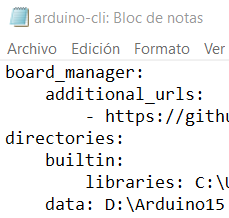
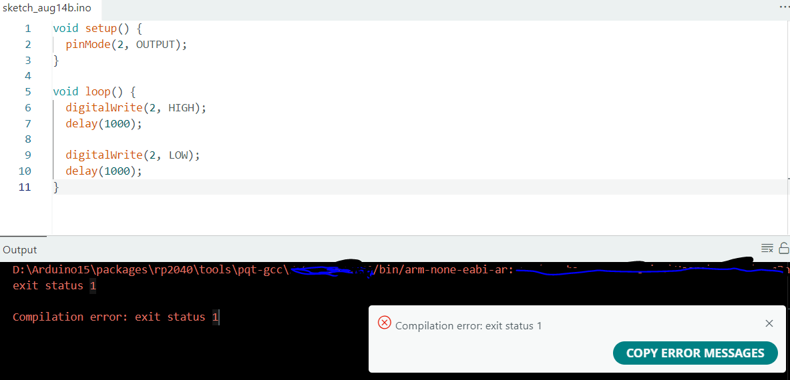
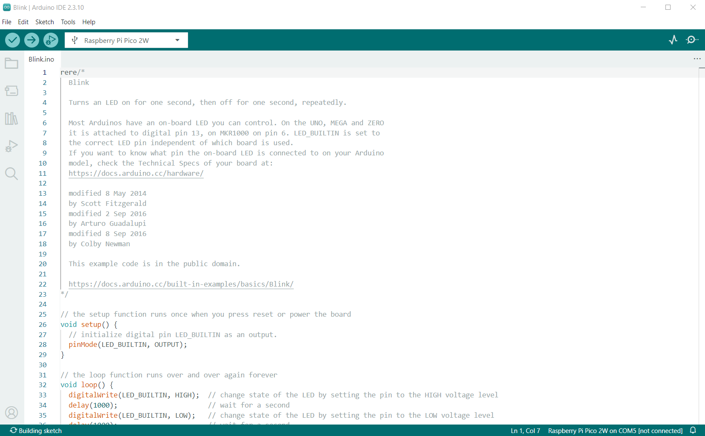
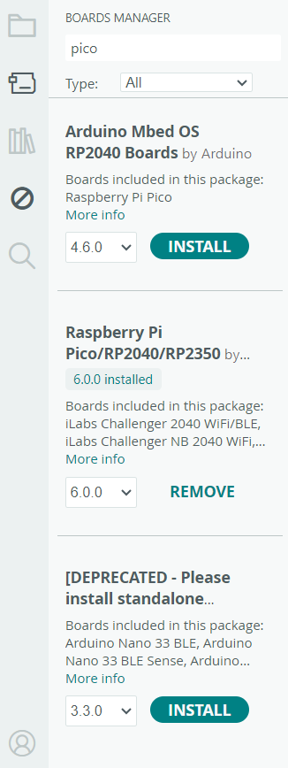
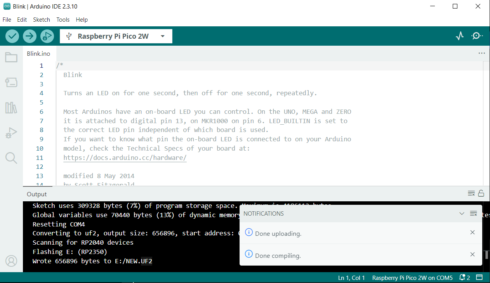
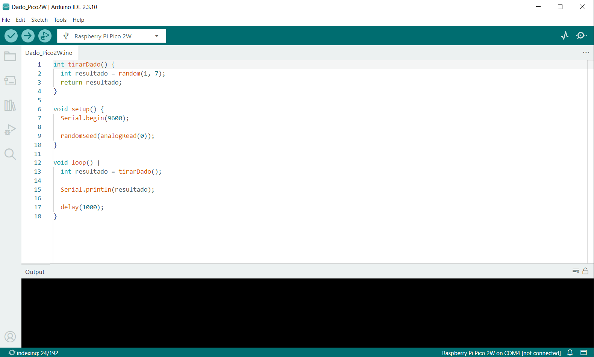
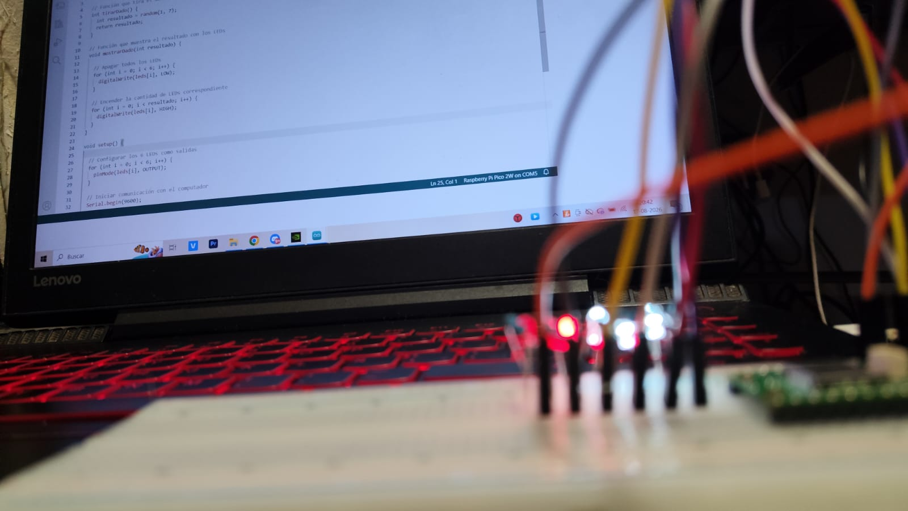
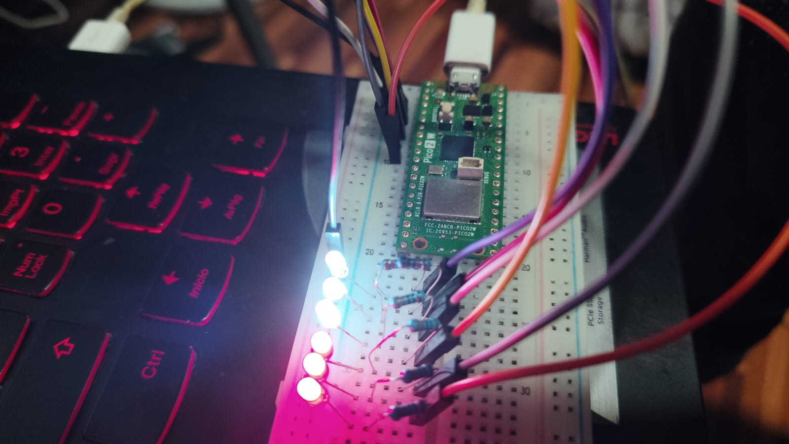

# sesion-01b

14-08-2026

## apuntes sesión

Hoy vamos a leer nuestras descripciones propias y las vamos a pasar a código.

- Tipo: es qué tipo de dato puedo tener.

- Variables: pueden ser extremas y pueden valer SÍ o NO.

Variable booleana

---

Firefox y hay atajos para buscar en la web, no con Google. EJEMPLO:

- !g: Google
- !w: Wikipedia
- !yt: YouTube

---

Álgebra Booleana

### AND gate / OR gate

### OR

A + 0 = A

A + 1 = 1

A + A = A

A + (opuesto de) A = 1

### AND

A * 0 = 0

A * 1 = A

A * A = A

A * (opuesto de) A = 0

Entonces vamos a describirnos con valores. Ej.: si es verdadero vale 1 y si es falso vale 0.

Un bicho = un Bug, gracias a que una polilla no dejó cerrar una compuerta.

Necesidad de formas "variables" y "constantes" en rangos distintos.

Los datos no caben en un computador, así que se aproximan para la retención humana.

Ejemplo

Variable: Rut

Funciones: Ver, moverse, hablar

Hay niveles de abstracción dependiendo de qué necesitemos programar.

**String** = es una cadena (tiene un núcleo y una espiral por encima envuelta como en cuerdas de guitarra).

C++ Variables: https://www.w3schools.com/cpp/cpp_variables.asp

**EN COMPUTACIÓN PARTIMOS CONTANDO DESDE EL CERO.**

Enteros de ej.: 8 bits (2 elevado a 8) = 256 posibles valores / -127, 126 y como estoy midiendo siempre en valor positivo.

- int8_t = 8, con signo
- uint8_t = 8, sin signo (La "U" es sin signo)
- int16_t = 16, con signo
- uint16_t = 16, sin signo

Vamos a instalar 2 programas que nos acompañarán en este periodo del semestre.

Arduino IDE (entorno de desarrollo integrado).

Para conversar con el Arduino, las que están en el lab es la "UNO R4". Tiene USB C.

Historia de Arduino: https://arduinohistory.github.io/

Cursos Gratis, usabilidad y etc.: https://github.com/ITPNYU/physcomp

https://itp.nyu.edu/physcomp/

Cuando inyectamos un software. Es el programa de Arduino.

- Void = Vacío "es un tipo", no responde con nada después de pasar algo.
- En Arduino, setup() es la función principal de configuración que se ejecuta una sola vez al encender o reiniciar la placa.
- El murciélago "{,}" Ej.: {- esto declara la función Setup.

Declarar es para señalar que algo existe.

Si es setup. Ej.: en la línea 2, qué hay: // esto es un comentario que describe todo lo que va a pasar.

Acá está prohibido escribir una línea de código si no está comentada con lo que realiza, porque lo importante es leer lo que describe lo que se supone que hace, lo que debería pasar, por lo que estamos describiendo un pseudocódigo que describe lo que queremos.

() si veo paréntesis hay una indicación.

**Loop()**: Ocurre repetidamente.
// aquí va loop()
// ocurre después de setup()
// se repite hasta que no se pueda

Backtick = `

If condicional: una estructura de control en programación que evalúa si una condición es verdadera para ejecutar código, o las oraciones condicionales con "if" en inglés que expresan situaciones y sus resultados.

Luego, para colocar códigos y que se sepa el lenguaje, ej.: `, y luego cerramos con los mismos, pero iniciamos así para C++ ```cpp

### Este código en Arduino IDE (ejemplo Angel, lo escribí mientras se impartía la clase) 

```cpp
// Angel es estudiante udp
//bools
bool AngelEstudianteUDP = true;
bool AngelColombiano = true;
bool AngelCoreano = false;
bool AngelDientes = true;

// integers
int AngelEdad = 23;

int AngelNacimientoAnho = 2003;
// enero es 1, diciembre 12 
int AngelNacimientoMes = 06;
// dias desde 1 hasta que termine el mes
int AngelNacimientoDia = 13;

// negro
string AngelColorFavorito = "000000";

// 10 millones de colores
// 24 bits tengo mas de 10 millones de valores posibles
// 3 receptores rojizo, verdoso, azuloso
// desmosle 8 bits a cada canal de color
// entonces rojo tiene 8 bits
// G de verde tb, B de azul tb
// entonces 0 es apagado, 255 es prendido al maximo
// 8 bits se llaman 1 byte
// disco duro 2 MB mega bites, pero de 2 Mb y esos son 2 mega bit

// 1 byte tiene 2 nibbles, 2 pedacitos


// en 1 nibble, o 4 bits tengo 2 elevado a 4 valores posibles
// del 0 al 15


// sistema decimal   luego colocaron el sistema hexadecimal
// 00                      0
// 01                      1
// 02                      2
// 03                      3
// 04                      4
// 05                      5
// 06                      6
// 07                      7
// 08                      8
// 09                      9
// 10                      A
// 11                      B
// 12                      C
// 13                      D
// 14                      E
// 15                      F

// estoy en el dia de nacimiento
// de Angel
// le deseo feliz cumpleanhos

// scope esta dentro de {}
// scope es un contexto

//if (mesActual == AngelNAcimientoMes)  {
// estoy en el mes interesado

// if (diaActual == AngelNacimientoDia) {

  // decirle feliz cumple
  // que se tome el dia libre
  // traer cositas pa picar
//}

if (mesActual == AngelNAcimientoMes &&
diaActual == AngelNacimientoDia)


// }
}


En Arduino tien un editor para reglas y estandares como auto formatear, también finalizar o algo que esto termina acá (importantes comentarios o punto y coma) Hay señales como que las funciones están pegadas al borde, La "v" hace void

- las funciones tienen parentesis
- las funciones tienen nombre
- Primero se resuelve el valor de la derecha se inserta al valor de la isquierda

// la vamos a correr cuando
// sea el cumple de Angel
void cumplirAnhosAngel() {
 // actuializar la edad de Angel
 // edad es la que es mas uno
 AngelEdad = 23 + 1;
 // manera abreviada
 // AngelEdad += 1; (esta no la vamos a usar pero existe)
 // AngelEdad++; (esta no la vamos a usar pero existe)
}
```

### Otro ejemplo:

```cpp
int valorPancito = 2000;
int valorCafecito = 3000;

void setup() {
  // put your setup code here, to run once:

}

void loop() {
  // put your main code here, to run repeatedly:

  int valorDesayuno = sumarEnteros(valorPancito, valorCafecito);

  if (valorDesayuno < 5000) {
    // oh no 
  } else {

    // oh si
  }

}

// sumar numeros enteros
// es tipo int porque nos va a dar un resultado
// las void ocurren sin emitir un resultado
int sumarEnteros(int x, int y) {
  // declarar un resultado
  int resultado = 0;
  // es una abreviacion de dos pasos
  // declarar       int resultado;
  // asignar valor  resultado = 0;

  // hacer la suma de x e y
  // y reemplazar valor resultado
  // por ese valor
  resultado = x + y;

  // emitir resultado al exterior de la funcion
  return resultado;

  // declarar solo lo puedo hacer una vez
}
```


## encargos

encargo01b:

1. tratar de correr un código en el microcontrolador asignado a cada dupla, incluir referentes, citas, comentarios, imágenes, descripciones textuales, y en caso de éxito o fracaso incluir aciertos, preguntas, dramas, atados. recordatorio que estos apuntes son personales, cada persona sube su versión.

---

### Solución 1

Al comenzar el trabajo, mi compañero y yo intentamos ejecutar un código utilizando Arduino IDE en la Raspberry Pi Pico 2 W que tomamos en clase. Primero tuvimos un problema con el espacio del computador, ya que el disco local C: estaba lleno sin siquiera 50 megas de espacio, por eso tuvimos que desinstalar programas que no utilizábamos, eliminar archivos innecesarios y mover parte de la configuración "por no decir que todo el programa", archivos temporales y funcionamiento de Arduino hacia el disco local D:.

Fotos de proceso:

| Imagen 1 | Imagen 2 |
|:---:|:---:|
|  |  |

| Imagen 3 | Imagen 4 |
|:---:|:---:|
|  |  |

Después configuramos Arduino IDE para utilizar la Raspberry y realizamos las primeras pruebas de conexión. Un problema importante fue que el primer cable micro USB que utilicé sí encendía la Raspberry pero no la reconocía correctamente el computador, por lo que inicialmente no aparecía ningún puerto en Arduino IDE. Al cambiar el cable, finalmente apareció COM4 en la configuración porque reconoció la conexión y pudimos continuar.

Como primera prueba utilizamos el ejemplo Blink, que compiló y se cargó correctamente, mostrando Done uploading.



Algunos de los primeros aciertos fue preguntarnos por qué un cable podía entregar energía a la placa pero no permitir la comunicación de datos.

Después propusimos una función relacionada con nuestro proyecto: tirarDado(), de tipo int, sin argumentos y su uso es generar un número aleatorio entre 1 y 6.

El pseudocódigo fue: “Generar un número aleatorio entre 1 y 6, guardar el número en resultado y devolverlo”.

Durante el primer código apareció el error undefined reference to setup y undefined reference to loop; aunque esas funciones estaban escritas, solucionamos el problema creando un sketch nuevo y colocando nuevamente el código.

Luego al intentar subirlo, Arduino mostró No drive to deploy y entonces tuvimos que utilizar el botón BOOTSEL de la Raspberry, en ese modo la placa apareció en el computador como RP2350, por lo que ahora si dejó que funcionara. Al volver a conectar la placa "con el cable nuevo + el bootsel y el nuevo sketch" el puerto pasó de COM4 a COM5 en el Serial Monitor, configurado a 9600 baudios, comenzaron a aparecer números entre 1 y 6, permitiendo que tirarDado() funcionara en el microcontrolador.



Estos problemas fueron parte de los dramas y preguntas del proceso: qué hacía BOOTSEL, por qué aparecía RP2350, por qué cambiaba el puerto COM y cómo funcionaba random(1, 7).

Para finalizar mi compañero y yo realizamos el montaje físico del dado utilizando seis LEDs de 5 mm, cada uno con una resistencia de 330 Ω, conectados en línea recta a los GPIO 2, 3, 4, 5, 6 y 7 de la Raspberry, compartiendo GND.

- Primero probamos un solo LED y no encendió porque habíamos olvidado conectar tierra (GND), al corregirlo funcionó correctamente.

Luego conectamos los seis LEDs y comprobamos que se encendieran uno por uno y en orden, confirmando que las conexiones y los GPIO funcionaran. Hasta que finalmente integramos tirarDado() con una función mostrarDado(resultado), haciendo que si salía 1 se encendiera un LED, si salía 2 dos LEDs y así sucesivamente hasta 6, mientras el resultado también aparecía en el Serial Monitor.





El principal acierto fue conseguir que el código se ejecutara en el microcontrolador y controlar físicamente los seis LEDs.

Los principales atados fueron el poco espacio del disco C, el cable USB que solo entregaba energía, los errores de compilación y carga, el cambio de COM4 a COM5 y la falta inicial de GND.

Como reflexión personal, aprendí que trabajar con un microcontrolador no consiste solamente en escribir código, sino también en solucionar problemas de almacenamiento, comunicación, programación y conexiones eléctricas, y que los errores y preguntas que aparecieron durante el proceso fueron parte fundamental para conseguir finalmente un dado electrónico funcional.

---

2. proponer una función con nombre, tipo, argumentos y uso, que modele algún área de su interés, por ejemplo subirCerro(enBicicleta), tomarMetro(conPaseEscolar), etc. escribir en pseudocódigo los pasos que necesita esa función internamente para que literalmente funcione.

---

### Solución 2

### Código

```cpp
// Pines donde están conectados los 6 LEDs
int leds[] = {2, 3, 4, 5, 6, 7};

// Función que tira el dado
int tirarDado() {
  int resultado = random(1, 7);
  return resultado;
}

// Función que muestra el resultado con los LEDs
void mostrarDado(int resultado) {

  // Apagar todos los LEDs
  for (int i = 0; i < 6; i++) {
    digitalWrite(leds[i], LOW);
  }

  // Encender la cantidad de LEDs correspondiente
  for (int i = 0; i < resultado; i++) {
    digitalWrite(leds[i], HIGH);
  }
}

void setup() {

  // Configurar los 6 LEDs como salidas
  for (int i = 0; i < 6; i++) {
    pinMode(leds[i], OUTPUT);
  }

  // Iniciar comunicación con el computador
  Serial.begin(9600);

  // Inicializar la semilla aleatoria
  randomSeed(analogRead(0));
}

void loop() {

  // Tirar el dado
  int resultado = tirarDado();

  // Mostrar el resultado con los LEDs
  mostrarDado(resultado);

  // Mostrar el resultado en Serial Monitor
  Serial.println(resultado);

  // Esperar 2 segundos
  delay(2000);
}

```

| Elemento                     | ¿Qué es / qué hace?                                                                   |
| ---------------------------- | ------------------------------------------------------------------------------------- |
| `int`                        | Tipo de dato para guardar **números enteros**.                                        |
| `leds[]`                     | Arreglo que guarda los números de los **pines de los LEDs**.                          |
| `{2, 3, 4, 5, 6, 7}`         | Valores guardados dentro del arreglo. Son los GPIO utilizados.                        |
| `[]`                         | Indica que se está trabajando con un **arreglo**.                                     |
| `tirarDado()`                | Nombre de nuestra función que genera el resultado del dado.                           |
| `()`                         | Contiene los **argumentos** de una función. Vacío significa que no recibe argumentos. |
| `void`                       | Indica que una función **no devuelve ningún valor**.                                  |
| `resultado`                  | Variable que guarda el número obtenido.                                               |
| `random(1, 7)`               | Genera un número aleatorio entre **1 y 6**.                                           |
| `return`                     | **Devuelve** un valor desde una función.                                              |
| `mostrarDado(int resultado)` | Función que recibe el resultado y controla los LEDs.                                  |
| `for`                        | Repite un bloque de código varias veces.                                              |
| `int i = 0`                  | Crea `i` y comienza su valor en 0.                                                    |
| `i < 6`                      | Indica que el `for` continúa mientras `i` sea menor que 6.                            |
| `i++`                        | Aumenta `i` en **1**.                                                                 |
| `leds[i]`                    | Busca dentro del arreglo el LED que corresponde al número de `i`.                     |
| `digitalWrite()`             | Enciende o apaga un pin digital.                                                      |
| `HIGH`                       | Pone el pin en estado **encendido/alto**.                                             |
| `LOW`                        | Pone el pin en estado **apagado/bajo**.                                               |
| `pinMode()`                  | Define cómo funcionará un pin.                                                        |
| `OUTPUT`                     | Indica que el pin será utilizado como **salida**.                                     |
| `Serial.begin(9600)`         | Inicia la comunicación con el computador a **9600 baudios**.                          |
| `Serial.println()`           | Muestra un dato en el **Serial Monitor** y baja a la siguiente línea.                 |
| `randomSeed()`               | Inicializa la generación de números aleatorios para variar las secuencias.            |
| `analogRead(0)`              | Lee un valor analógico del pin indicado; aquí se usa como semilla para `randomSeed`.  |
| `delay(2000)`                | Pausa el programa durante **2000 milisegundos (2 segundos)**.                         |
| `setup()`                    | Se ejecuta **una sola vez** al iniciar la Pico.                                       |
| `loop()`                     | Se ejecuta **repetidamente** mientras la Pico esté funcionando.                       |
| `{ }`                        | Indican el **inicio y final** de un bloque de código.                                 |
| `;`                          | Indica el **final de una instrucción**.                                               |
| `=`                          | Asigna un valor a una variable.                                                       |
| `<`                          | Significa **“menor que”**.                                                            |

En resumen, el programa hace esto:

- setup(): prepara los LEDs y la comunicación.
- Paos: loop(), tira el dado, guarda el resultado, enciende los LEDs correspondientes, muestra el número, espera 2 segundos, vuelve a tirar.

**int tirarDado() {
  int resultado = random(1, 7);
  return resultado;
}

int = devuelve un número entero, tirarDado() = nombre de la función, random(1, 7) = genera números del 1 a 6, resultado = guarda el número, return = devuelve ese número.**

- Al no entender mucho cómo iniciar, tuve indicaciones y seguí pasos con ayuda de la IA para realizar este código.

---

## lectura

Resumen:

Estas páginas presentan una introducción al hardware de la Raspberry Pi, revisando sus principales puertos y conectores.

Se explican conexiones como Ethernet, micro USB, USB 2.0 y 3.0, además de conectores utilizados para cámaras y pantallas táctiles.

También describen el puerto AV, que permite enviar audio y vídeo compuesto a televisores, proyectores u otras pantallas mediante un adaptador TRRS.

2 Citas:

“televisores, proyectores y otras pantallas que admitan una señal de vídeo compuesto”

“un adaptador TRRS (las iniciales inglesas de punta-anillo-anillo-cuerpo)”

Pregunta:

¿Qué función específica cumple cada uno de los conectores de la Raspberry Pi y qué tipo de dispositivos puedo conectar en ellos?

Referente:

Como referente puedo considerar otras placas y dispositivos electrónicos, ya que muchos utilizan conexiones USB, Ethernet y conectores especializados para comunicarse con periféricos tal como una compu de mesa.

Esto permite relacionar la Raspberry Pi con dispositivos que ya conozco, como computadores y smartphones.

Aseveración:

La Raspberry Pi no funciona únicamente como una placa para programar, sino que cuenta con diferentes puertos y conectores que permiten conectarla con otros dispositivos, como redes, cámaras, pantallas, proyectores, televisores, sistemas de audio y periféricos USB.
