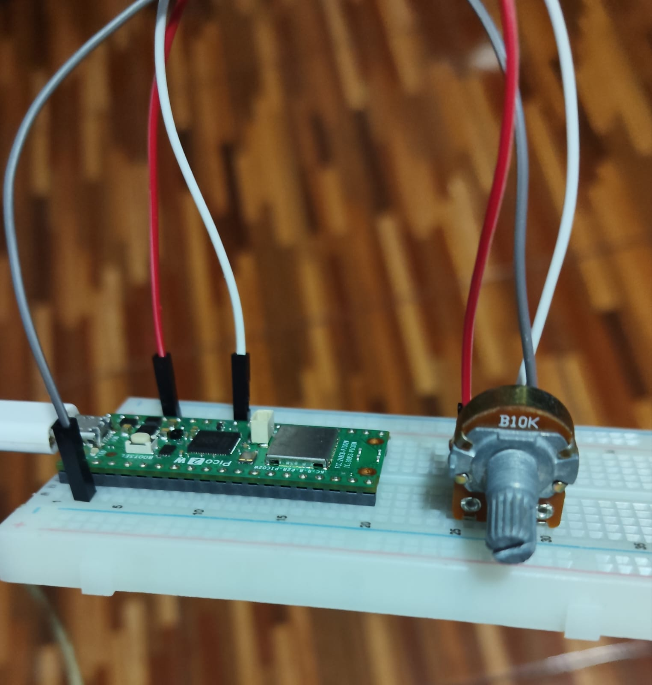
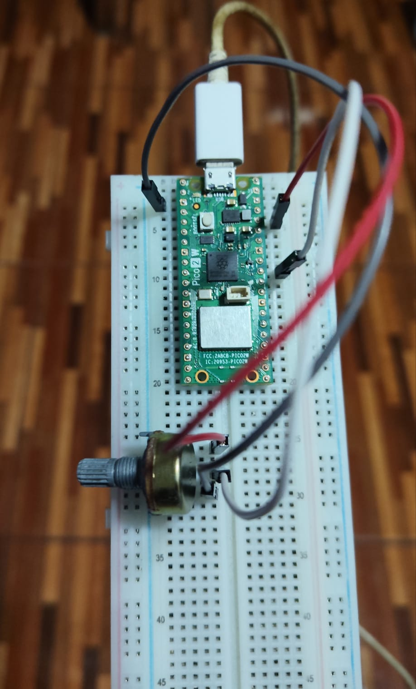
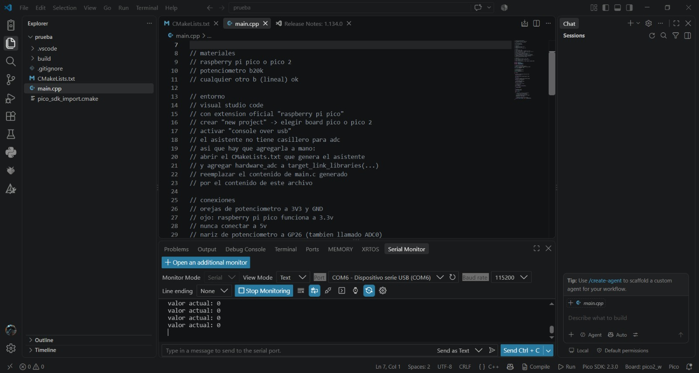

# sesion-02b

clase cancelada por cierre de udp

## apuntes sesión

## encargos

encargo02b:

subimos videos en canvas de hoy, son 3 videos.

1: instalar visual studio code, cami está regrabando el video parte 1 porque tuvimos un problema ténico, les avisará por discord cuando esté listo
2: ver los videos parte 2 y parte 3, aunque no tengan una placa raspberry pi, anotar dudas, tratar de subir código a sus placas si es que las piden.

### Solución encargo

Revisé los videos y como anteriormente me había llevado a casa una Raspberry Pi Pico 2 W, decidí utilizar los videos como referencia y conectar el potenciómetro a la breadboard que tenía junto al microcontrolador.

Descargué el programa (visual studio code) en mi computador de mesa y en el portátil, aunque al usar la misma cuenta, las rutas de guardado al crear los proyectos son diferentes.

Esto pasa ya que, aunque los cree al mismo tiempo, no son el mismo proyecto. Puede parecer obvio, pero al tener los dos computadores creando el proyecto a la vez pensé que se podía priorizar el guardado de un solo computador, pero no es así, ya que cada uno se guarda de forma independiente.

Para subir el código a la placa primero tuve que entender que funciona distinto al Arduino IDE, por que "Compile" era el apartado que debía seleccionar para compilar y "Run" para iniciar el programa, pero estaban en la parte inferior y no parecían exactamente botones, ni eran fáciles de ver.

Al pulsarlo, inmediatamente se abría una consola donde me indicaba si el código estaba correcto o tenía algún fallo. En este caso, funcionó correctamente, pero me demoré bastante en notar que arriba, en la misma consola, decía "Serial Monitor". Este fue el que finalmente me permitió ver el puerto, el baud rate y al iniciar, ver el valor de la perilla del potenciómetro, que en la foto que adjuntaré está en cero.

También adjunto fotos de las conexiones en la protoboard o breadboard, como le digan:

| Imagen 1 | Imagen 2 |
|:---:|:---:|
|  |  |

Código funcionando:

Mis dudas fueron:

- ¿Cómo se utiliza el Serial Monitor de Visual Studio Code para visualizar los valores que envía la Pico mediante printf()?
- ¿Cómo se identifica correctamente el puerto COM de la Raspberry Pi Pico 2 W?
- ¿Cómo se debe conectar un potenciómetro a un pin ADC y por qué no se puede utilizar cualquier GPIO para leer valores analógicos?

## lectura
