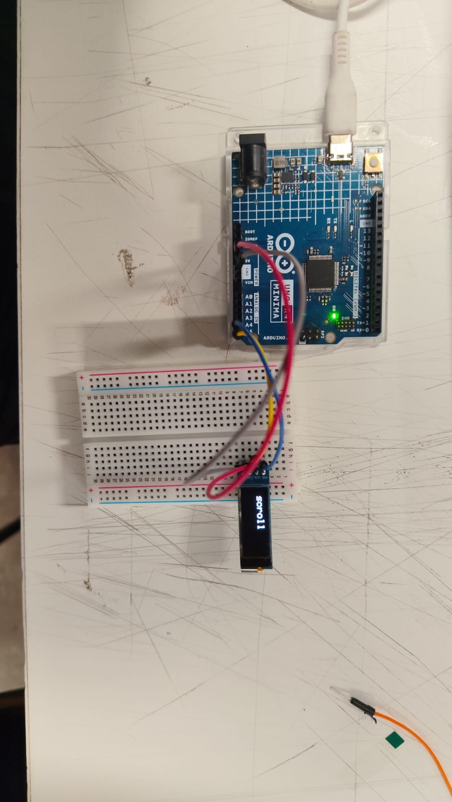

# sesion-03a

25-08-2026

## apuntes sesión

0,91 pulgadas en diagonal (es la pantalla que usaremos). Las pantallas se miden en diagonal, es lo que importa.

Equidistante, en el medio, colocar la pantalla en la protoboard para que no se entrelacen los cables.

Se conecta GND y VCC.

- SDA: señal de datos.
- SCK: señal de clock o "reloj".

En Arduino: BIBLIOTECA, no librería.

Usaremos Adafruit SSD1306, versión 2.5.17.

Controlador: SSD1306.

Para borrar, es importante no dejar un murciélago flotando para borrar y no destruir el código.

## encargos

y aunque no hubo encargo este fue el aporte que hice para el grupo en cuanto a la distribución del poema que queremos implementar para el encargo:

este poema nada puede resolver
adentro del poema la muerte se consume
// disolver este extracto por palabras y que cada vez sea menos visible

ya, dilo de nuevo, el porcentaje de pureza mezclado con un poco de sol,
con un poco de hambre
// que aparezcan letras o palabras que luego vayan desapareciendo en el orden que salieron ej: 1,2,3 luego se van: ,2,3 y luego , ,3 hasta quedar en nada: , , y aparezcan las otras palabras

todo acaba aquí y de pronto no,
// puede aparecer un espacio grande con letra “size 1” donde haya un espacio gigante entre (todo acaba aquí) y (y de pronto no,)

un nuevo servidor, un poema electrónico, un mesías
// que aparezca pequeña letra por letra y la palabra “electrónico” sea más grande y un MESÍAS aparezca con contraste de letras negras y fondo blanco

poema bajando desde el cielo
// que vaya de arriba a abajo en sentido inverso para que se lea en orden

sólo los elegidos contemplan su propia destrucción
no, en serio, este poema nada puede resolver
// aparece todo el párrafo y se van yendo las palabras hacia arriba una por una hasta que solo queda en la pantalla: “este poema nada puede resolver”

## lectura

Resumen:

Después de entender más sobre las conexiones, pasé a descubrir y seguir leyendo sobre que en la placa hay “40 pines metálicos divididos en dos filas de 20 pines cada una”, correspondientes al sistema GPIO (entrada/salida de uso general), un componente utilizado para hardware.

También se describen un poco más otras conexiones, como HAT PoE, que permite la alimentación a través de Ethernet, y el almacenamiento mediante una tarjeta microSD.

Para la pág. 20 muestran la Raspberry Pi 400, donde no solo es un teclado, sino que también tiene una Raspberry Pi debajo de la carcasa, que se enciende cuando está prendido el tercer LED del teclado. Los pines se ven en la parte trasera de este mismo, al igual que las conexiones.

En el capítulo 2, en la pág. 22, se menciona que se hizo la Raspberry Pi para ser tan rápida y fácil de configurar como sea posible. Además, se puede conectar a monitores o pantallas de TV por medio del puerto HDMI.

Por último, se pudo apreciar hasta la pág. 24 el hardware necesario para empezar a usar la Raspberry Pi de una forma segura y no la Raspberry Pi 400, porque esa es la que viene con el teclado y la mencionarán más adelante. Además, mencionan que es robusta, pero no está de más colocarle una carcasa para mejorar su cuidado.

2 Citas:

“40 pines metálicos divididos en dos filas de 20 pines cada una”

“sistema GPIO: (entrada/salida de uso general)”

Pregunta:

¿Qué función cumplen los 40 pines GPIO de la Raspberry Pi y qué tipo de hardware puedo conectar a ellos?

Referente:

Puedo relacionar los pines GPIO con otras placas electrónicas que también utilizan pines para conectar diferentes componentes de hardware, como la Raspberry Pi Pico 2 w y el Arduino que he utilizado anteriormente.
