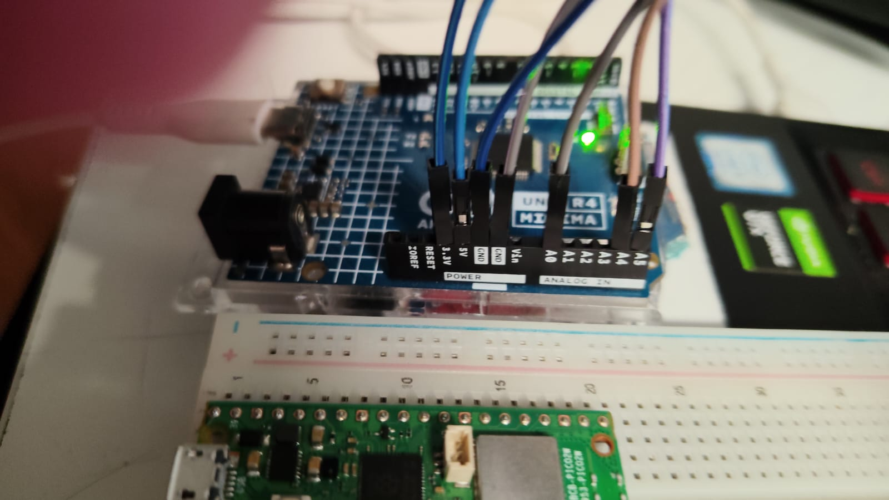
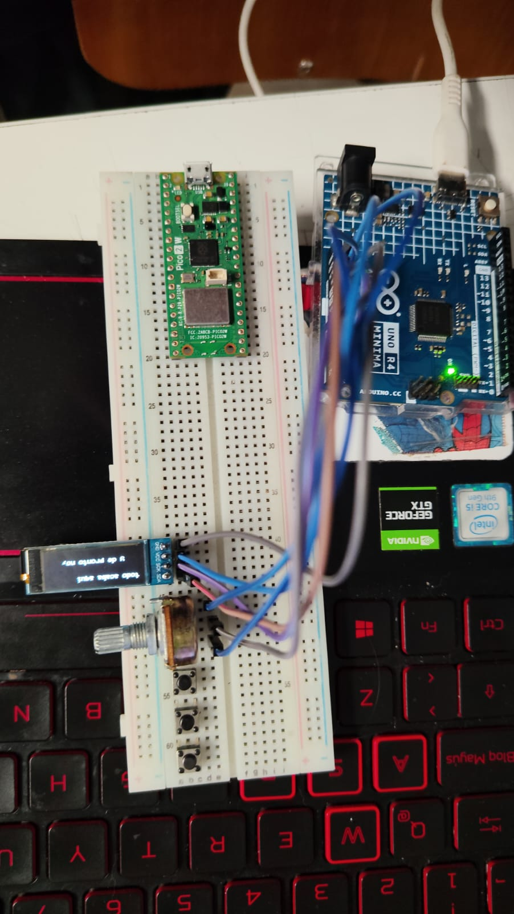
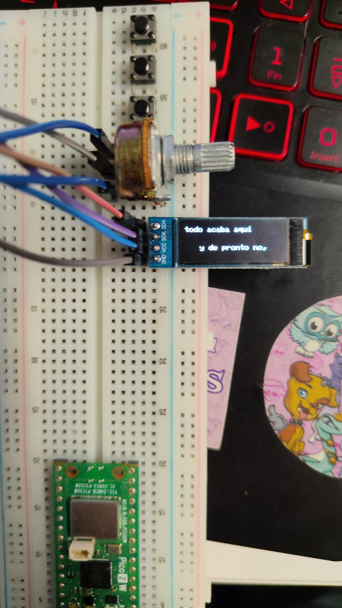
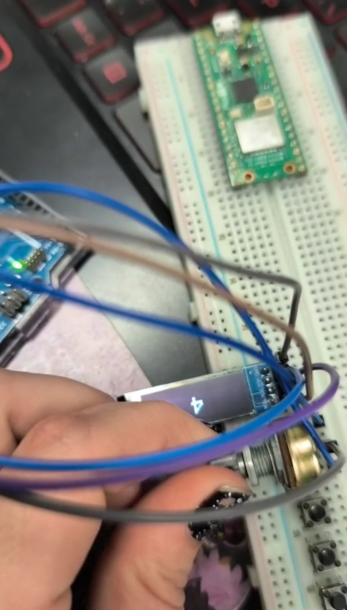
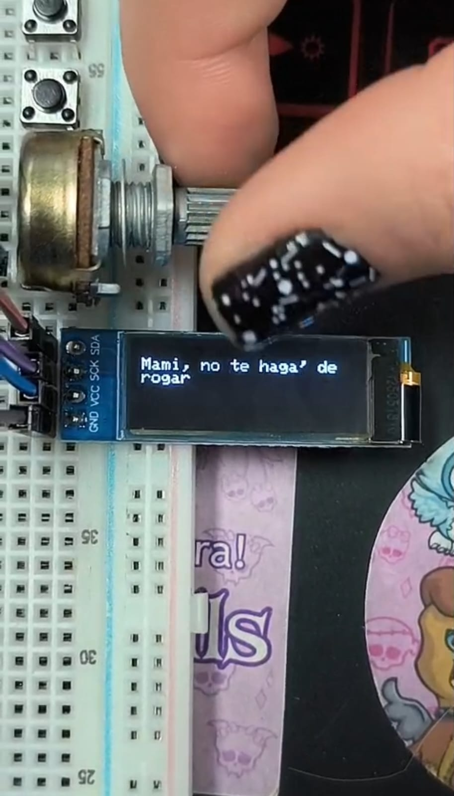

# sesion-03b

28-08-2026

## apuntes sesión

Existe una clase que se llama **String**, es un estilo de vida.

Cuando algo tenga mayúscula es una clase y es importante solo mayuscular esto.

* En inglés, como un collar de secuencias.
* Una versión particular que sea un carácter.
* En un lenguaje particular es para encerrar texto.
* Se puede hacer un carácter con una comilla simple.

Si es con minúscula, no es lo mismo.

El computador no sabe cuánto va a medir, por eso se pone la palabra o la cantidad de caracteres entre paréntesis.

Set es configuración y cuando uno configura dice cómo va a ser ahora, para cambiar lo que va dentro del String.

Arduino también deja poner String con minúscula.

El texto se puede describir con tipos de datos con S mayúscula y es una estructura específica ficticia.

Y también se puede decir: existen caracteres y vamos a hacer un arreglo.

Lo que podemos hacer es un arreglo de tipo carácter que corra C++.

Corchete indica arreglo. Ej.: `char palabrita[]`, tiene que llevar corchete, lo que sea que escribamos.

Link ejemplo: https://docs.arduino.cc/language-reference/en/variables/data-types/string/

Ejemplo código en clase:


```cpp
// declaracion de arreglo de enteros
// que se llama edades
int edades[3] = { 37, 22, 24 };

void setup() {
  Serial.begin(9600);
}

void loop() {
  Serial.print(edades[0]);
  Serial.print(", ");
  Serial.print(edades[1]);
  Serial.print(", ");
  Serial.println(edades[2]);
}
```
eso es para colocar la cantidad y las edades

```cpp
// un poemario
// es un arreglo de paginas
// una pagina es un arreglo de lineas
// una linea es un arreglo de caracteres
```

el asterisco "*" nos permite hacer un arreglo de arreglos

```cpp
// un poemario
// es un arreglo de paginas
// una pagina es un arreglo de lineas
// una linea es un arreglo de caracteres

char *misVersos[] = {
  "Mami, no te haga' de rogar",
  "No me gustaría perder el tiempo",
  "Que tenemo' pa' poderte tocar",
  "Y estás con otro, esa mierda no lo entiendo, yeah",
  "Que te lo juro, no eres nada pa' mí, te lo juro, ah",};


// bah que raro
// con 5 no funciono
char nombre[6] = "aaron";

void setup() {
  Serial.begin(9600);
}

void loop() {
  Serial.println(misVersos[0]);
}
```

un for es para recorrer conjuntos

la linea se separa con punto y coma pero en el for hay 2

para el caso si i parte desde cero queremos que recorra desde cero hata ej 5 entonce i++ es = lo que sea que valga i + 1

```cpp
// un poemario
// es un arreglo de paginas
// una pagina es un arreglo de lineas
// una linea es un arreglo de caracteres

char *misVersos[] = {
  "Mami, no te haga' de rogar",
  "No me gustaría perder el tiempo",
  "Que tenemo' pa' poderte tocar",
  "Y estás con otro, esa mierda no lo entiendo, yeah",
  "Que te lo juro, no eres nada pa' mí, te lo juro, ah",
};


// bah que raro
// con 5 no funciono
char nombre[6] = "aaron";

void setup() {
  Serial.begin(9600);
}

void loop() {

  // recorrer el arreglo
  // for es para recorrer conjuntos
  // adentro tiene 3 mini lineas
  // inicio de los tiempos
  // oye pero cuando paro
  // que hago despues de cada iteracion
  for (int i = 0; i < 5; i++) {
    Serial.println(misVersos[i]);
  }
}
```


## encargos

encargo-03b:

1. apuntes personales de String, string, array, con bibliografia y con pantallazos de resultados, y dudas textuales.
2. subir código a su bitácora ordenado con el formato de backticks a continuación, del proyecto hasta ahora.
3. definir y escribir el corpus a usar: autora, poemas, licencias, poblarlo en la carpeta 00-proyecto-1

```cpp
// codigo aqui
// por ejemplo
```

### Solución encargo

1. Los apuntes personales están basados en lo que estoy leyendo actualmente y lo escrito en clases sobre: String, string y array

**String** con "S" mayúscula: se utiliza para representar una cadena de caracteres o texto como una palabra, frase o conjunto de caracteres y símbolos este es principalmente usado en lenguajes de programación y en C++ no existe un estándar de esa forma por lo que es clave diferenciarlo del std::string

**string** En C++ se utiliza como std::string y sirve para almacenar textos y también trabajar con ellos, permite guardar desde una sola palabra hasta frases completas y también realizar diferentes operaciones como conocer cuántos caracteres tiene un texto, unir dos textos, comparar cadenas o acceder a un carácter específico. Para utilizarlo normalmente se incluye la biblioteca <string>.

**array** Un array permite almacenar varios valores dentro de una misma estructura a la hora de escribir código, en lugar de crear una variable diferente para cada valor o dicho de otra manera "estar haciendo uno por uno los cambios". Los elementos normalmente deben ser del mismo tipo, por ejemplo: varios números enteros, palabras, frases. Cada elemento ocupa una posición llamada índice, que comienza desde 0, gracias a esto podemos encontrar el elemento que deseamos por la posición en la que se encuentra

**El código usado para la prueba + fotos con la bibliografía:**

en este caso el código fue con el que experimentamos y nos mandó el profe durante la clase, que ya puse anteriormente en la bitácora arriba:

```cpp
// un poemario
// es un arreglo de paginas
// una pagina es un arreglo de lineas
// una linea es un arreglo de caracteres

char *misVersos[] = {
  "Mami, no te haga' de rogar",
  "No me gustaría perder el tiempo",
  "Que tenemo' pa' poderte tocar",
  "Y estás con otro, esa mierda no lo entiendo, yeah",
  "Que te lo juro, no eres nada pa' mí, te lo juro, ah",
};


// bah que raro
// con 5 no funciono
char nombre[6] = "aaron";

void setup() {
  Serial.begin(9600);
}

void loop() {

  // recorrer el arreglo
  // for es para recorrer conjuntos
  // adentro tiene 3 mini lineas
  // inicio de los tiempos
  // oye pero cuando paro
  // que hago despues de cada iteracion
  for (int i = 0; i < 5; i++) {
    Serial.println(misVersos[i]);
  }
}
```












2. Hasta ahora el proyecto sigue en proceso por lo que tenemos el texto del extracto del poema que queremos utilizar en escrito, mi aporte:

este poema nada puede resolver
adentro del poema la muerte se consume
// disolver este extracto por palabras y que cada vez sea menos visible

ya, dilo de nuevo, el porcentaje de pureza mezclado con un poco de sol,
con un poco de hambre
// que aparezcan letras o palabras que luego vayan desapareciendo en el orden que salieron ej: 1,2,3 luego se van:  ,2,3 y luego  ,  ,3 hasta quedar en en nada: ,  ,   y aparezcan las otras palabras

todo acaba aquí y de pronto no,
// puede aparecer un espacio grande con letra “size 1” donde haya un espacio gigante entre (todo acaba aquí) y (y de pronto no,)

un nuevo servidor, un poema electrónico, un mesías
// que aparezca pequeña letra por letra y la palabra “electrónico” sea más grande y un MESIAS aparezca con contraste de letras negras y fondo blanco

poema bajando desde el cielo
// que vaya de arriba a abajo en sentido inverso para que se lea en orden

sólo los elegidos contemplan su propia destrucción
no, en serio, este poema nada puede resolver
// aparece todo el párrafo y se van yendo las palabras hacia arriba una por una hasta que solo queda en la pantalla: “este poema nada puede resolver”

aunque este puede ser un acercamiento de experimentación en base a este específico aporte:


```cpp
#include <Wire.h>
#include <Adafruit_GFX.h>
#include <Adafruit_SSD1306.h>

// CONFIGURACIÓN DE LA PANTALLA

// La pantalla OLED tiene una resolución de 128 x 64 píxeles.
#define SCREEN_WIDTH 128
#define SCREEN_HEIGHT 64

// Dirección I2C habitual de la pantalla SSD1306.
#define OLED_RESET -1
#define SCREEN_ADDRESS 0x3C

Adafruit_SSD1306 display(SCREEN_WIDTH, SCREEN_HEIGHT, &Wire, OLED_RESET);

// FUNCIÓN PARA CENTRAR TEXTO

// Esta función calcula automáticamente la posición horizontal
// para que un texto quede centrado en la pantalla.
void textoCentrado(String texto, int y, int tamaño) {

  display.setTextSize(tamaño);
  display.setTextColor(SSD1306_WHITE);

  int16_t x1, y1;
  uint16_t ancho, alto;

  display.getTextBounds(texto, 0, y, &x1, &y1, &ancho, &alto);

  int x = (SCREEN_WIDTH - ancho) / 2;

  display.setCursor(x, y);
  display.println(texto);
}


// PARTE 1
// "este poema nada puede resolver"
// "adentro del poema la muerte se consume"
//
// El texto se muestra y después se disuelve palabra por palabra.
// Cada palabra desaparece siguiendo el orden en que apareció.

void parteUno() {

  String palabras[] = {
    "este",
    "poema",
    "nada",
    "puede",
    "resolver"
  };

  int cantidad = 5;

  // Primero mostramos el texto completo.
  display.clearDisplay();

  textoCentrado("este poema nada", 20, 1);
  textoCentrado("puede resolver", 32, 1);

  display.display();
  delay(2000);


  // Las palabras comienzan a desaparecer.
  //
  // Ejemplo:
  // este poema nada puede resolver
  //      poema nada puede resolver
  //           nada puede resolver
  //                puede resolver
  //                     resolver

  for (int desaparecen = 0; desaparecen < cantidad; desaparecen++) {

    display.clearDisplay();

    int x = 5;

    for (int i = 0; i < cantidad; i++) {

      // Si la palabra todavía no desaparece,
      // se muestra en pantalla.
      if (i >= desaparecen) {

        display.setTextSize(1);
        display.setTextColor(SSD1306_WHITE);
        display.setCursor(x, 28);
        display.print(palabras[i]);

        x += palabras[i].length() * 6;
        x += 3;
      }
    }

    display.display();
    delay(600);
  }


  // Segundo fragmento.
  display.clearDisplay();

  textoCentrado("adentro del poema", 20, 1);
  textoCentrado("la muerte se consume", 32, 1);

  display.display();
  delay(2000);
}


// PARTE 2
// "ya, dilo de nuevo, el porcentaje de pureza mezclado"
// "con un poco de sol, con un poco de hambre"
//
// Las palabras aparecen una por una y posteriormente
// desaparecen en el mismo orden en que aparecieron.

void parteDos() {

  String palabras[] = {
    "ya,",
    "dilo",
    "de",
    "nuevo,",
    "pureza",
    "sol,",
    "hambre"
  };

  int cantidad = 7;

  // APARICIÓN DE LAS PALABRAS

  for (int hasta = 1; hasta <= cantidad; hasta++) {

    display.clearDisplay();

    int x = 2;

    for (int i = 0; i < hasta; i++) {

      display.setTextSize(1);
      display.setTextColor(SSD1306_WHITE);
      display.setCursor(x, 28);

      display.print(palabras[i]);

      x += palabras[i].length() * 6;
      x += 3;
    }

    display.display();
    delay(450);
  }


  delay(1000);


  // DESAPARICIÓN
  //
  // Se eliminan una por una:
  //
  // ya, dilo de nuevo...
  //      dilo de nuevo...
  //           de nuevo...

  for (int desaparecen = 0; desaparecen < cantidad; desaparecen++) {

    display.clearDisplay();

    int x = 2;

    for (int i = desaparecen; i < cantidad; i++) {

      display.setTextSize(1);
      display.setTextColor(SSD1306_WHITE);
      display.setCursor(x, 28);

      display.print(palabras[i]);

      x += palabras[i].length() * 6;
      x += 3;
    }

    display.display();
    delay(500);
  }

  delay(1000);
}


// PARTE 3
// "todo acaba aquí          y de pronto no,"
//
// Se genera un espacio muy grande entre ambas frases.

void parteTres() {

  display.clearDisplay();

  // Primera parte.
  display.setTextSize(1);
  display.setTextColor(SSD1306_WHITE);
  display.setCursor(2, 28);
  display.print("todo acaba aqui");

  // Espacio gigante.
  //
  // En vez de escribir las dos frases juntas,
  // la segunda aparece muy alejada de la primera.
  display.setCursor(105, 28);
  display.print("y");

  display.display();
  delay(2500);

  // Aparece lentamente el resto de la frase.
  display.setCursor(105, 38);
  display.print("de pronto no,");

  display.display();
  delay(2000);
}


// PARTE 4
//
// "un nuevo servidor, un poema electrónico, un mesías"
//
// La frase aparece letra por letra.
//
// "electrónico" aparece con un tamaño mayor.
//
// "MESIAS" aparece con contraste:
// fondo blanco + letras negras.

void parteCuatro() {

  String texto = "un nuevo servidor,";

  display.clearDisplay();

  // APARICIÓN LETRA POR LETRA

  String actual = "";

  for (int i = 0; i < texto.length(); i++) {

    actual += texto[i];

    display.clearDisplay();

    textoCentrado(actual, 8, 1);

    display.display();

    delay(120);
  }


  delay(500);

  // "un poema"

  actual = "";

  for (int i = 0; i < 8; i++) {

    actual += String("un poema")[i];

    display.clearDisplay();

    textoCentrado(actual, 20, 1);

    display.display();

    delay(120);
  }


  delay(500);

  // "ELECTRÓNICO"
  //
  // Se utiliza tamaño 2 para generar contraste visual
  // con respecto al resto del texto.

  display.clearDisplay();

  textoCentrado("electronico", 32, 2);

  display.display();
  delay(2500);

  // "MESIAS"
  //
  // La pantalla se invierte:
  // fondo blanco + letras negras.
  //
  // Esto genera un contraste fuerte con el resto del poema.

  display.clearDisplay();

  display.fillRect(0, 0, 128, 64, SSD1306_WHITE);

  display.setTextSize(2);
  display.setTextColor(SSD1306_BLACK);

  display.setCursor(28, 25);
  display.print("MESIAS");

  display.display();

  delay(3000);
}


// PARTE 5
// "poema bajando desde el cielo"
//
// El poema aparece desde la parte superior de la pantalla
// y va descendiendo hasta su posición final.

void parteCinco() {

  String poema[] = {
    "poema",
    "bajando",
    "desde",
    "el cielo"
  };

  int cantidad = 4;

  // Cada palabra parte desde fuera de la pantalla
  // y baja hasta su posición correspondiente.

  for (int movimiento = -40; movimiento <= 20; movimiento += 3) {

    display.clearDisplay();

    for (int i = 0; i < cantidad; i++) {

      int y = movimiento + (i * 10);

      textoCentrado(poema[i], y, 1);
    }

    display.display();

    delay(80);
  }

  delay(2000);
}

// PARTE 6
//
// "sólo los elegidos contemplan su propia destrucción"
// "no, en serio, este poema nada puede resolver"
//
// Primero aparece todo el texto.
//
// Después las palabras comienzan a desplazarse hacia arriba
// una por una.
//
// Al final solamente permanece:
//
// "este poema nada puede resolver"

void parteSeis() {

  display.clearDisplay();

  textoCentrado("solo los elegidos", 5, 1);
  textoCentrado("contemplan su propia", 17, 1);
  textoCentrado("destruccion", 29, 1);

  textoCentrado("no, en serio,", 41, 1);
  textoCentrado("este poema nada", 51, 1);

  display.display();

  delay(2500);


  // Las primeras palabras comienzan a subir.

  for (int y = 5; y > -20; y -= 3) {

    display.clearDisplay();

    textoCentrado("solo los elegidos", y, 1);
    textoCentrado("contemplan su propia", 17, 1);
    textoCentrado("destruccion", 29, 1);
    textoCentrado("no, en serio,", 41, 1);
    textoCentrado("este poema nada", 51, 1);

    display.display();

    delay(80);
  }


  // Desaparece "contemplan su propia destrucción".

  for (int y = 17; y > -20; y -= 3) {

    display.clearDisplay();

    textoCentrado("contemplan su propia", y, 1);
    textoCentrado("destruccion", y + 12, 1);
    textoCentrado("no, en serio,", 41, 1);
    textoCentrado("este poema nada", 51, 1);

    display.display();

    delay(80);
  }


  // Desaparece "no, en serio".

  for (int y = 41; y > -20; y -= 3) {

    display.clearDisplay();

    textoCentrado("no, en serio,", y, 1);
    textoCentrado("este poema nada", 51, 1);

    display.display();

    delay(80);
  }


  // FINAL
  //
  // Solamente queda:
  //
  // "este poema nada puede resolver"

  display.clearDisplay();

  textoCentrado("este poema nada", 25, 1);
  textoCentrado("puede resolver", 37, 1);

  display.display();

  delay(5000);
}


// SETUP

void setup() {

  // Iniciamos la comunicación con la pantalla.
  if (!display.begin(SSD1306_SWITCHCAPVCC, SCREEN_ADDRESS)) {

    // Si la pantalla no es encontrada,
    // el programa queda detenido.
    while (true) {
    }
  }

  display.clearDisplay();
  display.display();

  delay(1000);
}


// LOOP

// Cada parte del poema se ejecuta en orden.

void loop() {

  parteUno();

  parteDos();

  parteTres();

  parteCuatro();

  parteCinco();

  parteSeis();

  // Cuando termina todo el poema,
  // vuelve a comenzar desde el principio.
  delay(3000);
}
```
aunque esta es una aproximación de experimentación hecha con ayuda de la IA es una de las variables.

3. Nuestro grupo está en la carpeta: 00-proyecto-1, grupo-03.

## lectura

Esta lectura es la misma que pondré para la sesión-04a, solo que como acá está el encargo, igual lo coloco. Pero estas son las 7 páginas de lectura desde el martes pasado.

**Resumen:**

Comienzo en la pág. 25, donde se describe la importancia de instalar la Raspberry Pi dentro de una carcasa oficial para protegerla y mantener correctamente sus componentes.

Luego, en la pág. 26, se menciona cómo conectar la tarjeta microSD. Esta solo puede entrar en un sentido y debería encajar en su lugar sin demasiada presión. Si es necesario forzarla, probablemente existe algún problema.

En la pág. 27 se explica cómo conectar un teclado y un ratón. Estos también deberían conectarse sin demasiada fuerza, ya que si es necesario forzar el conector, puede ser señal de que existe algún problema. También se explica que, en informática, el teclado y el ratón se conocen como dispositivos de entrada, a diferencia de la pantalla, que es un dispositivo de salida.

En la pág. 28 se explica cómo conectar una pantalla. Se muestra cómo conectar los cables micro-HDMI y HDMI respectivamente en cada lugar. Además, se menciona que en el televisor es necesario seleccionar la entrada correspondiente para poder visualizar la Raspberry Pi.

En la pág. 29 se explica cómo conectar un cable de red, aunque este paso es opcional. Se conecta el cable Ethernet de la misma forma en los puertos correspondientes, tanto en la Raspberry Pi como en el conmutador o enrutador de la red.

En la pág. 30 se explica cómo conectar una fuente de alimentación. Este es el último paso del proceso de instalación del hardware. La fuente también se conecta a una toma de corriente y, con esto, la Raspberry Pi ya queda montada.

Finalmente, en la pág. 31 se explica que la primera vez que se conecta la Raspberry Pi hay que esperar algunos minutos, debido a que debe realizar algunas tareas en segundo plano. Después de esto, aparece el asistente de configuración y el sistema operativo Raspberry Pi queda listo para ser configurado. Este procedimiento se aprenderá en el capítulo 3.

**2 Citas:**

1. “Solo puede entrar en un sentido y debería encajar en un sitio sin demasiada presión”.

2. “En informática, se conocen como dispositivos de entrada, a diferencia de la pantalla que es un dispositivo de salida”.

**Pregunta:**

¿Por qué la Raspberry Pi necesita realizar tareas en segundo plano durante varios minutos la primera vez que se conecta antes de mostrar el asistente de configuración?

**Referente:**

Raspberry Pi y sus diferentes componentes de hardware, especialmente la carcasa oficial, la tarjeta microSD, el teclado, el ratón, la pantalla, el cable Ethernet y la fuente de alimentación.
