# sesion-00b

## apuntes sesión

esta clase fue introductoria, por lo que Aarón nos explicó un poco de lo que trataría este semestre y nos presentamos entre todos!!

---

# encargo-01

## Heidi Jalkh: una práctica centrada en los materiales - charla

como parte del encargo-01 se nos informó mediante canvas que el día viernes 07 de agosto a las 09:00 am habría una charla de bienvenida a los talleres verticales, en la cual se hablaría sobre las obras de Heidi Jalkh, profesora del taller vertical _Materia Situada_ junto con Valentina Aliaga. se nos recomendó asistir ya que parte del encargo-01 sería sobre investigación y apuntes de lo que se hable en la charla, la cual se realizó en la Facultad de Derecho UDP (Av. República 105), Aula Magna (ubicada en el piso -1 del edificio).

### apuntes de la charla!! (los reforcé viendo el video que subió la cuenta _Escuela de Diseño udp_ a YouTube, el cual pueden ver apretando el siguiente link: <https://www.youtube.com/watch?v=AMUU7QZXW5E>)

+ la apertura de la charla la realizó Pedro Silva (Director de la Escuela de Diseño), en donde mencionó que la razón que nos convoca es la realización de un primer ejercicio de internacionalización la cual se prolonga por todo el semestre durante el ciclo de talleres verticales y se espera volver a hacer en el futuro, ya que quieren volver a replicar estas nuevas versiones de talleres verticales cada segundo semestre con invitades internacionales provenientes predominadamente de Latinoamérica.
+ Merry hizo una breve presentación de Heidi Jalkh, en donde mencionó lo siguiente:
	+ Heidi Jalkh es diseñadora experimental, docente, investigadora y curadora en el campo de diseño de materiales
	+ la práctica de Heidi Jalkh explora el diseño de materiales a través de la intersección de materiales bioinspirados y biofabricados, la investigación interdisciplinaria y los procesos de producción artesanal, impulsando así los materiales como agentes activos.
	+ su trabajo indaga en cómo el conocimiento emerge a través del hacer incorporado la experimentación y el comportamiento material.
	+ dirige el grupo de investigación _Sistemas Materiales_, ubicado en Buenos Aires y del cual también es parte Valentina Aliaga.
	+ se ha desempeñado como docente de manera continua desde 2009 tanto en pregrado como en posgrado en diversas universidades de Argentina, además de haber sido profesora invitada en distintos países.
+ Heidi Jalkh habla del taller que impartirá (Taller Materia Situada), el cual tiene que ver con reflexiones que ella ha tenido sobre los proyectos en los que ha trabajado.
+ Heidi menciona que lo que hacen en _Sistemas Materiales_ es centrarse en la materialidad como un punto de partida, para así poder observar las posibles operaciones e intervenciones que se pueden realizar en el material.

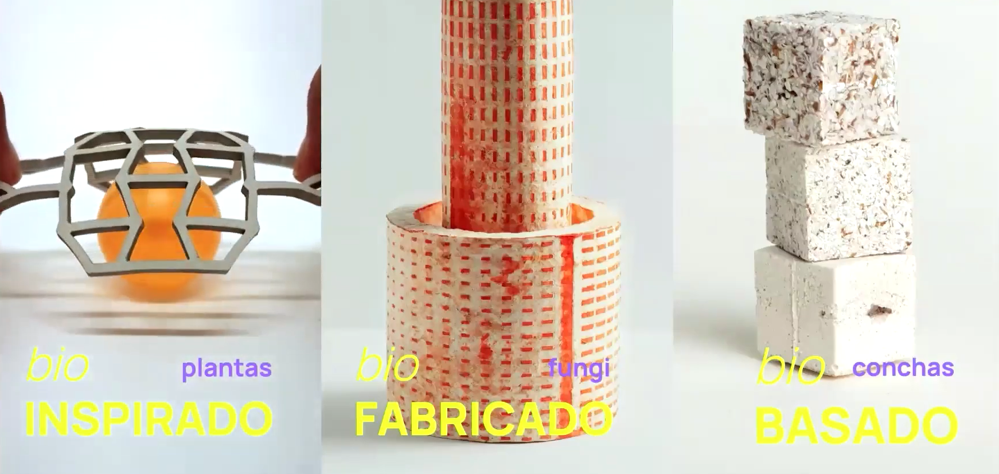

#### bioinspiración

Heidi nos cuenta que hizo una maestría en el programa llamado _Diseño Abierto Para la Innovación_, el cual se imparte entre la Universidad de Buenos Aires y la Universidad de Humboldt de Berlín. dentro de la maestría, uno de sus profesores estaba investigando la _Planta de Hielo_, originaria de Australia la cual absorbe humedad y esto causa que cambie de forma. en base a esta planta y el cambio en su estructura celular se empezó a buscar maneras de simular la expansión fuera del plano que genera la planta, pasando así por distintos diseños y finalmente terminando con el siguiente resultado:

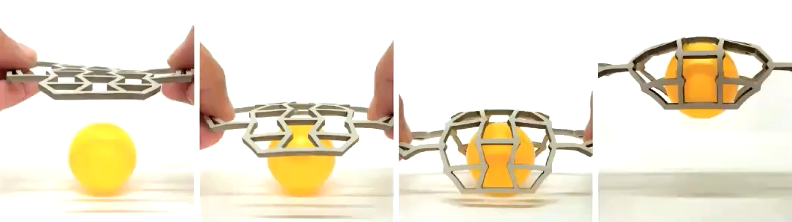

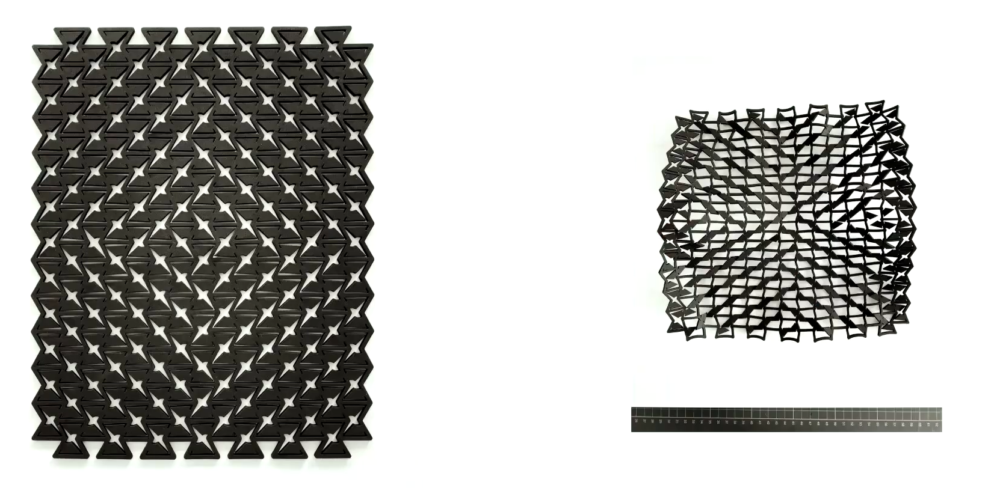

#### biofabricado

en el proyecto de _Interacciones Fúngicas_ se buscó el trabajar con los colores que dan algunos hongos, razón por la cual se probó mezclar hongos que den color para intentar conseguir un color nuevo, pero debido a que los hongos son territoriales esto no se pudo lograr ya que en vez de mezclarse estos luchan para ganar territorio.

para poder aplicar el color con los hongos a una superficie se utilizó un tipo de stencil para así controlar las zonas en donde crecía el color mediante el hongo.

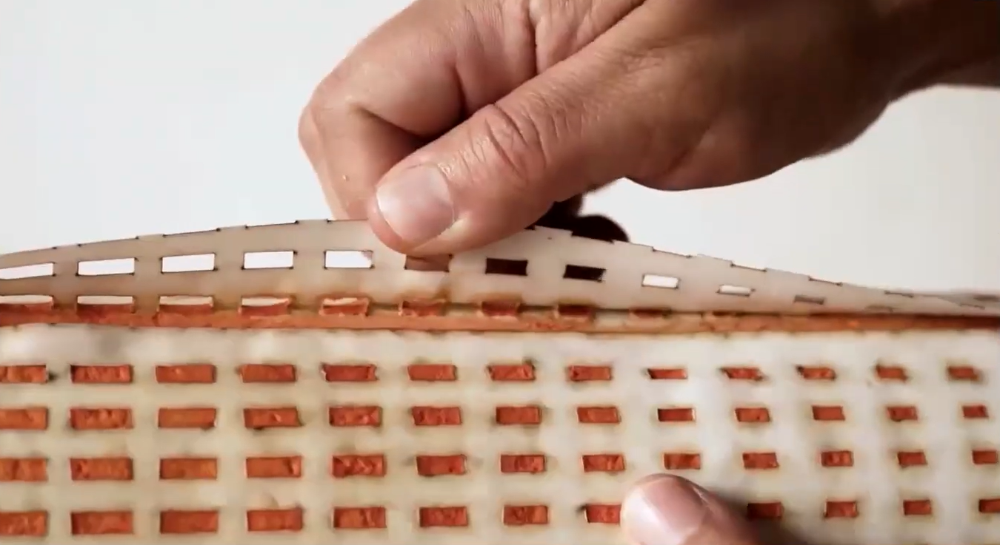

gracias a este proceso, se genera el siguiente resultado en el proyecto _Creciendo Color_:

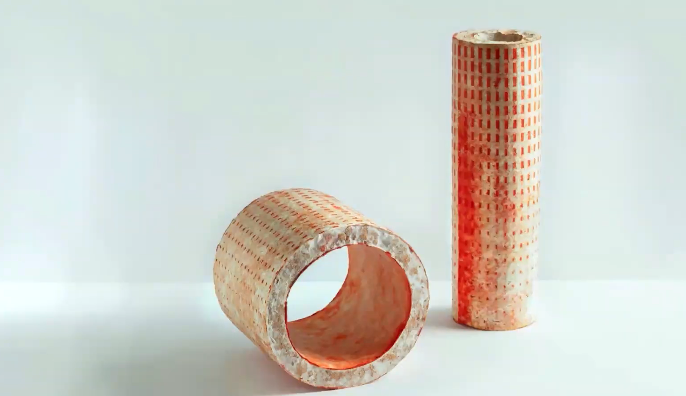

#### biobasado

junto a Angie Dub, arquitecta argentina, trabajó en un proyecto que era para una aplicación en la arquitectura en base al descarte de conchitas que terminan en el vertedero. para probar con distintas apariencias y texturas, se trabajó con choritos, navajas y ostras en variadas granulometrías.

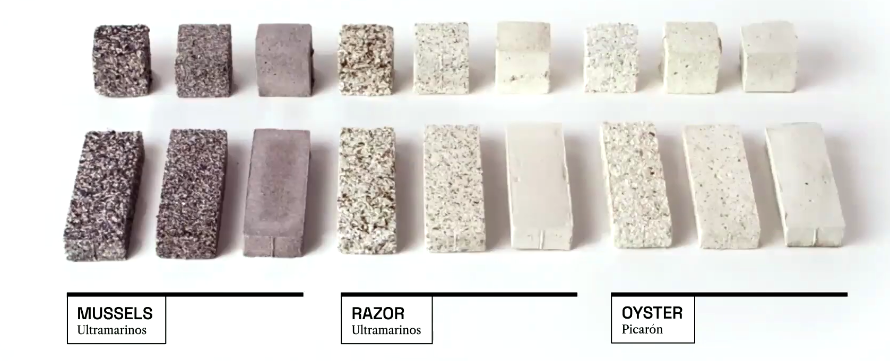

gracias a este proceso, se obtuvieron como resultado el proyecto _CONQ_, hecho por Heidi y Angie en donde se hicieron piezas que se pueden encajar entre si gracias a la forma interna que tienen. este mismo proyecto tuvo un workshop en Berlín, en donde se probó imprimir el material en 3D.

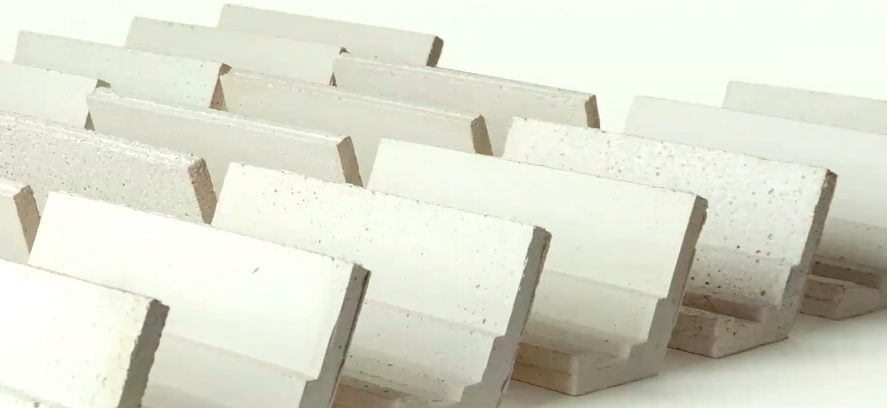

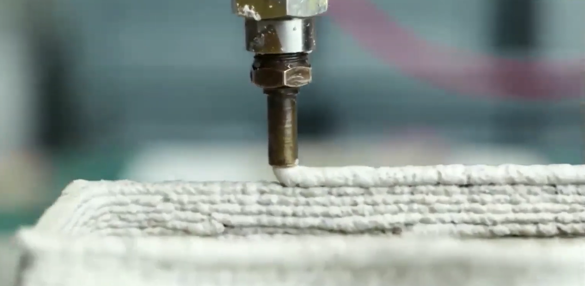

---

## ascensores 

como parte del encargo-01, también se nos indicó sacar fotos de 3 botoneras de ascensores y analizarlos, por lo que elegí los siguientes:

### 1- ascensor Facultad de Arquitectura, Arte y Diseño - República 180

saliendo de la clase decidí sacarle fotos al ascensor del edificio en donde se encuentra nuestra sala (república 180), el cual tiene dos opciones como botón de llamada: arriba, o abajo. yo estaba en el tercer piso y quería bajar al primero, así que presioné el botón para bajar y al momento de presionar el botón se prende un LED el cual indica que el botón ya ha sido presionado, para así evitar que otras personas presionen el mismo más de una vez.

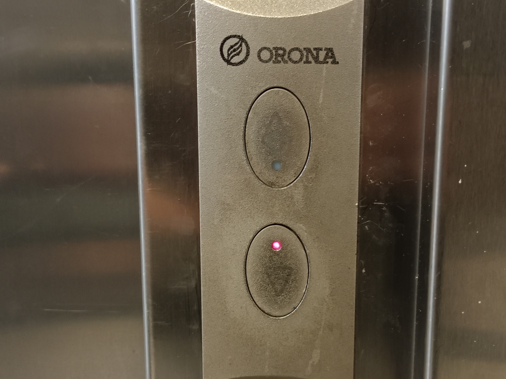

en la parte superior de la parte externa del ascensor se encuentra una pantalla la cual nos indica en donde se encuentra actualmente el ascensor.

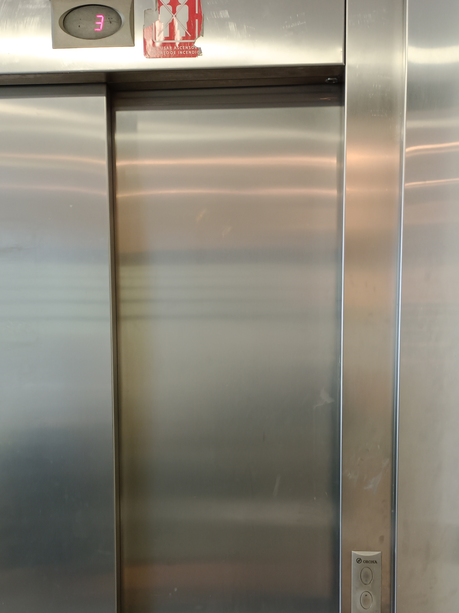

una vez dentro del ascensor, noté que en comparación a los botones que se encuentran fuera de este los que están en el interior tienen relieve y su versión en braille!! la verdad no entiendo por qué los de afuera no lo tienen, pero asumo que es porque estos se encuentran en una posición que permite que uno asuma cuál es la función de cada uno sin necesidad de tener que verlos? no lo sé, igual se me hace un poco dudoso. al igual que los botones del exterior, estos también prenden un LED para demostrar que el botón ya ha sido presionado. 

dentro de las opciones, se encuentran los cuatro pisos sobre la tierra y los dos pisos subterráneos (-1 y -2), aparte de tener dos botones para poder cerrar o mantener abiertas las puertas y otro para emergencias (el de la campanita). 

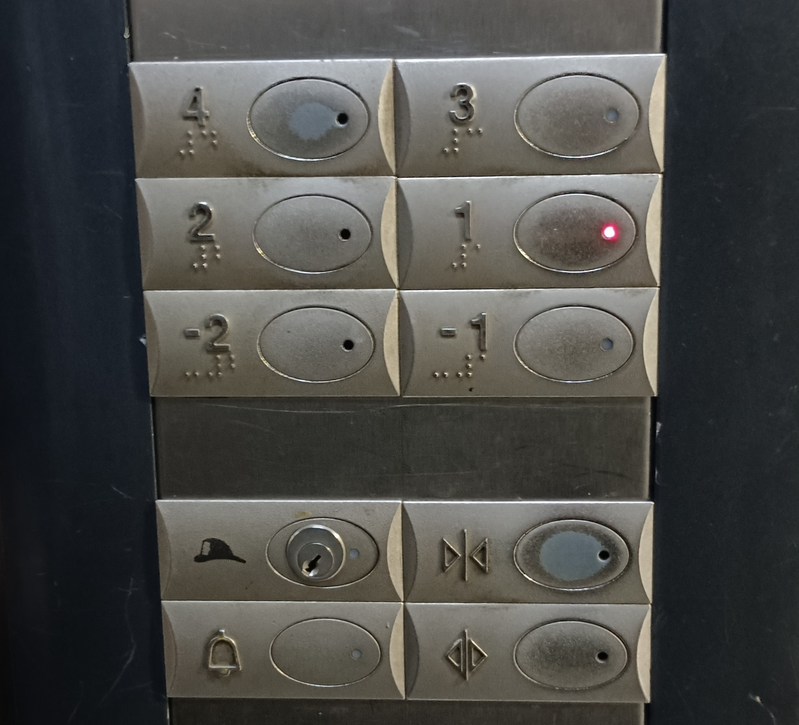

al igual que el exterior, en el interior hay una pantalla que indica el piso en el que se encuentra el ascensor.

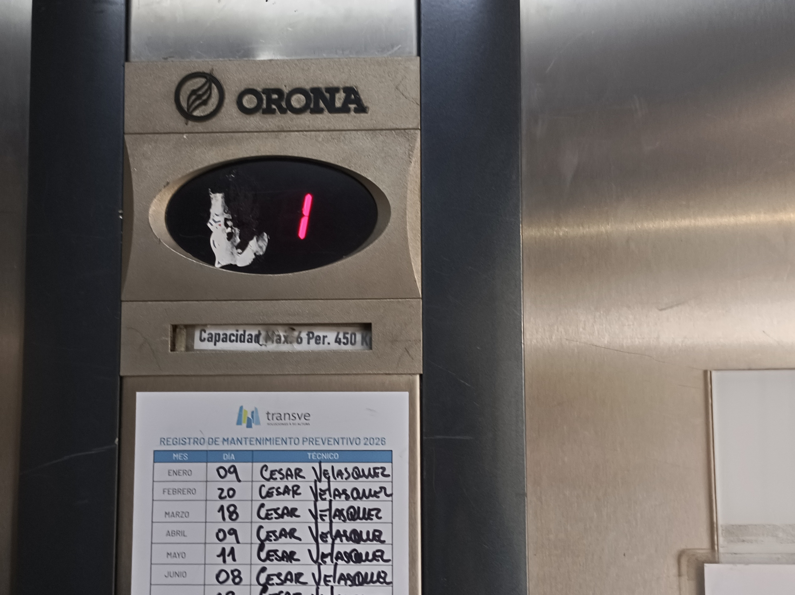

### 2- ascensor Patio Outlet La Florida - Av. La Florida 8988

como ya usé un ascensor de la facultad, decidí salir del entorno universitario e ir a lugares que quedan relativamente cerca de mi casa para poder ver sus ascensores. en este caso fui al Vivo Outlet de La Florida, el cual tiene un ascensor para poder llegar al segundo piso de las tiendas.

lo primero que noté en este ascensor es que el botón de llamada era más moderno que el de República 180, ya que este tenía una pantalla en el mismo lugar en donde se encuentra el botón para llamar al ascensor. también es distinto en la cantidad de botones que tiene comparado al de República 180, pero esto es debido a que este edificio solo tiene dos pisos, por lo que solo está la opción de subir si es que estás en el piso 1, y la de bajar si te encuentras en el piso 2.

al presionar el botón de llamada se enciende una luz roja al rededor del botón que indica que ya ha sido presionado, mientras que en la pantalla te indica en qué piso está el ascensor.

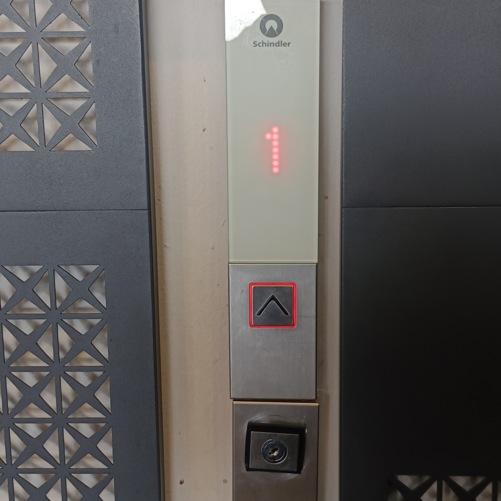

dentro del ascensor hay 8 espacios de botones disponibles, pero se usan solo 5 de ellos: dos para los dos pisos disponibles, otros dos para abrir y cerrar las puertas y otro para emergencia (la campanita). estos botones al igual que los de República 180 tienen relieve y braille.

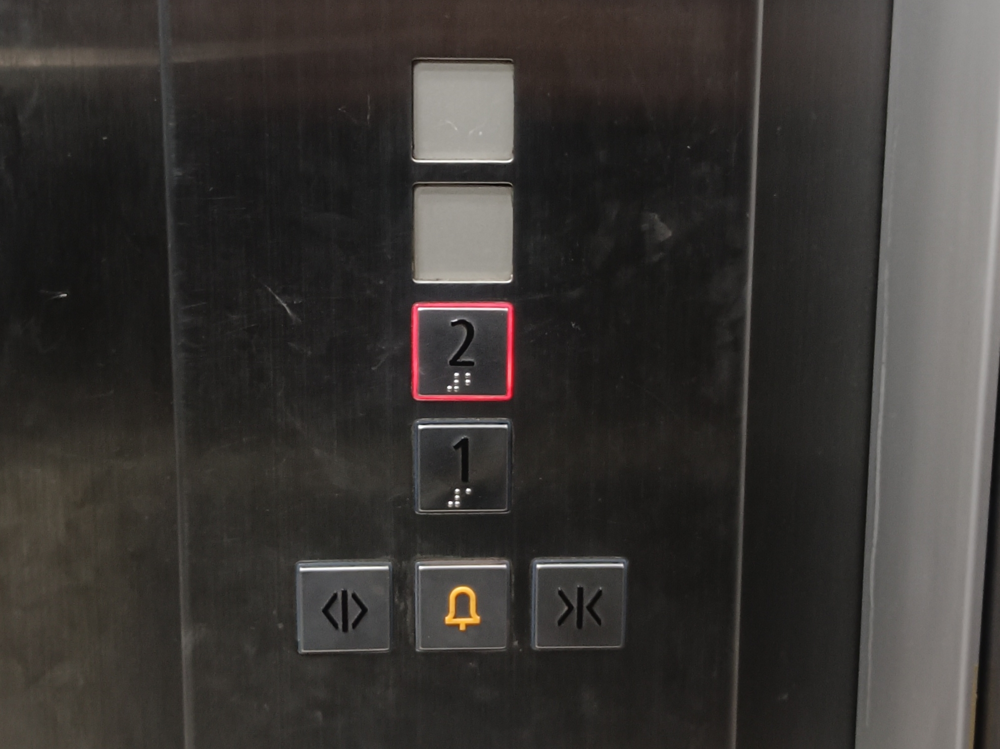

arriba de los botones, se encuentra la pantalla interior que nos va indicando el piso en el que se encuentra el ascensor y si está subiendo o bajando mediante una flechita al lado del número del piso.

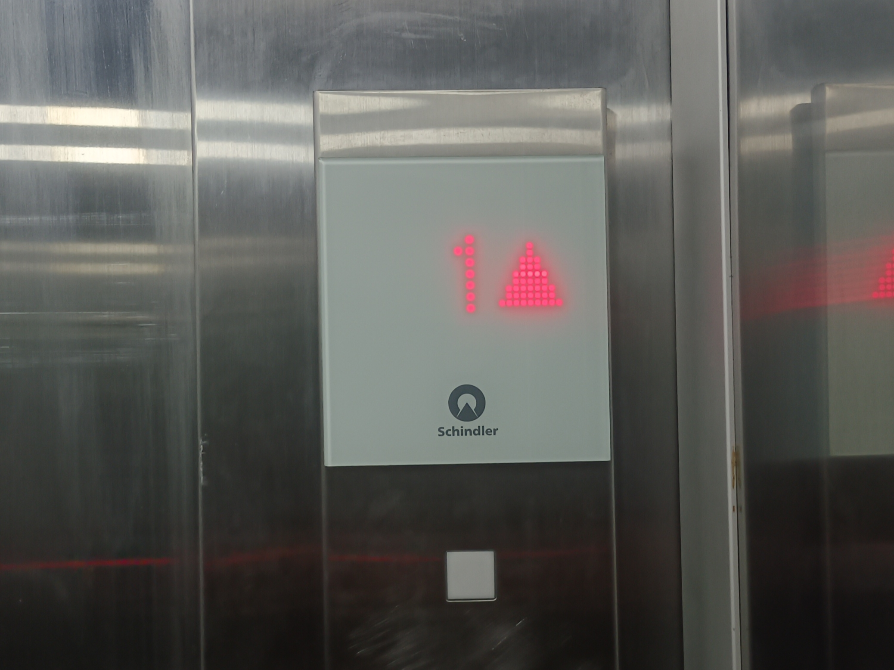

dentro del ascensor noté una guía de recomendaciones para el buen uso del ascensor, en donde se mencionaban situaciones que la verdad nunca habría pensado que la gente podía hacer (como forzar la puerta o saltar en el ascensor).

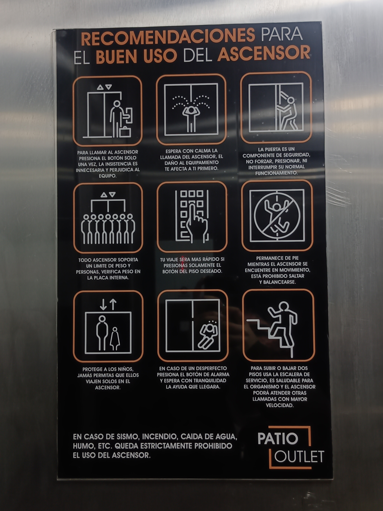

### 3- ascensor Unimarc Rojas Magallanes - Rojas Magallanes 3638

tengo unos amigos que viven por el sector de Rojas Magallanes y me habían mencionado que había un ascensor muy raro en el Unimarc que les queda cerca, por lo que decidí ir y ver qué tan extraño podía ser. una vez llegué al lugar y encontré el ascensor (el cual se encuentra al lado de la tienda Grido), me di cuenta de que con "extraño" se referían a que tenía una interfaz complicada de entender lo cual se hacía aún más difícil de comprender debido a que no funciona como debiese.

el botón de llamada no es en realidad un botón el cual puedas empujar de manera física, sino que es un sensor de cercanía que no funciona como debiese y tienes que pegarle repetidas veces para que logre sentir el contacto. luego de que logres llamar al ascensor, se puede ver en la misma pantalla en donde se encuentra el ascensor (solo tiene dos opciones: 1 o 2, ya que este lugar tiene dos pisos).

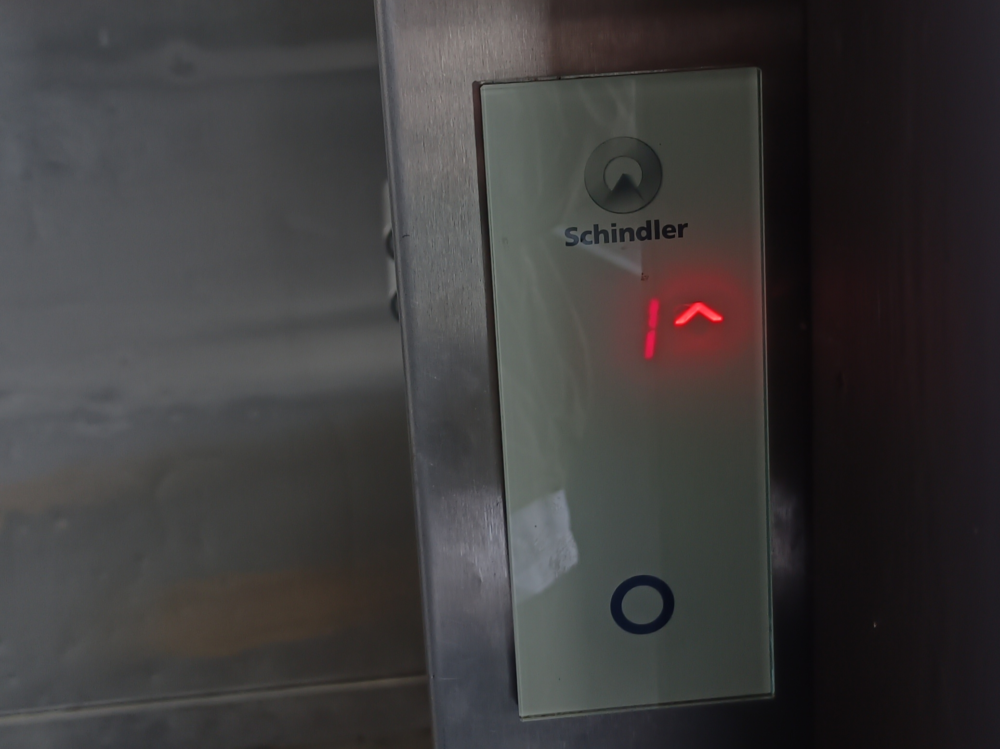

cuando entré al ascensor, por un momento creí que estaba en un escenario de terror con una interfaz de usuario horrible. es primera vez que veo que en un ascensor hayan sensores de cabina y que no se demuestren con algún símbolo o color en donde se encuentran las opciones de pisos!! la pasé mal honestamente y no supe que hacer ya que cuando estaba dentro se veía todo en blanco, hasta que entró un guardia y me explicó que debía tocar la pantalla hasta encontrar los números. para demostrarme cómo hacerlo, el guardia empezó a mover la mano por encima de toda la pantalla hasta que se prendió un número y me di cuenta que al lado de este se podía ver de manera muy ligera la otra opción.

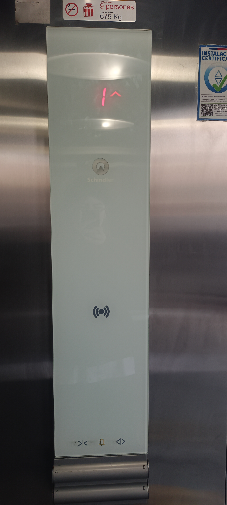

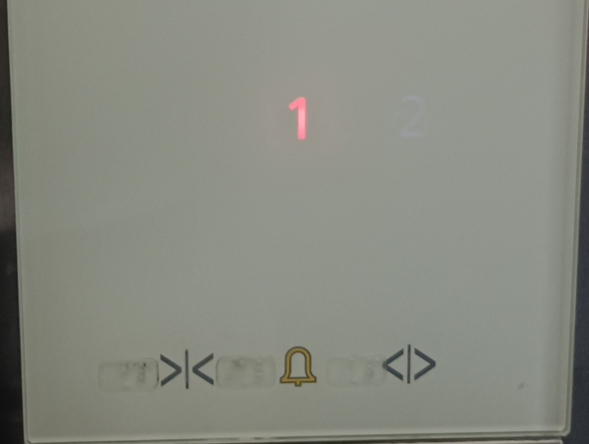

honestamente no entiendo por qué no han cambiado esta interfaz, la cual ni siquiera tiene una versión de números en braille o con relieves para que personas con discapacidad visual puedan utilizarla.

### botoneras

la razón por la que se nos indicó realizar este encargo es debido a que Aarón ha visto a muchas personas usar mal los ascensores al momento de presionar la botonera externa, por lo que pareciera que la mayoría de las personas no sabemos hacer un buen uso de éste (me incluyo ya que no recuerdo qué cosas presiono al momento de pedir un ascensor LOL). para poder entender cómo se utilizan realmente los botones para llamar al ascensor (aka botones de llamada) vi guías de botones (como lo es el siguiente sitio: <https://dazentech.com/es/la-guia-definitiva-sobre-los-botones-del-ascensor/>) y lugares en donde la gente se dedica a explicar el funcionamiento de las cosas, como lo es el siguiente link: <https://ingenieriasamat.es/blog/como-se-usa-un-ascensor/>. en este lugar se nos explica que la funcionalidad de los botones de llamada es, en el caso de que tenga dos sentidos (uno que sube y el otro que baja), señalar la dirección en la que te diriges!! es decir, si estás en el piso 2 y el ascensor de encuentra en el piso 3 mientras tu quieres llegar al piso 4, debes presionar la flecha que va para arriba, ya que ese es el sentido en el que quieres viajar. 

una de las cosas que se menciona a manera de cuidado de los ascensores, es que no se deben de presionar ambos botones de llamada al mismo tiempo!! por favor no lo hagan, esto no hará que llegue más rápido el ascensor. también se aclara que uno no debe de presionar la dirección en la que quieres que se dirija el ascensor para que llegue a ti, ya que al presionar el botón ya le estás indicando al ascensor en qué piso te encuentras, por lo que este solo necesita saber para dónde quieres ir.

según [ésta guía](<https://www.langirswitch.com/es/guia-definitiva-para-los-botones-de-los-ascensores/>) existen tres tipos de paneles de botoneras para ascensores:

+ panel de control de vehículo (COP): este panel se ubica dentro del ascensor, el cual trae botones para seleccionar el piso al que viajas, control de puertas (abrir y cerrar) y botón de emergencia. 
+ panel de control de aterrizaje (LOP): estos son los botones que se encuentran en la parte externa del ascensor y suele incluir botones de subir y bajar, pero en el caso de que no lo tenga siempre hay un botón que sirve para llamar al ascensor.
+ paneles de control de destino: este panel de control son en base a tecnología moderna, en donde uno en vez de seleccionar el piso al que va, hay que introducir al lugar que nos dirigimos lo cual el sistema del ascensor entiende y selecciona donde tiene que viajar de manera automática (este la verdad yo no los he visto y en realidad no entiendo muy bien por qué son mejores que los que tienen botones lol).
