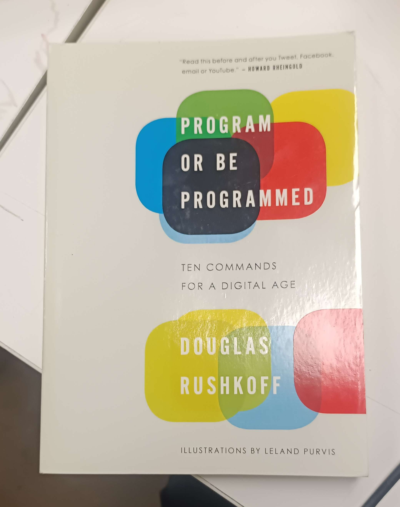
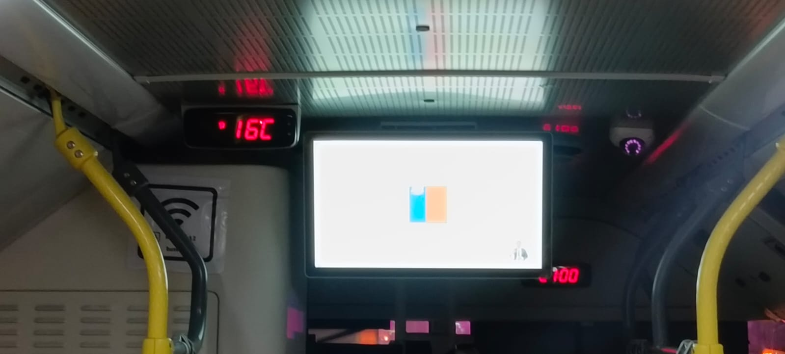
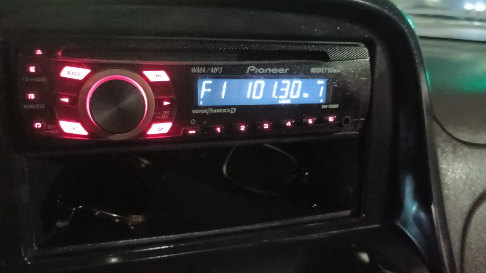
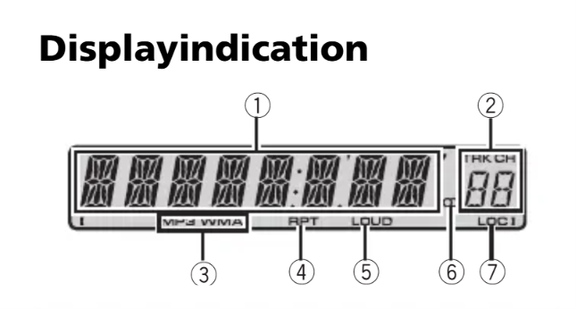
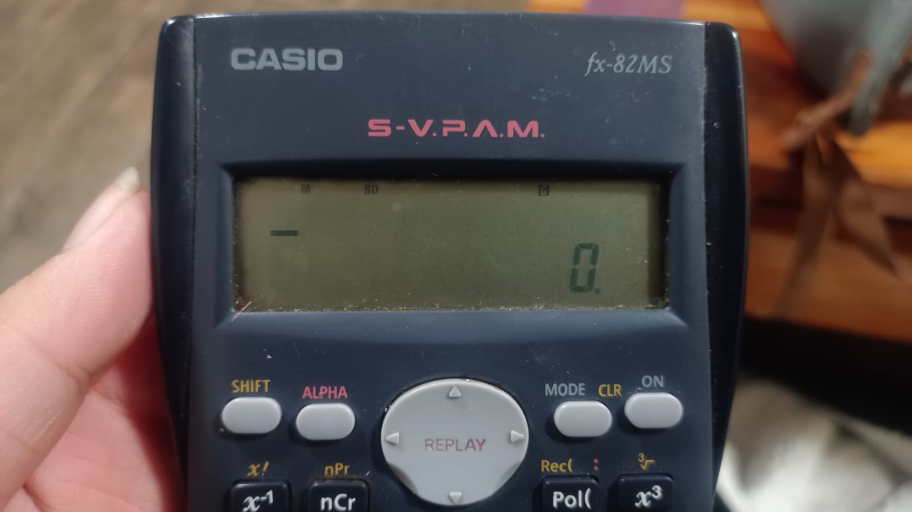
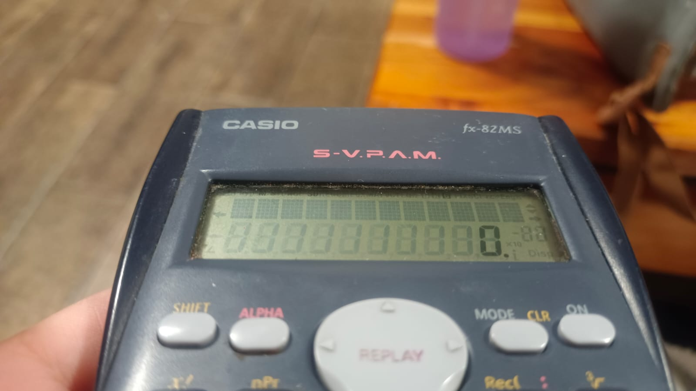

# sesion-01a

## apuntes 11/08

maneras de referirnos a los siguientes símbolos:

+ murciélago -> ``{}``
+ corchete -> ``[]``
+ paréntesis -> ``()``

---

### libro para el semestre omg

Aarón nos dijo que para este semestre tendremos que leer un libro por persona, por lo que nos indicó a las primeras dos filas a retirar un libro de los tantos que tenía en la mesa de en frente. la verdad no conocía ninguno, pero me llamó la atención el libro llamado "_Program Or Be Programmed: Ten Commands for a Digital Age_", escrito por Douglas Rushkoff ya que me dio risa el título el cual asumí que era una referencia al "ser o no ser" de Hamlet (puede que no sea pero igual me causa gracia lol).



cuando ya escogimos los libros, Aarón nos explicó que estos serán parte de los encargos en los cuales cada martes debemos escribir un resumen de lo que leímos incluyendo dos citas del libro, siendo una página el mínimo de lectura por día para así leer un mínimo de 100 páginas al semestre (idealmente terminar el libro, pero eso ya es decisión de cada uno).

---

### GitHub

Aarón enseñó de manera rápida el cómo se utilizará GitHub, y cómo trabajar en las carpetas de cada uno utilizando la carpeta de Magdalena como ejemplo. al crear la carpeta de Magda, Aarón explicó cómo agregar cambios dentro del ``README.md`` y cómo agregar imagenes, las cuales se agregan dentro de la carpeta de imagenes y para poder añadirlas al README.md se hace de la siguiente manera: ````

para poder trabajar dentro de tu propia carpeta, Aarón explicó cómo crear un fork para poder editar con tu propio trabajo y apuntes, el cual se hace de la siguiente manera:

1. ir al repositorio del taller para la primera parte de este semestre, el cual es ``dis8645-2026-2-procesos-1`` y se puede encontrar en el siguiente link: <https://github.com/disenoUDP/dis8645-2026-2-procesos-1>
2. hacer click en donde dice ``Fork``
3. no cambiar nada, y hacer click en el botón verde que dice ``Create Fork``

> responsabilidad emocional y responsabilidad computacional:)

---

### ejercicio en clases: cosas constantes y variables que tiene el ascensor 

constantes:

+ tiene puertas
+ viaja en el eje ``Z`` (pero uno puede ingresar a este por el eje ``X`` o ``Y``)
+ tiene botones
+ puede parar
+ suena
+ tiene sensores

datos internos que maneja (según ascensor seleccionado, el cual fue el ascensor del lugar en donde vive Bombobby):

> esta información es inferida!! todo basado en observaciones que ha tenido Bombobby durante el tiempo que ha vivido ahí:)

+ distancia entre pisos (cuánto tiene que viajar)
+ cantidad de pisos
+ selección de ascensor al más próximo al piso en el que se solicita mediante la botonera de llamada
+ si pasa una cantidad determinada de tiempo (5 min aprox.), el ascensor baja a la planta (piso 1) de manera automática 
+ prioridad de llamada dependiendo del sentido en el que desean viajar los usuarios y la cercanía que tiene el ascensor
+ tiempo de espera que tienen las puertas para mantenerse abiertas

variables:

+ cantidad de botones
+ orden de botones
+ tipos de botones auxiliares
+ límite de peso
+ velocidad en la que viaja

gracias a estas variables, se pueden hacer acciones (funciones), como por ejemplo:

```ccp
if(EstoyEnUnPiso){

AbrirPuerta();

}
```

el que tenga un ``();`` quiere decir que esto es una acción, como por ejemplo:

``SonarAlarma();``

---

## encargos

### pantallas de segmentos

las pantallas de segmentos son pantallas que usan una cierta cantidad de LEDs para poder mostrar números o letras. la pantalla de segmentos más utilizada es la de siete segmentos, lo que significa que usa solo 7 LEDs para mostrar caracteres, pero esto no significa que sea la única!! aquí dejo una lista de algunas pantallas de segmentos las cuales son nombradas en base a la cantidad de LEDs que utilizan:

1. pantalla de siete segmentos, utilizada mayoritariamente en relojes digitales o calculadoras
2. pantalla de ocho segmentos, igual a la pantalla de siete segmentos, pero se le añade un punto al lado del dígito, el cual se llama punto decimal.
3. pantalla de nueve segmentos, la cual es como la de siete segmentos, pero se le añaden diagonales dentro del perímetro para poder hacer números más claros.
4. pantalla de catorce segmentos, el cual es como la de siete segmentos, pero se le añaden cuatro diagonales y dos verticales dentro del perímetro para poder mostrar números y letras de manera más clara.
5. pantalla de dieciséis segmentos, la cual es como la de catorce segmentos, pero se dividen los tres segmentos horizontales a la mitad. estas pantallas utilizan normalmente un generador de caracteres para poder traducir los códigos de caracteres ASCII de 7 a 16 bits que informan cuál de los 16 segmentos tiene que prenderse y cuál debe apagarse.

como encargo, se nos pidió sacar fotos de 3 pantallas distintas, por lo que aquí dejo las mías:

1. pantalla micro RED, 323



esta foto la tomé cuando ya iba llegando a la última parada de la micro 323 (Rojas Magallanes) la cual me deja cerca de mi casa LOL. me di cuenta de que esa pantalla (la que muestra la cantidad de grados Celsius que hay dentro de la micro) me servía cuando me subí en el inicio de su recorrido, esto siendo en la intermodal de Bellavista de La Florida, pero no le saqué foto en ese momento ya que habían personas arriba y me dio vergüenza así que decidí esperar a que llegase a la última parada para poder tomar la foto y bajarme de inmediato XD.

esta pantalla dice cuántos °C hay dentro de la micro, ya que estas tienen aire acondicionado (super fancy) por lo que aparte de mostrar números también puede mostrar el circulito que muestra que son grados, aparte de mostrar letras como lo es la C de Celsius. esta pantalla por lo que logré ver es de 8 segmentos, al igual que la pantalla con luces rojas que se muestra al fondo, la cual va mostrando la hora.

2. pantalla radio camioneta



esta foto fue tomada por mi papá en su camioneta en donde se muestra la radio!! recién gracias a este encargo me dediqué a buscar su modelo, la cual es _MP3 Pioneer DEH-1300MP (serie MOSFET 50Wx4)_. al buscar la radio por su nombre propio, encontré este manual <https://www.manuales.mx/pioneer/deh-1300mp/manual?p=3>, el cual menciona partes de la radio, cómo funciona, etc. en la página 3 de este manual, hay un vector de cómo es la pantalla y se logra ver con claridad de cuántos segmentos es esta misma:



la verdad me costó contar los segmentos, pero ahora estoy 80% seguro de que la pantalla es de 14 segmentos (creo, tal vez conté mal muchas veces). a diferencia de la pantalla de la micro, la de la radio es mejor para mostrar letras como lo es la "M" gracias a los segmentos diagonales que tiene lo cual sirve para ir viendo los modos en los que uno puede usar la radio.

3- pantalla calculadora



estas fotos fueron tomadas por mi hermana menor en nuestra casa, en donde muestra la pantalla de su calculadora de manera frontal y se puede observar cómo hay un "0.", lo cual me hace creer que esta es una pantalla de 8 segmentos al contar el punto! otra cosa de lo que no estoy muy seguro es sobre si esta pantalla se considera una pantalla de segmentos ya que al poner la calculadora en ángulo se ve lo siguiente:



al poner la calculadora en esta posición, podemos ver en dónde se pueden prender los LEDs de la pantalla, notando así que en efecto hay 8 segmentos en la mitad inferior de la pantalla, pero en la parte superior hay 30 cuadrados (son rectángulos de 5x6 si no me equivoco), cosa que nos permite mostrar textos muuuucho más claros, pero no sé si esto sigue siendo una pantalla de segmentos al tener dos formas distintas para mostrar texto (segmentos y los cuadrados).

#### fuentes:

+ <https://www.panoxdisplay.com/knowledge/key-features-applications-7-segment-displays.html>
+ <https://www.manuales.mx/pioneer/deh-1300mp/manual?p=3>
+ <https://en.wikipedia.org/wiki/Segment_display>

### autorretrato

nombre-de-la-función(datos transmitidos a la función)

void la función no regresa nada

int la función regresa algo que puede ser una variable (float), letra (chart)

autorretrato: describir variables y funciones de ustedes.

---

## lectura: Program Or Be Programmed: Ten Commands for a Digital Age - Douglas Rushkoff

> todo el libro está en inglés, pero la verdad de momento no se me ha dificultado la lectura! siento que tiene un lenguaje bastante simple y amigable:) esta semana me leí desde el "preface" hasta la introducción (pág. 13).

en las primeras 13 páginas, Douglas habla de la importancia de saber programar o, por lo menos, entender qué es la programación para poder entender qué es lo que estás usando y cómo funciona dándolo a entender de manera sarcástica lo cual me dio risa XD aquí dejo la primera cita textual para que entiendan a lo que me refiero:

- "You may not know what's going on, you may not have much of an impact on the future of our species, and you may begin to feel like technology knows more about you than you know about it-but no, you don't have to learn to program" (pág. 8)

para poder explicar la importancia de saber programar o entender lo que es la programación, Douglas da como ejemplo una situación cotidiana como lo es el usar un auto, ya que uno de los argumentos que le han dicho para justificar que "no es necesario aprender programación" es el compararlo con un auto y decir que "uno puede saber manejarlo sin necesidad de ser mecánico", lo cual es una comparación errónea ya que en esta situación uno no tiene que comparar entre ser conductor y mecánico, sino que sería entre el conductor y el pasajero. en el ejemplo que da Douglas, nos dice que para ser pasajero tienes que confiar en el conductor y creer que te lleva por los lugares correctos, sin mentir sobre lo que hay en el camino por lo que generas una dependencia en él, lo cual el conductor puede explotar para su propio beneficio sin que tú lo sepas.

debido a lo anterior, Douglas explica que la razón por la que escribió el libro es porque quiere que las personas sepan algo sobre la programación y la importancia que tiene esta en nuestro presente y en el futuro de nuestras vidas, diciéndolo de la siguiente forma:

- "I do want people to know something about programming, but more than that, I want them to consider putting their own hands back on the steering wheel of our civilization. It may just keep us from driving off a cliff. And besides, it's fun to be in the driver's seat." (pág. 11)
