# sesion-01b

### tragedia al inicio de la clase (es una exageración, todo salió bien)

para esta clase no traje mi computador ya que hoy tengo que hacer muchos viajes, y la verdad no quiero andar con dolor de espalda por el peso de mi pc (aparte de que ando llevando 6 kilos de cerámica en mi mochila (ayuda)).

para poder tomar apuntes de manera más rápida, pedí prestado un computador del LID y me lo llevé a la sala de República 180 en donde tenemos la clase de taller:) todo iba bien hasta que me di cuenta de que no podía conectar el cargador del computador al enchufe de la corriente ya que necesitaba un adaptador, por lo que volví a Salvador Sanfuentes para buscar un adaptador que me sirva en el LID, lo cual salió mal ya que no encontré ninguno que sirviera LOL (probablemente busqué mal, ya que estaba medio desesperado y no estaba pensando muy bien). como no encontraba nada, le hablé a Emi por discord para pedirle ayuda (gracias emi por tanto, perdón por tan poco) y me dijo que vea en la mochila que estaba en el cajón debajo de las impresoras 3D, en donde encontré un cargador que me servía para poder conectarme a corriente sin necesidad de usar un adaptador!! la vida es buena.

---

## apuntes 14/08

al hablar del encargo que se había dejado la clase pasada (autorretrato), se nos volvió a explicar qué son las funciones y qué son las variables, en donde se nos explicó que las variables de tipo entera usan más de un bit de información! como se nos explica en <https://disenoudp.github.io/apuntes-maquinas/>, pág. 56, la cantidad de valores posibles con bits (en donde los símbolos posibles son dos, estos siendo _0_ y _1_) sigue la ecuación de:

``valores posibles = 2^número de símbolos usados``

Aarón, Emi y Seba hicieron una coreografía para que logremos entender la cantidad de valores posibles que se pueden hacer con 3 bits… me emocioné, fue hermoso. la cantidad de valores posibles son 8, eso es contando desde 0-7.

dentro de <https://disenoudp.github.io/apuntes-maquinas/> también se nos menciona una tabla en donde se muestra la importancia de usar prefijos al momento de usar variables enteras, ya que así uno puede indicar el tamaño en bits y si esta usa signo o no:

| tipo de variable | tamaño en bits|
| :---: | :---: |
| int8_t | 8 bits, con signo |
|uint8_t | 8 bits, sin signo (como ej, para contar el tiempo ya que no existe la hora negativa)|

#### ¿el _=_ en programación tiene el mismo significado que en matemáticas?

no!! en programación, el signo _=_ no se utiliza para decir que algo es igual a otra cosa, sino que se utiliza para asignarle valor a una variable, mientras que el _==_ en programación es para comparar

#### fuente:

+ <https://www.lenovo.com/gb/en/glossary/equal/> (en realidad esto fue para recordar, pero esta info la dijo Aarón en clases lol)

---

## instalación de software!!

#### Arduino IDE

este semestre trabajaremos con microcontroladores, en los cuales inyectaremos código mediante Arduino IDE el cual debemos instalar siguiendo estos pasos:

1. ir a la página de Arduino (<https://www.arduino.cc/>) y hacer click en donde dice ``Products``

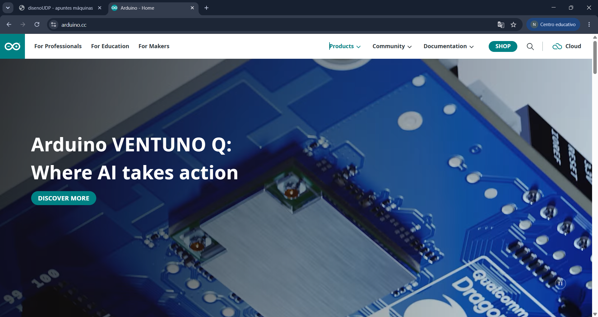

2. dentro de la sección ``SOFTWARE``, hacer click en donde dice ``Arduino IDE``

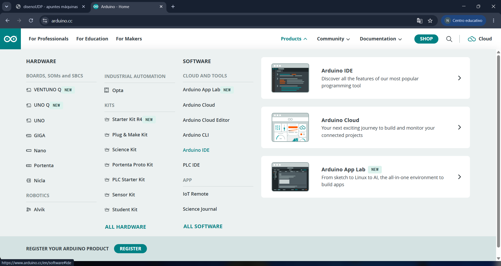

3. bajar hasta donde dice ``Arduino IDE 2.3.10``

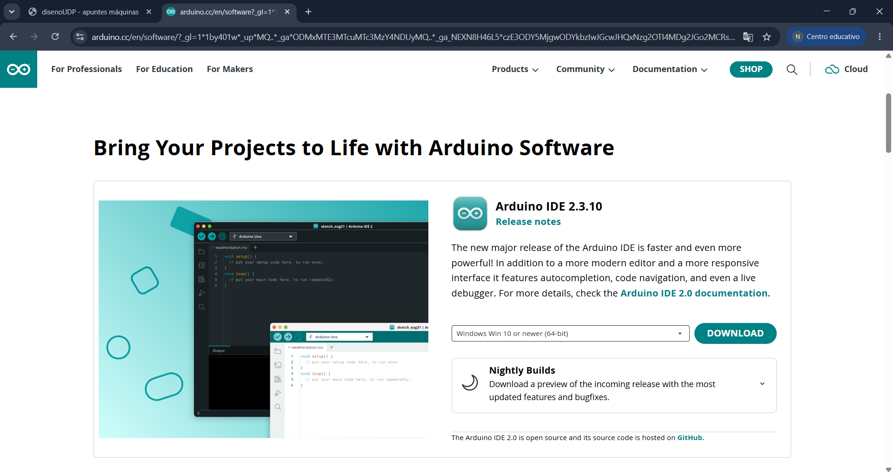

4. seleccionar la opción que se adapte a tu pc y luego presionar ``DOWNLOAD``

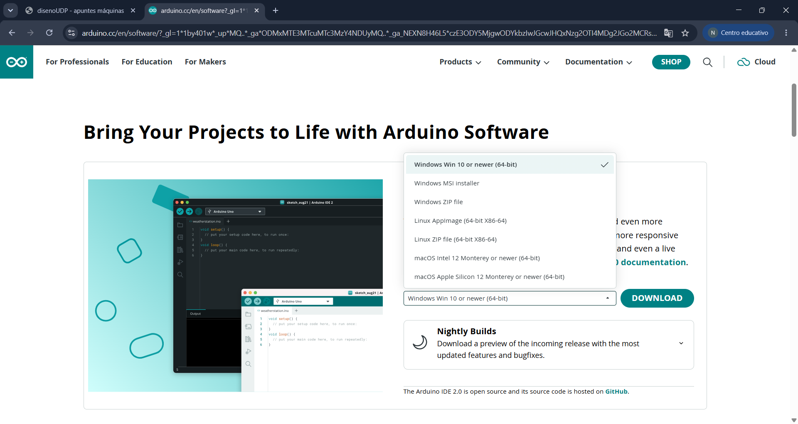

5. una vez ya lo instalemos, dentro del software tenemos que hacer click en ``BOARDS MANAGER``, en donde tenemos que buscar “Arduino UNO R4 Boards” e instalarlo.

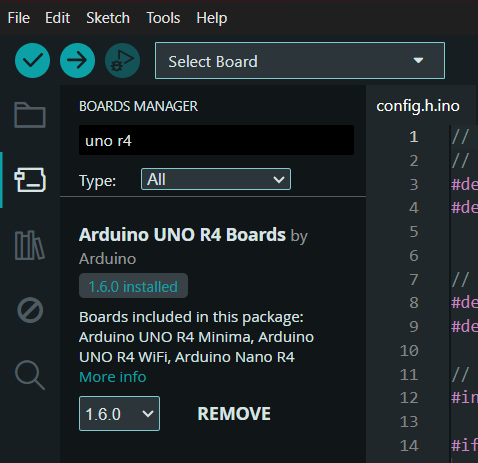

cada vez que hagamos entregas, tenemos que subir la carpeta completa del código que hemos hecho en Arduino IDE, la cual contiene dentro el archivo ``.ide`` el cual se llama igual que la carpeta que lo contiene, demostrando así que es el archivo correcto.

---

### lenguaje de programación

el _setup_ es una configuración, o también se puede ver como una coreografía por lo tanto ``setup()`` es la secuencia de instrucciones para que sucedan las cosas, es decir que indica la coreografía

tipos de funciones:

+ función tipo ``int`` = el resultado es un número entero
+ función tipo ``void`` = no expulsa como respuesta un valor, solo sucede

para que algo exista *hay que declararlo*. para declarar la función setup() se hace de la siguiente forma:

```cpp
void setup() {
  // aquí va setup(), ocurre solo una vez y es al inicio

}
```

> está prohibido hacer una línea de código sin comentar qué es lo que esa línea va a hacer, razón por la que trabajaremos con pseudocódigo.

luego va el loop, el cual ocurre después de setup() y se repite hasta que ya no pueda repetirse más.

```cpp
void loop() {
// aquí va loop()
// ocurre despues de setup()
// se repite hasta que no se pueda
}
```

los murciélagos indican desde dónde y hasta dónde suceden las cosas, es decir:

{ = desde acá

} = hasta acá

#### sistema hexadecimal

en hexadecimal se cuentan los números en una casilla de 0 a F, lo cual es equivalente a contar del 0 al 15 de la siguiente forma:

| hexa | decimal |
| :---: | :---: |
| 0 | 0 |
| 1 | 1 |
| 2 | 2 |
| 3 | 3 |
| 4 | 4 |
| 5 | 5 |
| 6 | 6 |
| 7 | 7 |
| 8 | 8 |
| 9 | 9 |
| A | 10 |
| B | 11 |
| C | 12 |
| D | 13 |
| E | 14 |
| F | 15 | 

+ dato: ``Ctrl + T`` organiza el archivo de Arduino IDE

---

## ejemplos de código

### ejemplo sumar

```cpp
//sumar enteros
//es tipo int porque nos tiene que dar un resultado
//void no entrega nada, solo ocurre sin emitir resultado

int sumarEnteros(int x, int y) {
//voy a declarar un resultado
	int resultado = 0;
	// int resultado y declarar
	// int vale 0

// hacer la suma de x e y
// y reemplazar valor resultado por ese valor
resultado = x + y;

return resultado;
}
```

+ isitchristmas.com (página hecha con ``if``)

---

## encargos

encargo01b:

1. tratar de correr un código en el microcontrolador asignado a cada dupla, incluir referentes, citas, comentarios, imágenes, descripciones textuales, y en caso de éxito o fracaso incluir aciertos, preguntas, dramas, atados. recordatorio que estos apuntes son personales, cada persona sube su versión.

2. proponer una función con nombre, tipo, argumentos y uso, que modele algún área de su interés, por ejemplo subirCerro(enBicicleta), tomarMetro(conPaseEscolar), etc. escribir en pseudocódigo los pasos que necesita esa función internamente para que literalmente funcione.

### 1. código en Raspberry Pi Pico 2W

como parte del encargo tenemos que tratar de correr un código en un microcontrolador, los cuales se entregaron primero a las personas que nunca habían usado un microcontrolador anteriormente, los cuales usarán Arduino UNO R4 WiFi o Arduino UNO R4 Minima. luego de que se les entregaran y formaran duplas, a las personas que ya habíamos utilizado microcontrolador anteriormente nos entregaron Raspberry Pi (en mi caso fue la Pi Pico 2W, no sé si había otra opción) y nos dijeron que íbamos a trabajar de manera individual.

al conectar el microcontrolador Raspberry Pi Pico 2W a mi computador mediante un cable USB-Micro USB, me di cuenta de que mi pc no reconocía que el microcontrolador estaba conectado a mi computador (ni siquiera lo reconoce como algo extraño), por lo cual busqué soluciones como lo es en ésta página <https://cursos.mcielectronics.cl/2025/09/22/programar-raspberry-pi-pico-2-y-2-w-con-arduino-ide/>, en donde menciona que si el microcontrolador no es detectado de manera automática debo entrar al modo Bootloader, cosa que aún no he probado en caso de que el problema sea otro, por lo tanto, antes de hacer esto, decidí probar cambiar el cable por otras dos opciones que tengo en mi casa, pero sucedió el mismo problema. para volver a intentar probar si el problema no es el microcontrolador y es otra cosa, conecté el cable en las distintas entradas USB que tiene mi pc, pero tampoco lo reconoció.

de momento prefiero esperar a ver qué opinan Emi y Aarón al respecto, por lo que envié un mensaje al canal de nuestro taller diciendo lo siguiente:

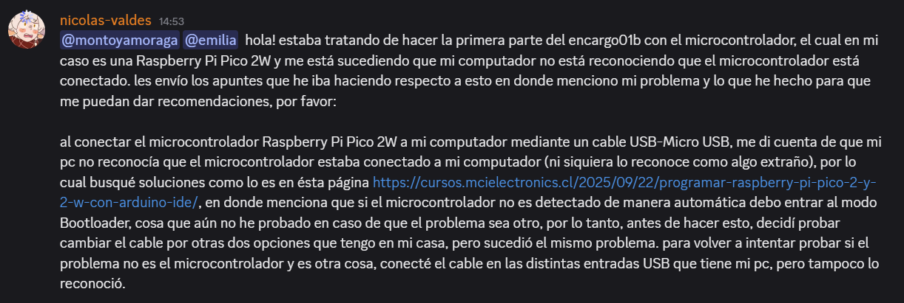

las respuestas que tuve a este mensaje fueron las siguientes:

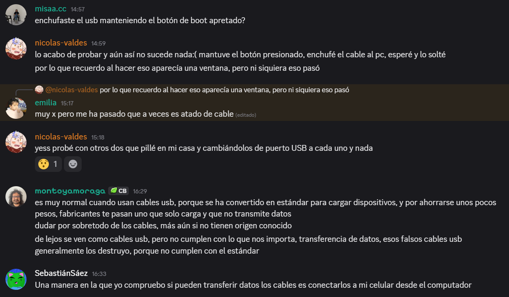

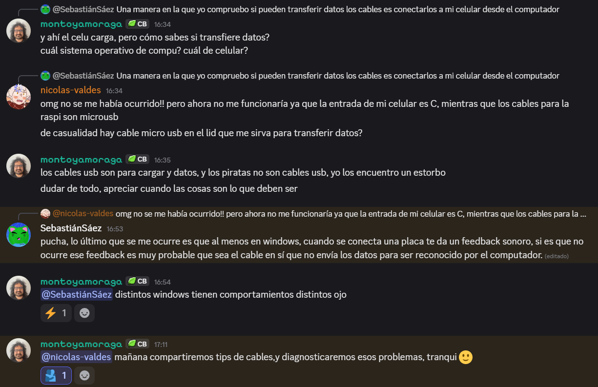

debido a esto, no he podido usar la raspi que me asignaron:( momos sad. de igual manera, aquí dejo mi investigación:

para poder meter código a la Raspberry Pi Pico 2W mediante Arduino IDE debemos seguir los siguientes pasos:

1. dentro de Arduino IDE, ir a ``File`` para luego hacer click en ``Preferences``.

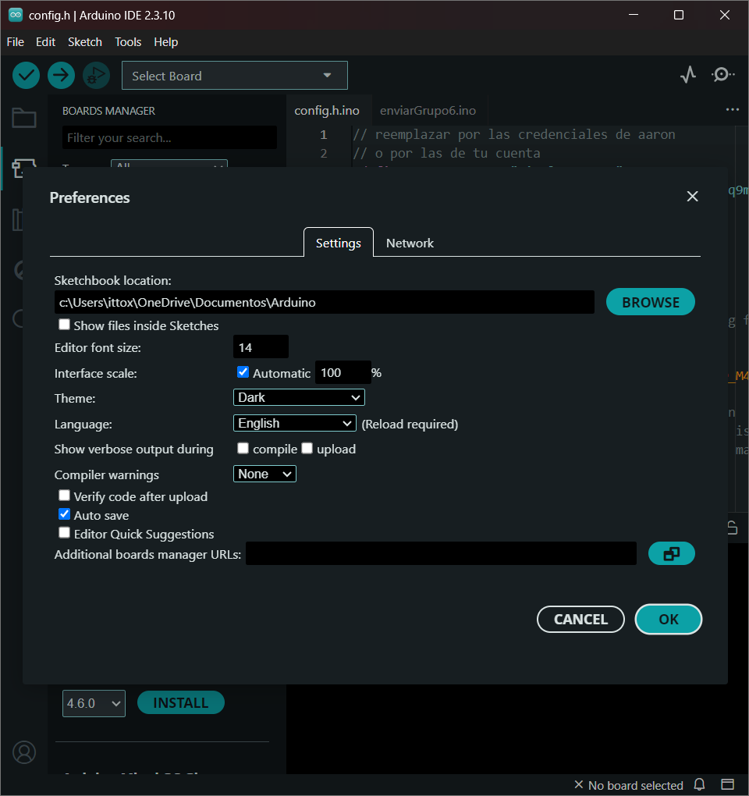

2. dentro de ``Preferences``, ir a "Additional boards manager URLs" y pegar la siguiente dirección: ``https://github.com/earlephilhower/arduino-pico/releases/download/global/package_rp2040_index.json``

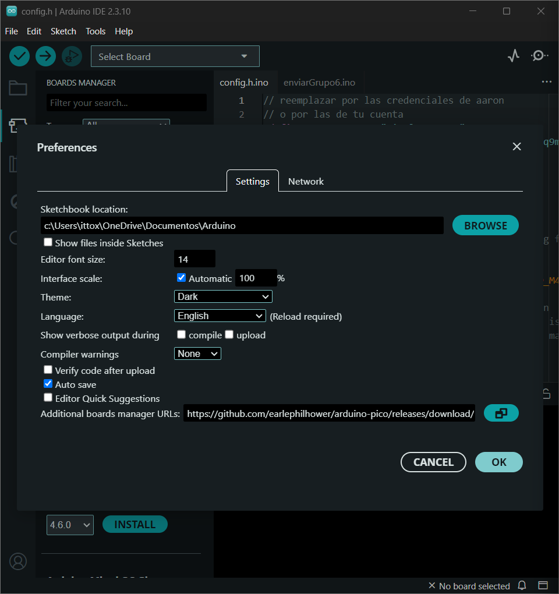

3. luego, ir a ``Boards Manager`` el cual se puede encontrar presionando en ``Tools`` -> ``Boards``

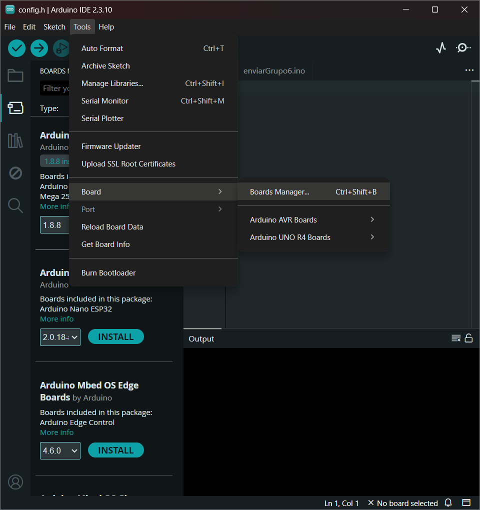

4. dentro de ``Boards Manager`` buscar "pico", en donde nos saldrán tres opciones pero debemos de instalar la versión de _Earle Philhower_.

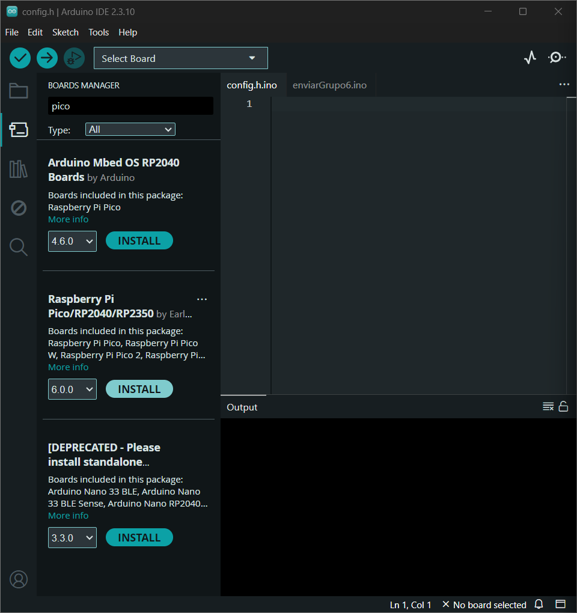

5. una vez ya tengamos el soporte para las placas instaladas, conectamos nuestra Raspi. en el caso de que no la identifique de manera inmediata, podemos ir a _"Select Other Board and Port"_ en donde podemos ayudar a identificar el microcontrolador y el puerto USB en el que se encuentra.

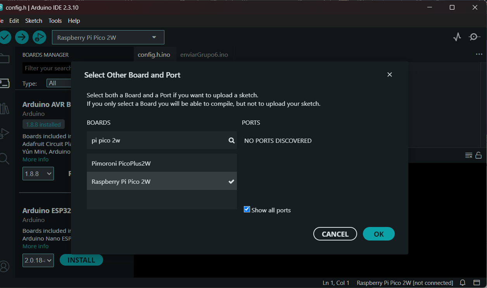

en mi caso no me aparece ya que los cables que tengo para poder conectar la Raspi a mi pc es muy probable que sean solo de carga, y que no sean capaces de transferir datos por lo que no me ayudan a poder identificar el microcontrolador ni comunicarse entre éste y mi pc.

una vez ya tengas conectada tu Raspberry Pi Pico 2W de manera correcta, podemos cargar el código de ejemplo _"Blink"_, el cual hace parpadear un LED con la placa:

```cpp
/*
  Blink

  Turns an LED on for one second, then off for one second, repeatedly.

  Most Arduinos have an on-board LED you can control. On the UNO, MEGA and ZERO
  it is attached to digital pin 13, on MKR1000 on pin 6. LED_BUILTIN is set to
  the correct LED pin independent of which board is used.
  If you want to know what pin the on-board LED is connected to on your Arduino
  model, check the Technical Specs of your board at:
  https://docs.arduino.cc/hardware/

  modified 8 May 2014
  by Scott Fitzgerald
  modified 2 Sep 2016
  by Arturo Guadalupi
  modified 8 Sep 2016
  by Colby Newman

  This example code is in the public domain.

  https://docs.arduino.cc/built-in-examples/basics/Blink/
*/

// the setup function runs once when you press reset or power the board
void setup() {
  // initialize digital pin LED_BUILTIN as an output.
  pinMode(LED_BUILTIN, OUTPUT);
}

// the loop function runs over and over again forever
void loop() {
  digitalWrite(LED_BUILTIN, HIGH);  // change state of the LED by setting the pin to the HIGH voltage level
  delay(1000);                      // wait for a second
  digitalWrite(LED_BUILTIN, LOW);   // change state of the LED by setting the pin to the LOW voltage level
  delay(1000);                      // wait for a second
}
```

o también podemos usar el código de ejemplo que nos enseñan en <https://randomnerdtutorials.com/raspberry-pi-pico-2-w-arduino-ide/>, el cual es el siguiente:

```cpp
/*
  Blink -  Turns an LED on for one second, then off for one second, repeatedly.
  Most Arduinos have an on-board LED you can control. On the UNO, MEGA and ZERO it is attached to digital pin 13, on MKR1000 on pin 6. LED_BUILTIN is set to the correct LED pin independent of which board is used.
  If you want to know what pin the on-board LED is connected to on your Arduino model, check the Technical Specs of your board at: https://www.arduino.cc/en/Main/Products
  modified 8 May 2014 by Scott Fitzgerald modified 2 Sep 2016 by Arturo Guadalupi modified 8 Sep 2016 by Colby Newman  This example code is in the public domain. https://www.arduino.cc/en/Tutorial/BuiltInExamples/Blink
  
  Programming Raspberry Pi Pico with Arduino IDE: https://RandomNerdTutorials.com/programming-raspberry-pi-pico-w-arduino-ide/
*/

// the setup function runs once when you press reset or power the board
void setup() {
  // initialize digital pin LED_BUILTIN as an output.
  pinMode(LED_BUILTIN, OUTPUT);
}

// the loop function runs over and over again forever
void loop() {
  digitalWrite(LED_BUILTIN, HIGH);   // turn the LED on (HIGH is the voltage level)
  delay(1000);                       // wait for a second
  digitalWrite(LED_BUILTIN, LOW);    // turn the LED off by making the voltage LOW
  delay(1000);                       // wait for a second
}
```

#### ¿qué hago si al conectar mi Raspberry Pi Pico 2W mi pc no la reconoce?

no caigamos en pánico, esto es lo que me sucedió y el problema puede ser uno de los siguientes:

1. cable que solo transfiere energía: no todos los cables son para transferir datos, sino que algunos son exclusivamente para transferir solo energía por lo que no nos sirve utilizar uno de estos al momento de conectar nuestro microcontrolador a nuestro pc. cámbialo.

2. entrada USB dañada: siempre dudar de todo! prueba conectando el cable a distintas entradas USB de tu pc, puede que una de ellas esté fallando.

3. Raspberry Pi Pico 2W con MicroPython firmware: es probable que tu Raspi esté corriendo actualmente con MicroPython firmware, por lo que es necesario ponerla de manera manual en el modo bootloader, lo cual se hace de la siguiente manera: desconecta el microcontrolador de tu pc y mantén apretado su botón _"BOOTSEL"_, luego, mientras lo mantienes presionado, conectar el microcontrolador a tu pc. esperar un momento hasta que te aparezca una nueva ventana de dispositivo de almacenamiento en tu pc, una vez aparezca ya puedes soltar el botón.
	

### ejercicio de función: sacar a pasear al Mailo (mi hermano chico que es un perro)

```cpp
// a mi me toca pasear al Mailo los días miércoles
// para poder sacarlo, el Mailo debe haber tomado once como su última comida
// del día, no de la vida
// la función sera tipo bool ya que es para indicar si se realiza el paseo(? según yo tiene sentido
// o no

bool pasearMailo(string diaSemana, string ultimaComida); // string sobre el día de la semana
// en el que corre el codigo
// string sobre que comio el Mailo por última vez

// entonces si es miércoles, y el Mailo tomo once como última comida
// salimos a pasear
// si no se cumplen esas dos reglas
// el Mailo no sale
// castigado
// esto es broma, si sale solo que no con tanta necesidad

if (pasearMailo("miércoles", "once")) {
	cout << "el Mailo sale a pasear" << endl;
}
	else { // lo que sucede si no se cumplen los requisitos (no estoy seguro de si lo escribí bien, es primera vez que uso un else)
	cout << "el Mailo se queda en el departamento" << endl;
}

// entonces para poder saber si toca paseo
// debemos saber si el dia es el correcto (miercoles)

bool pasearMailo(string diaSemana, string ultimaComida) {
	bool tocaPaseo = (diaSemana == "miércoles") //solo toca paseo conmigo si es miércoles
	bool tomoOnce = (ultimaComida == "oncecita") //su ultima comida del dia es la once

si (tocaPaseo y tomoOnce) entonces //si se cumplen estas dos condiciones entonces paseamos
	imprimir("el Mailo está paseando")
}
```
---

## lectura: Program Or Be Programmed: Ten Commands for a Digital Age - Douglas Rushkoff

> en estos días leí de la página 13 hasta la 22:) no he tenido ningún problema de momento con el idioma, así que creo que tuve suerte de elegir un libro con lenguaje simple muejejeje.

en las pocas páginas que leí, Doulas vuelve a hacer énfasis en la importancia de saber programar, en donde nombra lo siguiente (primera cita omg):

“It’s really simple: Program, or be programmed. Choose the former, and you gain access to the control panel of civilization. Choose the latter, and it could be the last real choice you get to make.” (pág. 14)

en la mayoría de estas páginas, Douglas nos menciona de distintas maneras que si no elegimos el saber programar, terminaremos siendo programados sin darnos cuenta. para hacernos dar cuenta de la gravedad de la situación, Douglas dice que las personas están siendo reducidas a ser un sistema nervioso externo bastante fácil de configurar mientras que las computadoras son libres de viajar y pensar en una manera mucho más avanzada que nosotros no podremos lograr alcanzar. como consecuencia de no saber controlar la tecnología como lo son los computadores ni tener el interés de comprenderla o de cómo ésta impacta en nuestras vidas, terminamos siendo nosotros los que nos adaptamos a la tecnología más que aprovechar el potencial que tiene ésta para nuestro futuro, tal como dice la siguiente frase:

“As a result, instead of optimizing our machines for humanity-or even the benefit of some particular group-we are optimizing humans for machinery.” (pág 21)

la verdad esta parte del texto me recordaba en cada momento a cómo estamos reaccionando las personas con la inteligencia artificial, ya que he visto casos cercanos en donde en vez de sacar provecho de esta herramienta tecnológica, las personas lo usan para tener conversaciones sin sentido o lo usan de manera extraña al formar una conexión emocional con la misma IA (?) me da un poco de miedo la verdad.
