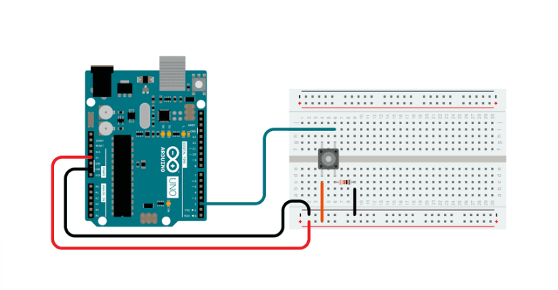
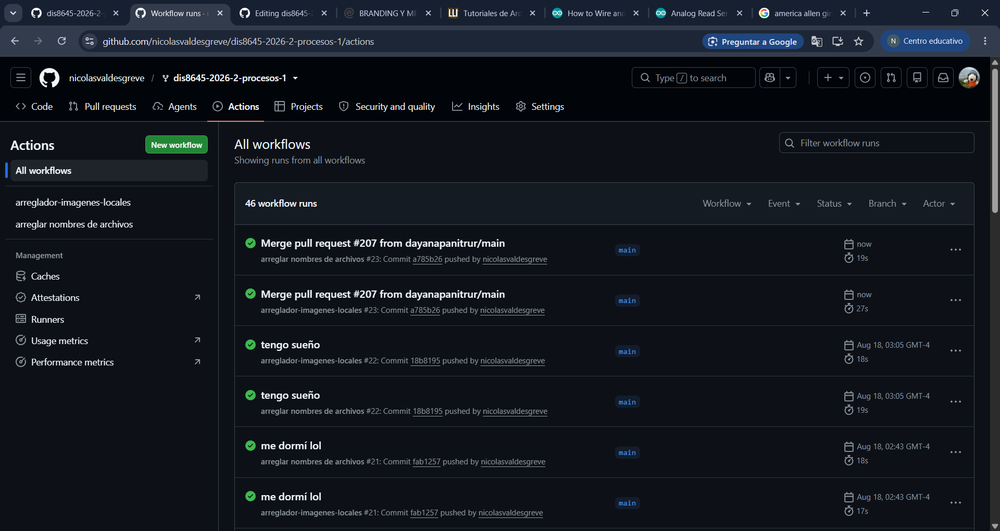

# sesion-02a

## apuntes 18/08

> la poesía no es para entenderla, es para leerla y sentir cosas.

### potenciómetros

los potenciómetros son perillas que funcionan como un resistor variable que nos permite regular la _potencia_, el cual lo usaremos para el primer proyecto. (resistor variable)- los usaremos para el primer proyecto - nos permite regular la potencia.

los potenciómetros tienen un nombre: A o B, el semestre pasado usamos muchos potenciómetros A (audio), pero en este curso usaremos los B (lineales).

#### potencia

*potencia = energía / tiempo*

para subir la potencia, hay que subir la energía o bajar el tiempo (o ambas al mismo tiempo).

*potencia = voltaje * corriente* -> ¿esto es lo mismo que la ecuación anterior? yes!! ya que dentro del voltaje hay energía (y otras cosas), mientras que dentro del tiempo, hay corriente.

#### resistencia

resistencia es lo que maneja el flujo de corriente: mientras más resistencia, menor el flujo de corriente. mientras menos resistencia, mayor el flujo de corriente.

dentro de un potenciómetro hay una resistencia gigante entre la patita 1 y 3, mientras que la patita 2 es la que nos permite movernos mediante esta resistencia.

### botones (push buttons)- 

cuando hablamos de botones, usualmente nos vamos a referir a pulsadores (push buttons), los cuales son elementos temporales y mediante pasa el tiempo, pasan cosas.

existen dos tipos de botones:

1. N.O. = Normally Open. un circuito normalmente abierto es en donde el electrón no puede transitar libremente por el circuito, ya que nadie está para presionar el botón y hacer puente entre dos puntos.

2. NC = Normalmente Conectado. siempre están conectados los dos lugares, y puedes desconectarlos al presionar el botón.

el que se utiliza más es el N.O.

---

#### pulldown

entre el punto de unión y GND, siempre debe haber una resistencia ya que si hacemos contacto sin ella podemos hacer corto circuito y dañar nuestro puerto USB. esta resistencia se llama resistor pulldown, que nos permite que la lectura sea siempre 0 excepto cuando el circuito está cerrado.

1= toy

0= no toy

---

#### pullup

si ponemos una resistencia en la parte de Vcc, tenemos que hacer la lectura entre vcc y la resistencia que está en el lado de Vcc, por lo que la lectura nos diría que si no presionamos el botón el lugar es Vcc, mientras que cuando lo presionamos se convierte en 0V.

1= no toy

0= toy

---

<https://docs.arduino.cc/built-in-examples/digital/Button/>

cables rojos para Vcc, cables negros para GND

el botón tiene dos lugares: hemisferio derecho y hemisferio izquierdo

en el hemisferio izquierdo, entre la patita del botón y GND hay una resistencia, la cual es pulldown ya que eso es lo que me está permitiendo llegar a tierra con calma.



---

### conectando un potenciómetro a la placa

a los dos extremos del potenciómetro va GND y Vcc
en la patita 2

Arduino: analog es el mundo real, aquí va el potenciómetro

botones al lado digital

while = mientras que

! = lo contrario de 

por lo tanto:

```cpp
while (!Serial) // mientras puerto serial no esté listo, no avanzar
{ // por lo tanto esto se queda pegado hasta que parta serial begin
} 
```
println imprime y se salta a la siguiente línea, en cambio print imprime y no se salta a la siguiente línea, sino que sigue de corrido. ej:

```cpp
Serial.print("valor actual: ");
Serial.println(poteLectura);
```

---

## encargos

encargo02a:

1. en tu fork, ir a actions, y aceptar que corran github worfklows. subir pantallazo con demostración de que han corrido actions exitosas en tu repo. esto es crucial, si no lo haces, no agregaremos tus apuntes al repo, y las tareas se tomarán como no entregadas. si en tu fork las actions no son exitosas, no serán tampoco agregadas al repo común ni evaluadas.



2. conformar grupos de 3 a 4 personas para la realización del proyecto-1. compartir 2 placas de desarrollo por grupo, documentar estudio conjunto de C++, microcontroladores, botones, potenciómetros.

mi grupo de trabajo para el proyecto-1 está compuesto por:

1. Santiago Cifuentes - [santiagocifuvelez](<https://github.com/nicolasvaldesgreve/dis8645-2026-2-procesos-1/tree/main/05-santiagocifuvelez>)
2. Francisca Palma - [frannciscapalma](<https://github.com/nicolasvaldesgreve/dis8645-2026-2-procesos-1/tree/main/18-frannciscapalma>)
3. Nicolás Valdés - [nicolasvaldesgreve](<https://github.com/nicolasvaldesgreve/dis8645-2026-2-procesos-1/tree/main/28-nicolasvaldesgreve>)

---

## lectura
