# sesion-02a

## apuntes 18/08

> la poesía no es para entenderla, es para leerla y sentir cosas.

### potenciómetros

los potenciómetros son perillas que funcionan como un resistor variable que nos permite regular la _potencia_, el cual lo usaremos para el primer proyecto. (resistor variable)- los usaremos para el primer proyecto - nos permite regular la potencia.

los potenciómetros tienen un nombre: A o B, el semestre pasado usamos muchos potenciómetros A (audio), pero en este curso usaremos los B (lineales).

#### potencia

*potencia = energía / tiempo*

para subir la potencia, hay que subir la energía o bajar el tiempo (o ambas al mismo tiempo).

*potencia = voltaje * corriente* -> ¿esto es lo mismo que la ecuación anterior? yes!! ya que dentro del voltaje hay energía (y otras cosas), mientras que dentro del tiempo, hay corriente.

#### resistencia

resistencia es lo que maneja el flujo de corriente: mientras más resistencia, menor el flujo de corriente. mientras menos resistencia, mayor el flujo de corriente.

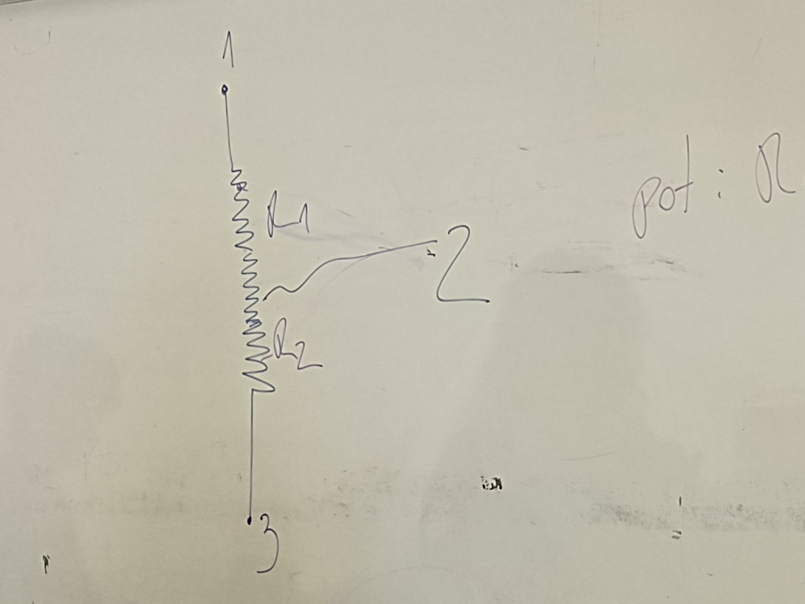

dentro de un potenciómetro hay una resistencia gigante entre la patita 1 y 3, mientras que la patita 2 es la que nos permite movernos mediante esta resistencia.

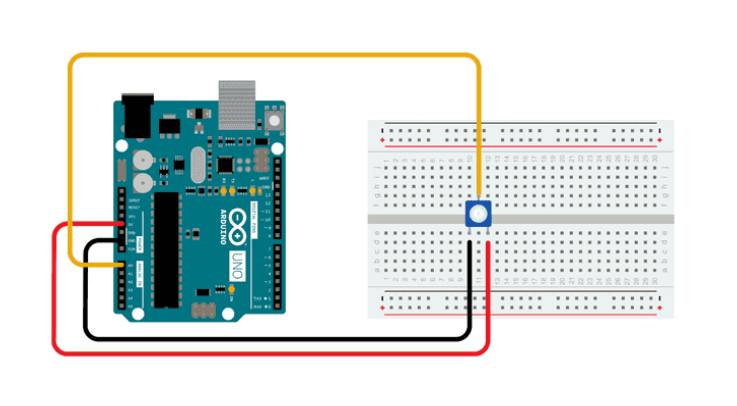

### botones (push buttons)

cuando hablamos de botones, usualmente nos vamos a referir a pulsadores (push buttons), los cuales son elementos temporales y mediante pasa el tiempo, pasan cosas.

existen dos tipos de botones:

1. N.O. = Normally Open. un circuito normalmente abierto es en donde el electrón no puede transitar libremente por el circuito, ya que nadie está para presionar el botón y hacer puente entre dos puntos.

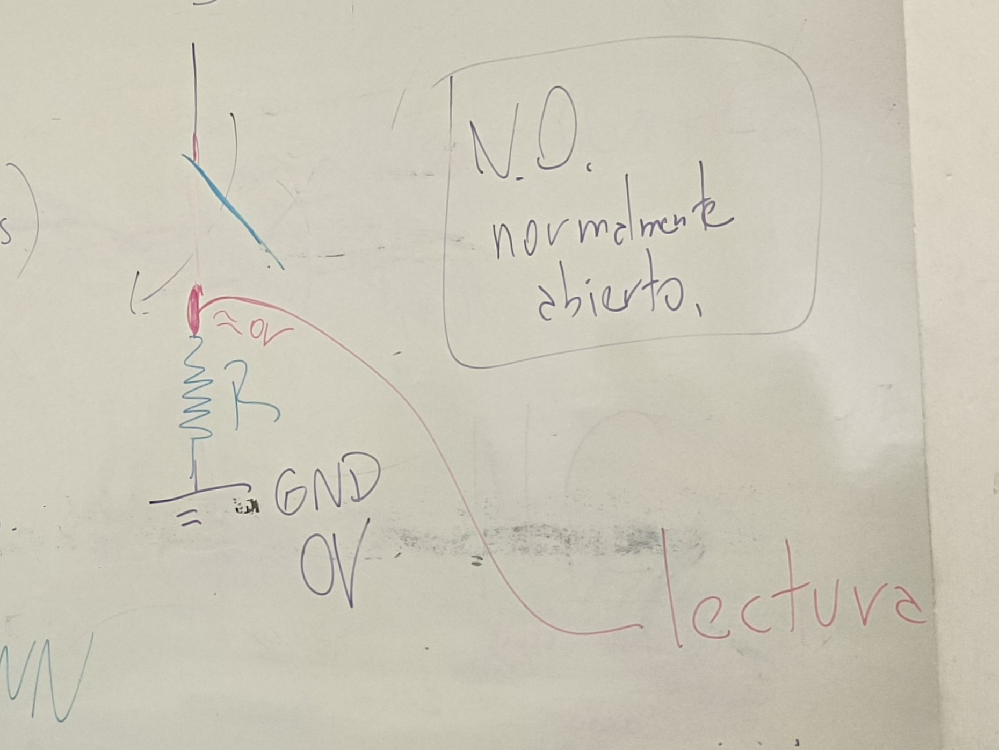

2. NC = Normalmente Conectado. siempre están conectados los dos lugares, y puedes desconectarlos al presionar el botón.

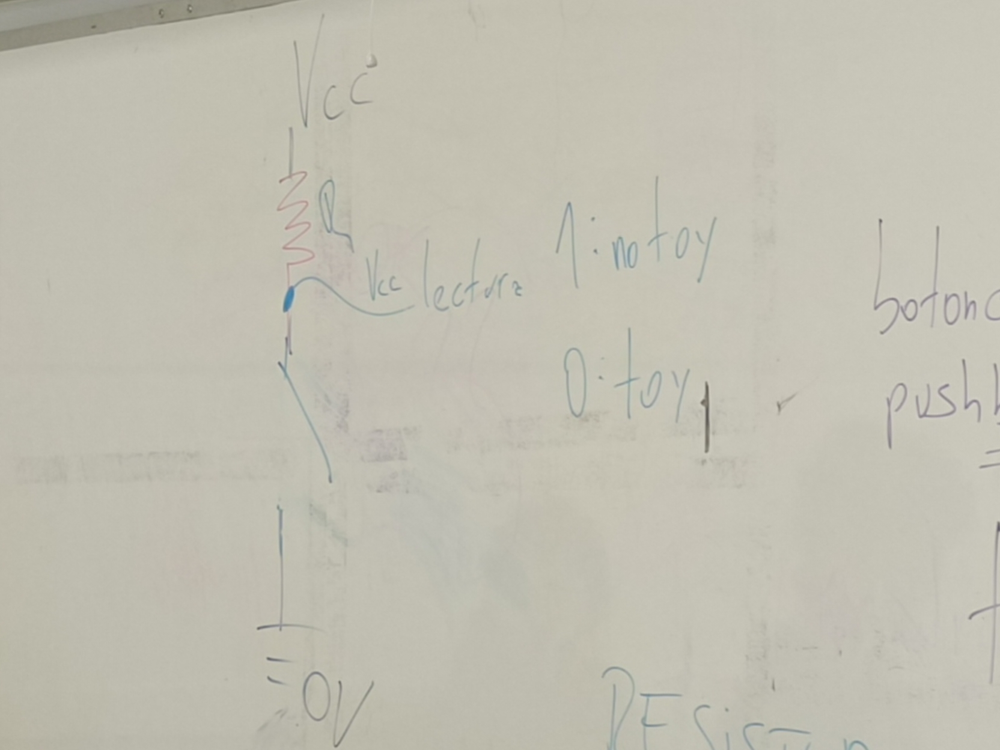

el que se utiliza más es el N.O.

---

#### pulldown

entre el punto de unión y GND, siempre debe haber una resistencia ya que si hacemos contacto sin ella podemos hacer corto circuito y dañar nuestro puerto USB. esta resistencia se llama resistor pulldown, que nos permite que la lectura sea siempre 0 excepto cuando el circuito está cerrado.

1= toy

0= no toy

---

#### pullup

si ponemos una resistencia en la parte de Vcc, tenemos que hacer la lectura entre vcc y la resistencia que está en el lado de Vcc, por lo que la lectura nos diría que si no presionamos el botón el lugar es Vcc, mientras que cuando lo presionamos se convierte en 0V.

1= no toy

0= toy

---

<https://docs.arduino.cc/built-in-examples/digital/Button/>

cables rojos para Vcc, cables negros para GND

el botón tiene dos lugares: hemisferio derecho y hemisferio izquierdo

en el hemisferio izquierdo, entre la patita del botón y GND hay una resistencia, la cual es pulldown ya que eso es lo que me está permitiendo llegar a tierra con calma.


---

### conectando un potenciómetro a la placa

a los dos extremos del potenciómetro va GND y Vcc
en la patita 2

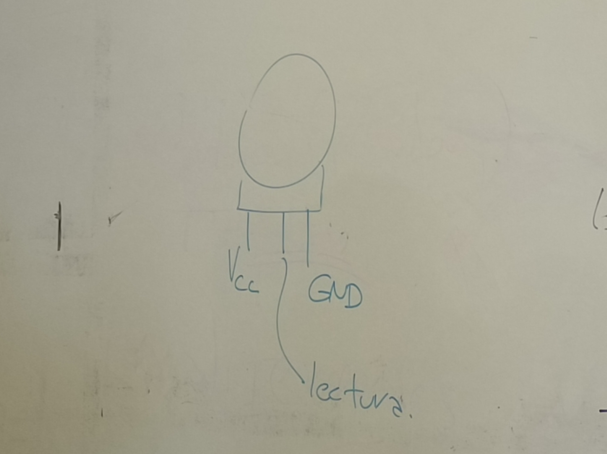

en Arduino la sección de ``analog`` es el mundo real, aquí va el potenciómetro, mientras que los botones van al lado de ``digital``.

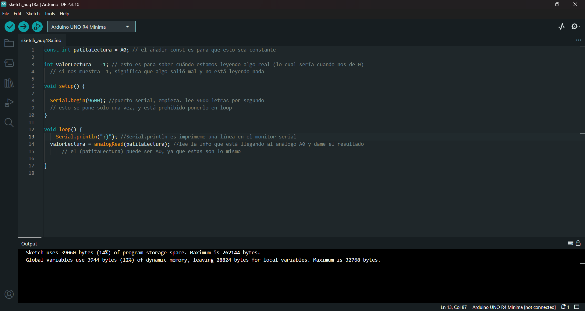

``while`` = mientras que

``!`` = lo contrario de 

por lo tanto:

```cpp
while (!Serial) // mientras puerto serial no esté listo, no avanzar
{ // por lo tanto esto se queda pegado hasta que parta serial begin
} 
```
println imprime y se salta a la siguiente línea, en cambio print imprime y no se salta a la siguiente línea, sino que sigue de corrido. ej:

```cpp
Serial.print("valor actual: ");
Serial.println(poteLectura);
```

---

### solución del problema con los cables

como mencioné en mi bitácora anterior, tuve problemas al momento de intentar conectar la Raspberry Pi Pico 2W con mi pc, ya que a pesar de intentar con tres cables distintos mi pc no reconocía que algo se había conectado, por lo cual pedí ayuda en el server del taller. en el server me dieron varias respuestas, pero la conclusión fue que era muy probable que el problema fueran mis cables ya que no todos los cables son para cargar y dar datos, sino que algunos solo pueden cargar.

ya estando en clases le pedí a Aarón prestado un cable USB-MicroUSB para poder confirmar que el problema eran mis cables. al usarlo para conectar mi pc a la Raspi, Arduino IDE identificó de manera inmediata el microcontrolador. una vez ya terminó la clase, le devolví a Aarón el cable y pregunté si de casualidad habían de este tipo en el LID, a lo que me dijo que lo más probable es que no, por lo que ese mismo día en la tarde aproveché de pasar a comprar un cable nuevo (el cual si me sirvió lolololol).

para poder saber identificar cuáles cables me sirven y cuales no, le pregunté a Aarón si había una manera de poder saber cuáles son los que cargan y dan datos, para evitar comprar uno que solo sirva para cargar, a lo que me dio los siguientes tips:

1. los que son exclusivamente de carga, tienen solo dos filas dentro de la parte USB

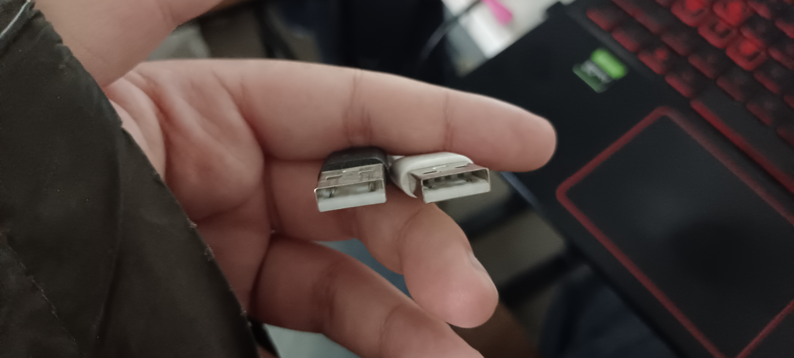

2. hay unos que son solo de carga, pero por alguna razón fingen que no lo son y de igual manera tienen 4 filas dentro de la parte USB lol

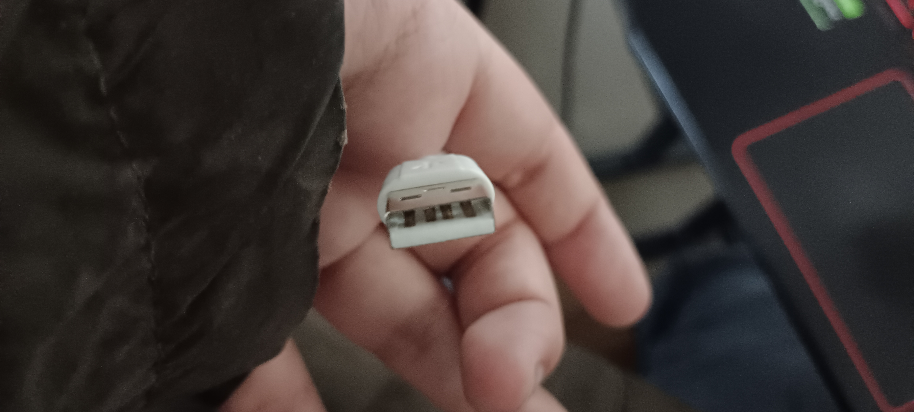

esos eran los tres cables que probé en mi casa, los cuales claramente no me iban a servir LOL. aquí dejo foto del cable totalmente funcional de Aarón (muchas gracias profe):

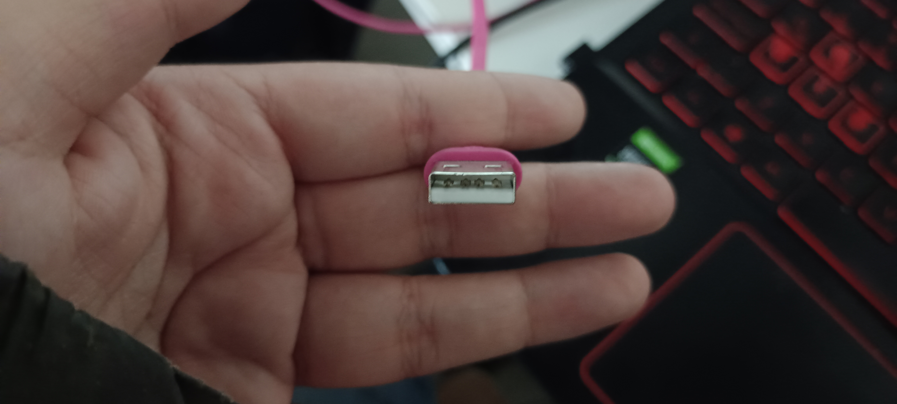

---

## encargos

encargo02a:

1. en tu fork, ir a actions, y aceptar que corran github worfklows. subir pantallazo con demostración de que han corrido actions exitosas en tu repo. esto es crucial, si no lo haces, no agregaremos tus apuntes al repo, y las tareas se tomarán como no entregadas. si en tu fork las actions no son exitosas, no serán tampoco agregadas al repo común ni evaluadas.


2. conformar grupos de 3 a 4 personas para la realización del proyecto-1. compartir 2 placas de desarrollo por grupo, documentar estudio conjunto de C++, microcontroladores, botones, potenciómetros.

mi grupo de trabajo para el proyecto-1 está compuesto por:

1. Santiago Cifuentes - [santiagocifuvelez](<https://github.com/nicolasvaldesgreve/dis8645-2026-2-procesos-1/tree/main/05-santiagocifuvelez>)
2. Francisca Palma - [frannciscapalma](<https://github.com/nicolasvaldesgreve/dis8645-2026-2-procesos-1/tree/main/18-frannciscapalma>)
3. Nicolás Valdés - [nicolasvaldesgreve](<https://github.com/nicolasvaldesgreve/dis8645-2026-2-procesos-1/tree/main/28-nicolasvaldesgreve>)

debido a nuestras diferencias de horario de clases y los trabajos que debemos hacer, decidimos que era mejor como grupo repartirnos la investigación en tres partes, encargándonos cada uno de las siguientes cosas:

+ Santi -> microcontroladores
+ Fran -> Cpp
+ Nico (yo hola) -> botones y potenciómetros

#### potenciómetros

los potenciómetros son un componente de resistencia variable, en el cual puedes ajustar el valor de resistencia al ir rotando la perilla que este trae. es un componente clave en los sistemas de control, regulación y medición.

para poder dibujar un potenciómetro dentro de un esquemático, se utilizan los siguientes símbolos: 

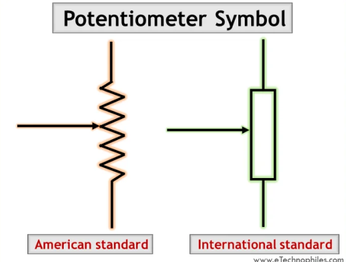

dentro de <https://www.etechnophiles.com/potentiometer-symbol-pinout/>, también nos muestran distintos tipos de potenciómetros, en qué orden se cuentan los pines de estos y cuál es el rol de cada pin.

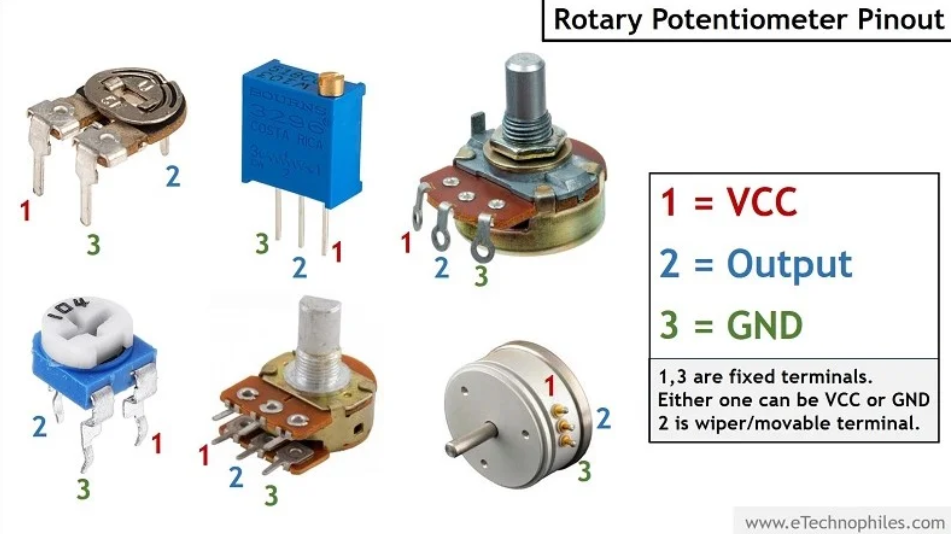

para poder entender qué tipo de proyectos se pueden realizar con este componente, quiero hablar sobre el trabajo de Lee Seunghun, el cual se llama [engmung](<https://github.com/engmung>) en GitHub. su trabajo se llama Patternflow, el cual es un sintetizador LED open-source el cual te permite crear y modificar patrones de luces mediante perillas, las cuales son potenciómetros.

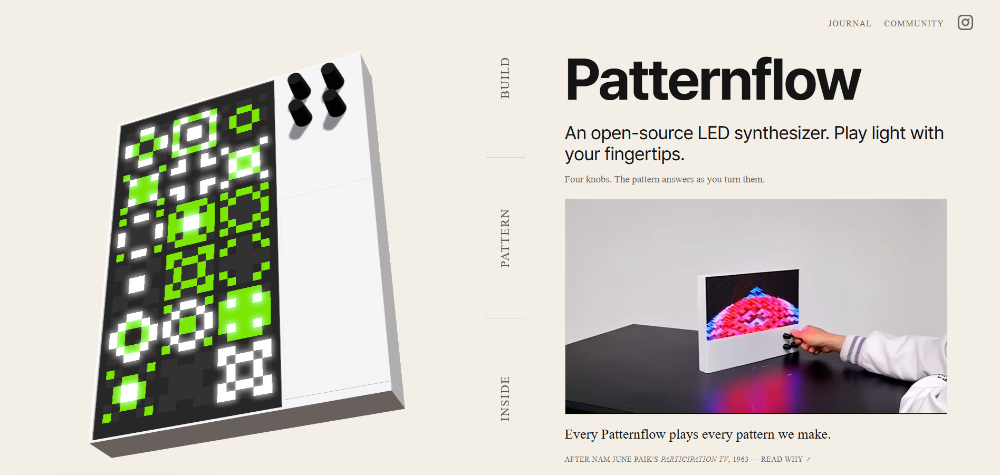

puedes interactuar con este sintetizador mediante 4 potenciómetros, los cuales te permiten ir modificando los patrones y la cantidad de repeticiones que éste tiene en la pantalla. la mejor parte de este proyecto es que es open-source, por lo que si nos dirigimos al siguiente link: <https://github.com/engmung/Patternflow>, podremos encontrar todo el material que necesitemos como lo es el firmware, hardware y las integraciones que este tiene.

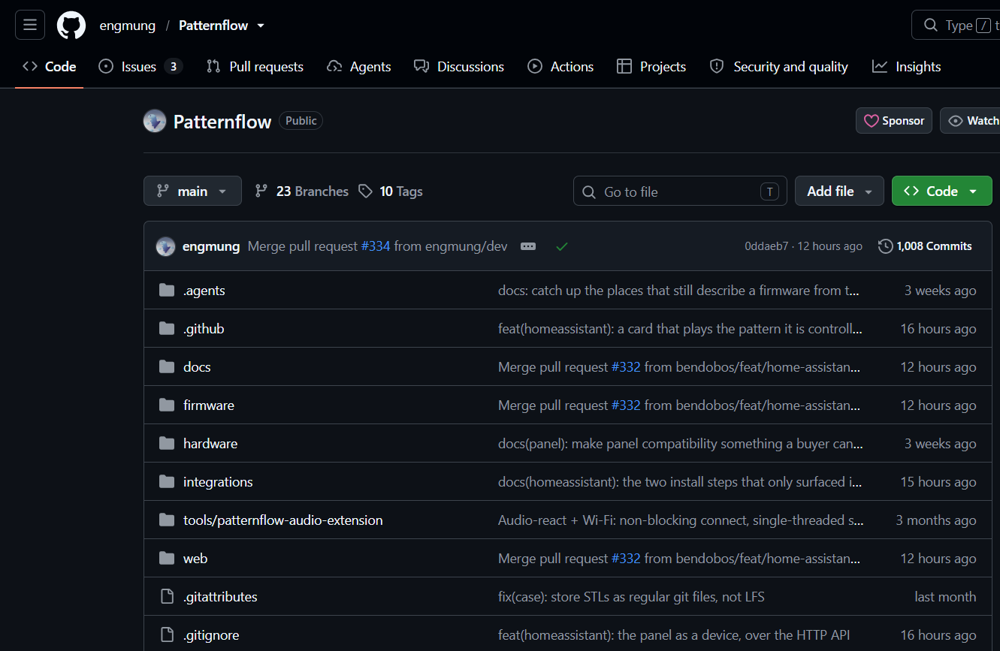

incluso si no tienes presupuesto para poder hacer este proyecto, no te preocupes!! ya que lo primero que nos recibe en su página es una versión interactiva del dispositivo de manera digital, pudiendo así rotarlo y rotar los potenciómetros!!

#### fuentes potenciómetros

+ <https://www.tme.com/cl/es/news/library-articles/glossary/page/69420/potenciometro-definicion/>
+ <https://www.etechnophiles.com/potentiometer-symbol-pinout/>
+ <https://github.com/engmung>
+ <https://github.com/engmung/Patternflow>
+ <

---

## lectura
