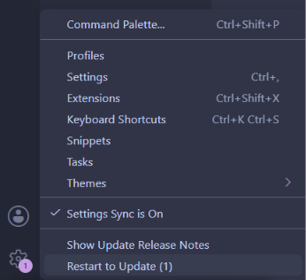
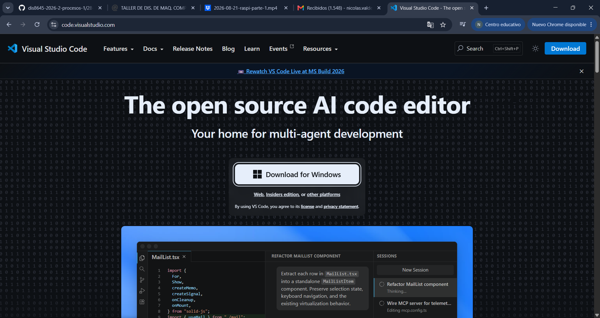
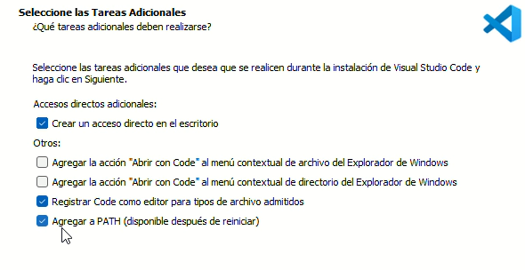
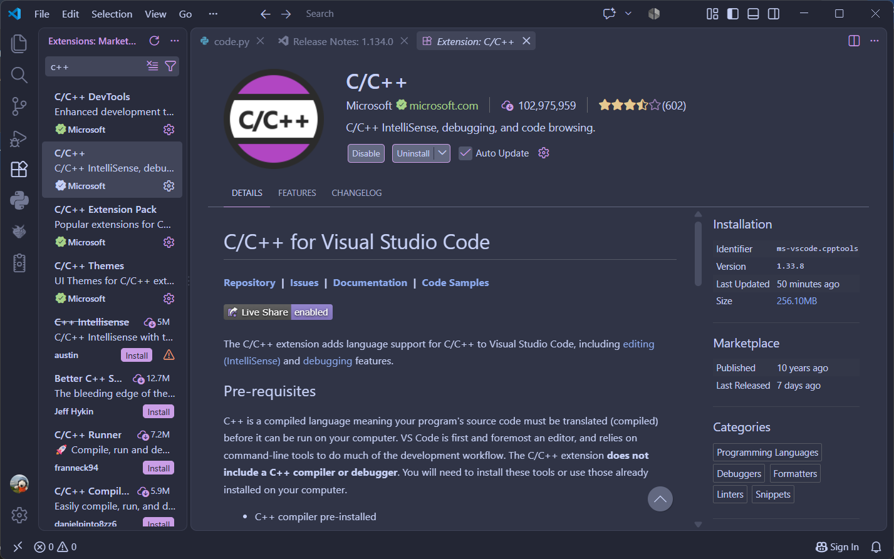
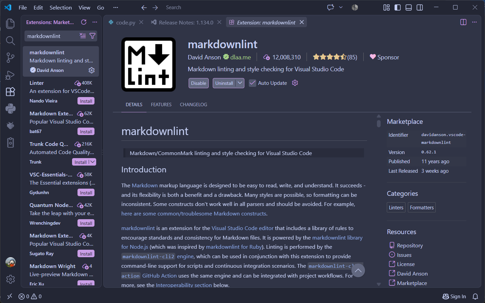
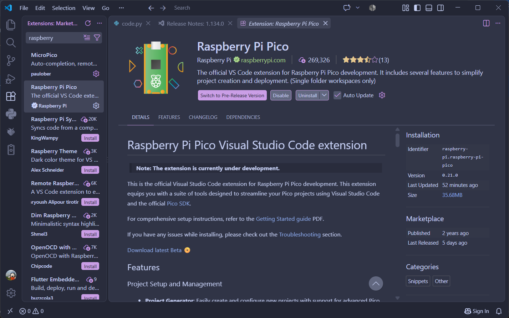
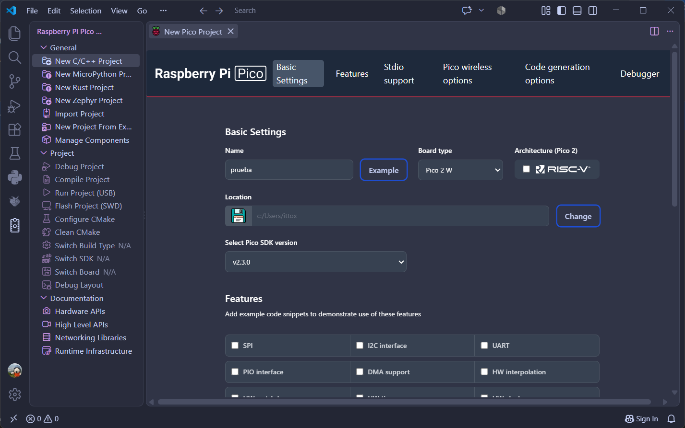
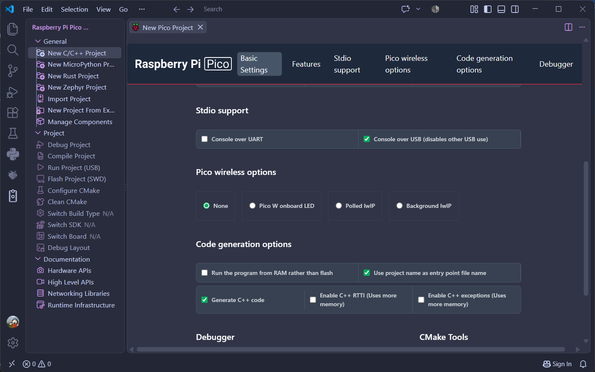
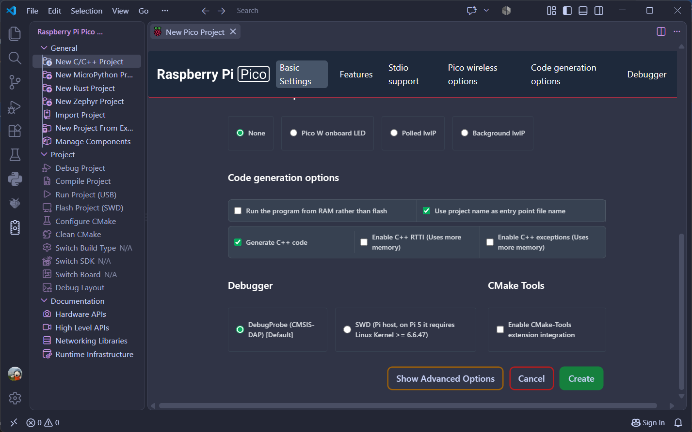

# sesion-02b

clase cancelada por cierre de udp

## encargos

encargo02b:

subimos videos en canvas de hoy, son 3 videos.

1- instalar visual studio code, cami está regrabando el video parte 1 porque tuvimos un problema ténico, les avisará por discord cuando esté listo
2- ver los videos parte 2 y parte 3, aunque no tengan una placa raspberry pi, anotar dudas, tratar de subir código a sus placas si es que las piden.

## Instalación Visual Studio Code

yo ya tenía el software instalado debido a que lo utilicé el semestre pasado, por lo que solo tuve que actualizarlo yendo a ``Manage`` y permitiendo que este descargue la última actualización. 

para poder instalar el software, se deben seguir los siguientes pasos:

1. ir a la página de Visual Studio Code: <https://code.visualstudio.com/> y descargar el software

2. al instalar el software, debemos procurar tener seleccionada la opción de "Agrefar a PATH (disponible después de reiniciar) y la de "Registrar Code como editor para tipos de archivo admitidos"

luego de instalarse, debemos añadir extensiones al software para que podamos utilizar distintos idiomas de programación. para esto debemos ir dentro de ``Extensions`` o presionando las teclas ``Ctrl`` + ``Shift`` + ``X``, en donde tenemos que buscar las siguientes extensiones y las instalaremos:

una vez ya tengamos las extensiones instaladas, podremos iniciar nuestro primer proyecto! para poder hacer esto, tenemos que presionar el ícono de Raspberry Pi Pico Project en donde nos aparecerá lo siguiente:

dentro de este lugar debemos poner el nombre del proyecto, el tipo de microcontrolador que estamos usando (en mi caso es la Raspberry Pi Pico 2W) y NO tenemos que seleccionar en donde dice "RISC-V", repito, NO hay que hacerlo!!

en la parte que dice "Location", debemos seleccionar el lugar en donde se guardará el proyecto por lo que debes elegir el lugar a tu gusto. Usaremos la versión más actual, la cual en este momento es la v2.3.0.

dentro de la sección "Code generation options" seleccionaremos la casilla que dice "Generate C++ code", mientras que en "Debugger" seleccionaremos la opción por Default.

una vez ya tengamos todo listo, podemos presionar en donde dice "Create"!!

\n = enter

## lectura
