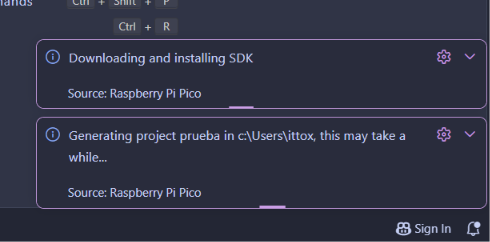
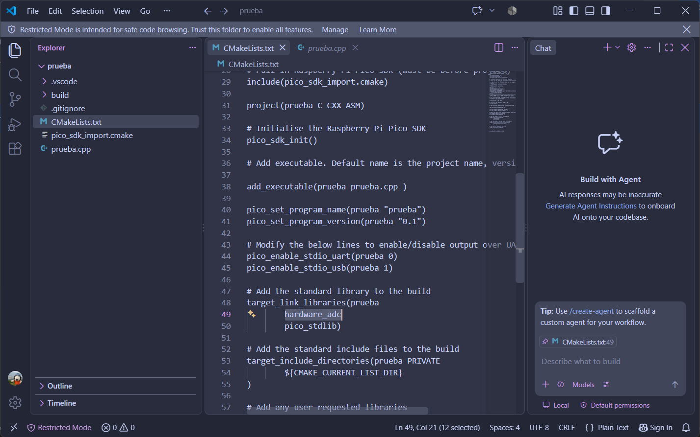
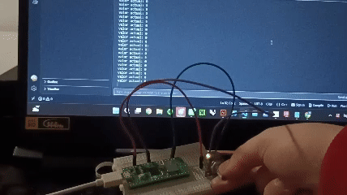

# sesion-02b

clase cancelada por cierre de udp

## encargos

encargo02b:

subimos videos en canvas de hoy, son 3 videos.

1- instalar visual studio code, cami está regrabando el video parte 1 porque tuvimos un problema ténico, les avisará por discord cuando esté listo
2- ver los videos parte 2 y parte 3, aunque no tengan una placa raspberry pi, anotar dudas, tratar de subir código a sus placas si es que las piden.

## Instalación Visual Studio Code

yo ya tenía el software instalado debido a que lo utilicé el semestre pasado, por lo que solo tuve que actualizarlo yendo a ``Manage`` y permitiendo que este descargue la última actualización. 

para poder instalar el software, se deben seguir los siguientes pasos:

1. ir a la página de Visual Studio Code: <https://code.visualstudio.com/> y descargar el software

2. al instalar el software, debemos procurar tener seleccionada la opción de "Agrefar a PATH (disponible después de reiniciar) y la de "Registrar Code como editor para tipos de archivo admitidos"

luego de instalarse, debemos añadir extensiones al software para que podamos utilizar distintos idiomas de programación. para esto debemos ir dentro de ``Extensions`` o presionando las teclas ``Ctrl`` + ``Shift`` + ``X``, en donde tenemos que buscar las siguientes extensiones y las instalaremos:

una vez ya tengamos las extensiones instaladas, podremos iniciar nuestro primer proyecto! para poder hacer esto, tenemos que presionar el ícono de Raspberry Pi Pico Project en donde nos aparecerá lo siguiente:

dentro de este lugar debemos poner el nombre del proyecto, el tipo de microcontrolador que estamos usando (en mi caso es la Raspberry Pi Pico 2W) y NO tenemos que seleccionar en donde dice "RISC-V", repito, NO hay que hacerlo!!

en la parte que dice "Location", debemos seleccionar el lugar en donde se guardará el proyecto por lo que debes elegir el lugar a tu gusto. Usaremos la versión más actual, la cual en este momento es la v2.3.0.

dentro de la sección "Code generation options" seleccionaremos la casilla que dice "Generate C++ code", mientras que en "Debugger" seleccionaremos la opción por Default.

una vez ya tengamos todo listo, podemos presionar en donde dice "Create"!! cuando presionamos el botón de crear se empieza a generar el archivo para nuestro proyecto, por lo que si es nuestra primera vez haciendo uno esto podría tardar unos minutos... es un momento incómodo que tenemos que superar.

cuando ya termine su proceso, tendremos que ir a ``CMakeLists.txt`` y luego de la línea 48 agregaremos la siguiente línea: ``hardware_adc``, lo cual debería quedar así:

para poder guardar cualquier cambio, debemos presionar las teclas ``Ctrl`` + ``S``!! no olvidar...

+ ``\n`` = enter

para probar un código en la Raspberry Pi Pico 2W utilicé el ejemplo que nos dio Aarón para aprender a usar el potenciómetro. cuando probé correr el código, no me dejaba y me decía algo relacionado a Python, por lo que decidí presionar el botón de la raspi, esperar unos segundos, conectarla a mi pc y soltar el botón. una vez ya hecho eso, si me permitió correr el código LOLOLOLOL.

aquí dejo un gif del código en VS Code!!

## lectura: Program Or Be Programmed: Ten Commands for a Digital Age - Douglas Rushkoff

"It may be true that "guns don't kill people, people kill people"; but guns are a technology more biased to killing than, say, clock radios.", pág 26. creo que una de las cosas que más me gusta de este libro es que me hace más fácil la lectura al usar un lenguaje simple en donde en realidad se siente como si estuviese escuchando una conversación casual pero con opiniones y argumentos de algún amigo. en esta parte, por ejemplo, demuestra lo obvio de manera un poco chistosa siento (no sobre lo que habla ya que las armas son cosas que no dan risa en realidad). la verdad es que en este ejemplo que da sobre los biases (las cuales son inclinaciones que suelen tener las cosas siento que, claramente las armas son hechas para hacer daño, pero esto no significa que esta sea la única participante ya que la persona que la porta es la que realiza la matanza, más no así lo hace la pistola, quien solo responde a órdenes que se les da.

"We live in a continuous "now", and time is always passing for us. Digital technologies do not exist in time, at all.", pág. 28. creo que fue en la bitácora pasada que mencioné que los humanos, al tener rutinas las cuales se guían en base a un horario no tienen tiempo para cuestionar las cosas que deberían ni de preocuparse por ellos mismos o el mismo futuro debido a que están muy preocupados viviendo el "ahora", pero claro, esto no les sucede a las cosas digitales ya que estas no se rigen por un horario predeterminado por lo que yo sepa(? miedo igual, lol.
