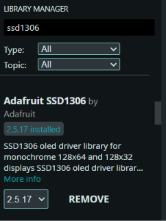
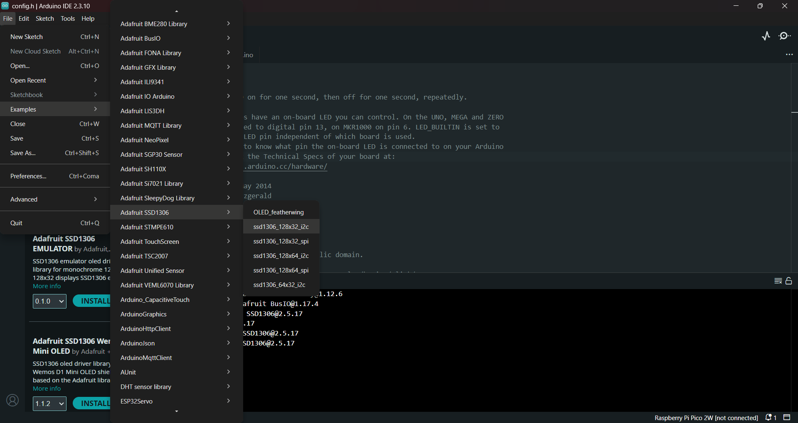
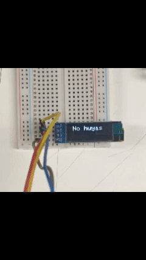
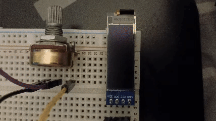

# sesion-03a

## apuntes sesión

> demorarse menos y hacerlo mejor

para partir con nuestro primer proyecto del semestre, debemos elegir un poeta antes del viernes al cual atributar. prohibido neruda por razones obvias... como grupo elegimos a Elvira Sastre, la cual fue recomendada por mi compañero de grupo Santi!! leímos sus obras, y decidimos mostrar en nuestro proyecto el poema "A los perros buenos no les pasan cosas malas", el cual es un poema dedicado a su perrito que falleció.

nos entregaron materiales nuevos!! en estos iba incluida una pantalla oled monocromática 0.91 pulgadas I2C controlador ssd1306, la cual usaremos para poder mostrar el poema. para poder aprender a usarla, Aarón nos enseñó cómo hacer las conexiones:

importante: las conexiones siempre hacerlas sin alimentación! solo dar alimentación cuando ya esté todo listo y revisado por alguien más.

SDA = señal de datos

SCK = señal de clock

GND = tierra

VCC = alimentación

en este caso, Vcc va a los 3.3V de nuestro microcontrolador, el cual en nuestro caso fue un Arduino R4 WiFi. GND va al GND de nuestro microcontrolador, SDA va a A4 de nuestra placa, el cual se encuentra en la sección de ``Analog`` mientras que SCK va en A5 de la misma sección.

una vez ya tengamos las conexiones listas, podemos probar el código de ejemplo que tenemos para esta pantalla, el cual está hecho por Adafruit. para poder encontrar este ejemplo, debemos ir al ``Library Manager``, buscar "ssd1306" y descargar la que está subida por Adafruit.



luego de instalar la biblioteca, debemos ir a ``File`` -> ``Example`` -> ``Adafruit SSD1306`` -> ``ssd1306_128x32_i2c``. una vez hagamos click, se nos abrirá el código de ejemplo.



este ejemplo muestra el logo de Adafruit en la pantalla seguido de movimientos bacanes de pixeles!! pero para poder trabajar con solo el texto, Aarón limpió el código para así poder dejar solo las cosas que nos interesan. al final el código quedó así:

```cpp
#include <SPI.h>
#include <Wire.h>
#include <Adafruit_GFX.h>
#include <Adafruit_SSD1306.h>

#define SCREEN_WIDTH 128 // OLED display width, in pixels
#define SCREEN_HEIGHT 32 // OLED display height, in pixels

#define OLED_RESET     -1 // Reset pin # (or -1 if sharing Arduino reset pin)
#define SCREEN_ADDRESS 0x3C ///< See datasheet for Address; 0x3D for 128x64, 0x3C for 128x32
Adafruit_SSD1306 display(SCREEN_WIDTH, SCREEN_HEIGHT, &Wire, OLED_RESET);

#define NUMFLAKES     10 // Number of snowflakes in the animation example

#define LOGO_HEIGHT   16
#define LOGO_WIDTH    16

void setup() {
  Serial.begin(9600);

  // Wait for display
  delay(500);

  // SSD1306_SWITCHCAPVCC = generate display voltage from 3.3V internally
  if(!display.begin(SSD1306_SWITCHCAPVCC, SCREEN_ADDRESS)) {
    Serial.println(F("SSD1306 allocation failed"));
    for(;;); // Don't proceed, loop forever
  }

  // Show initial display buffer contents on the screen --
  // the library initializes this with an Adafruit splash screen.
  display.display();
  delay(2000); // Pause for 2 seconds

  // Clear the buffer
  display.clearDisplay();

  // Draw a single pixel in white
  display.drawPixel(10, 10, SSD1306_WHITE);

  // Show the display buffer on the screen. You MUST call display() after
  // drawing commands to make them visible on screen!
  display.display();
  delay(2000);
  // display.display() is NOT necessary after every single drawing command,
  // unless that's what you want...rather, you can batch up a bunch of
  // drawing operations and then update the screen all at once by calling
  // display.display(). These examples demonstrate both approaches...

  testdrawchar();      // Draw characters of the default font

  testdrawstyles();    // Draw 'stylized' characters

  testscrolltext();    // Draw scrolling text
  // Invert and restore display, pausing in-between
  display.invertDisplay(true);
  delay(1000);
  display.invertDisplay(false);
  delay(1000);

  
}

void loop() {
}

void testdrawchar(void) {
  display.clearDisplay();

  display.setTextSize(1);      // Normal 1:1 pixel scale
  display.setTextColor(SSD1306_WHITE); // Draw white text
  display.setCursor(0, 0);     // Start at top-left corner
  display.cp437(true);         // Use full 256 char 'Code Page 437' font

  // Not all the characters will fit on the display. This is normal.
  // Library will draw what it can and the rest will be clipped.
  for(int16_t i=0; i<256; i++) {
    if(i == '\n') display.write(' ');
    else          display.write(i);
  }

  display.display();
  delay(2000);
}

void testdrawstyles(void) {
  display.clearDisplay();

  display.setTextSize(1);             // Normal 1:1 pixel scale
  display.setTextColor(SSD1306_WHITE);        // Draw white text
  display.setCursor(0,0);             // Start at top-left corner
  display.println(F("Hello, world!"));

  display.setTextColor(SSD1306_BLACK, SSD1306_WHITE); // Draw 'inverse' text
  display.println(3.141592);

  display.setTextSize(2);             // Draw 2X-scale text
  display.setTextColor(SSD1306_WHITE);
  display.print(F("0x")); display.println(0xDEADBEEF, HEX);

  display.display();
  delay(2000);
}

void testscrolltext(void) {
  display.clearDisplay();

  display.setTextSize(2); // Draw 2X-scale text
  display.setTextColor(SSD1306_WHITE);
  display.setCursor(10, 0);
  display.println(F("scroll"));
  display.display();      // Show initial text
  delay(100);

  // Scroll in various directions, pausing in-between:
  display.startscrollright(0x00, 0x0F);
  delay(2000);
  display.stopscroll();
  delay(1000);
  display.startscrollleft(0x00, 0x0F);
  delay(2000);
  display.stopscroll();
  delay(1000);
  display.startscrolldiagright(0x00, 0x07);
  delay(2000);
  display.startscrolldiagleft(0x00, 0x07);
  delay(2000);
  display.stopscroll();
  delay(1000);
}

#define XPOS   0 // Indexes into the 'icons' array in function below
#define YPOS   1
#define DELTAY 2

void testanimate(const uint8_t *bitmap, uint8_t w, uint8_t h) {
  int8_t f, icons[NUMFLAKES][3];

  // Initialize 'snowflake' positions
  for(f=0; f< NUMFLAKES; f++) {
    icons[f][XPOS]   = random(1 - LOGO_WIDTH, display.width());
    icons[f][YPOS]   = -LOGO_HEIGHT;
    icons[f][DELTAY] = random(1, 6);
    Serial.print(F("x: "));
    Serial.print(icons[f][XPOS], DEC);
    Serial.print(F(" y: "));
    Serial.print(icons[f][YPOS], DEC);
    Serial.print(F(" dy: "));
    Serial.println(icons[f][DELTAY], DEC);
  }

  for(;;) { // Loop forever...
    display.clearDisplay(); // Clear the display buffer

    // Draw each snowflake:
    for(f=0; f< NUMFLAKES; f++) {
      display.drawBitmap(icons[f][XPOS], icons[f][YPOS], bitmap, w, h, SSD1306_WHITE);
    }

    display.display(); // Show the display buffer on the screen
    delay(200);        // Pause for 1/10 second

    // Then update coordinates of each flake...
    for(f=0; f< NUMFLAKES; f++) {
      icons[f][YPOS] += icons[f][DELTAY];
      // If snowflake is off the bottom of the screen...
      if (icons[f][YPOS] >= display.height()) {
        // Reinitialize to a random position, just off the top
        icons[f][XPOS]   = random(1 - LOGO_WIDTH, display.width());
        icons[f][YPOS]   = -LOGO_HEIGHT;
        icons[f][DELTAY] = random(1, 6);
      }
    }
  }
}
```

lo que mostraba en pantalla era muy entretenido!! con mi grupo nos preguntamos si podíamos cambiar lo que decía en la pantalla en la última fase, por lo que buscamos en donde mencionaba "scroll" y lo cambiamos a gusto. al correr el código sucedió esto:



> .h son promesas de campaña
> .cpp son archivos con responsabilidad computacional y emocional

nuestro objetivo es poder mostrar en la pantalla la siguiente estrofa del poema "A los perros buenos no les pasan cosas malas" de Elvira Sastre:

Aprendí de la vida a quererte de igual modo, a amar este equilibrio nuestro, la igualdad de latido, a confiar sin atender al tiempo que tarda uno en encontrar la calma, a buscar lo urgente sin ninguna prisa, y a llegar a casa, y que mi casa sea mi casa porque tú me esperas, y que tu casa sea tu casa porque siempre vuelvo.

para poder lograr este objetivo, con mi grupo de trabajo nos juntamos para poder avanzar y aprender más (nerdssss lol), en donde aprendimos lo siguiente (gracias santi por hacer copy paste jiji):

#### Ejercicio con mi equipo <3

#### Funciones utilizadas

| Función | Qué hace |
|---|-----|
| `Wire.h` | Habilita la comunicación **I2C** (necesaria porque la pantalla usa I2C, no SPI) |
| `Adafruit_SSD1306 display(...)` | Crea el objeto `display`, vinculado a la resolución de la pantalla |
| `display.begin(...)` | Inicializa la pantalla y la conexión I2C — debe tener éxito o nada funciona |
| `display.clearDisplay()` | Borra el buffer interno de dibujo (en RAM), **no** la pantalla física todavía |
| `display.setTextSize(n)` | Escala el tamaño de la letra multiplicando por un número entero |
| `display.setTextColor(...)` | Define el color del píxel (casi siempre `SSD1306_WHITE` en OLEDs monocromáticas) |
| `display.setCursor(x, y)` | Define dónde empieza el próximo texto o dibujo |
| `display.println(...)` / `display.print(...)` | Escribe texto en el buffer |
| `display.getTextBounds(...)` | Calcula el ancho/alto en píxeles de un texto antes de dibujarlo (útil para centrar o alinear) |
| `display.display()` | Envía el buffer a la pantalla física — nada se muestra sin esto |
| `display.invertDisplay(true/false)` | Invierte los colores de la pantalla (blanco↔negro) como efecto visual |
| `Serial.begin(9600)` | Inicia la comunicación serial con la computadora, a 9600 baudios, para depuración (debug) |
| `F("texto")` | Guarda el texto en memoria Flash en vez de RAM, para ahorrar memoria RAM (muy limitada en microcontroladores) |
| `display.cp437(true)` | Activa el set extendido de caracteres "Code Page 437" (símbolos adicionales, no solo ASCII básico) |
| `display.write(i)` | Escribe un solo carácter (por su código numérico) en el buffer |
| `for(;;);` | Bucle infinito vacío — congela el programa ahí (se usa cuando algo falla y no se debe continuar) |


```cpp
//esta parte es OBLIGATORIA en todas las estructuras con Adafruit, 
//ya que son las librerias.
//de aquí:
#include <SPI.h>
#include <Wire.h>
#include <Adafruit_GFX.h>
#include <Adafruit_SSD1306.h>

#define SCREEN_WIDTH 128 // OLED display width, in pixels
#define SCREEN_HEIGHT 32 // OLED display height, in pixels

#define OLED_RESET     -1 // Reset pin # (or -1 if sharing Arduino reset pin)
#define SCREEN_ADDRESS 0x3C ///< See datasheet for Address; 0x3D for 128x64, 0x3C for 128x32
Adafruit_SSD1306 display(SCREEN_WIDTH, SCREEN_HEIGHT, &Wire, OLED_RESET);

//hasta aquí. 


//setup() — se ejecuta una sola vez al encender
void setup() {
  Serial.begin(9600); //inicialización de la pantalla
  delay(500);   // Wait for display para prenderse

//Esta parte igual, es obligatoria por el bien de la sociedad.
//Esta parte es por si a la pantalla no le llega la suficiente energía y hay un error, 
//ella pueda procesarlo y resistir, y nosotres actuar.
  // SSD1306_SWITCHCAPVCC = generate display voltage from 3.3V internally
  if(!display.begin(SSD1306_SWITCHCAPVCC, SCREEN_ADDRESS)) {
    Serial.println(F("SSD1306 allocation failed"));
    for(;;); // Don't proceed, loop forever
  }


// Al inicializarse, la librería carga automáticamente un logo de Adafruit en el buffer. 
//display.display() lo muestra en pantalla, y se queda 2 segundos.
  display.display();
  delay(2000); // Pause for 2 seconds
  // para borrar el buffer, lo que apareció en la pantalla
  display.clearDisplay();


  testdrawstyles(); // llama a la función (ya definida más abajo)

//si no quieres poner lo de la animación de cambiar de color que está en el
//siguiente parrafo de código...,
//se borra, duhh, pero, se debe cerrar entonces esta parte con un "}"


//SOLO SI SE QUIERE CAMBIAR EL COLOR.
//si queremos invertir los colores de la pantalla (recordemos que la pantalla es monocromatica
//podemos hacerlo así).
  display.invertDisplay(true); //esa función es para cambiar el colorrrrrrr. periodo.
  delay(1000);
  display.invertDisplay(false);
  delay(1000);
}
//Hay dos display.invertDisplay, porque hace como una pequeña animación.


  void loop() {
    // vacío, o lo que quieras que se repita  
  }

  // Aquí, AFUERA de setup() y loop(), defines las funciones:
    void testdrawstyles(void) {
      display.clearDisplay();
      display.setTextSize(2); //tamaño de la letra
      display.setTextColor(SSD1306_WHITE);
      display.setCursor(1, 4); //esta es la posición en x,y
      display.println(F("que rica tu agua")); //recordad que la "F", siempre va igual para que no se nos tueste la RAM del Arduino.
      display.display();  // muestra el texto en pantalla
      delay(2000);
    }
  
```
al aprender todo lo mencionado anteriormente, pudimos modificar el código a como se muestra arriba. en este código se retiró el movimiento del texto, por lo que ahora el texto se mantiene quieto en las coordenadas mencionadas de la pantalla.

ahora que ya teníamos control sobre la ubicación del texto y el qué dice, decidimos buscar maneras de poder adaptar el código más a nuestro gusto, partiendo por cambiar el logo de Adafruit en donde quisimos mostrar un cactus, por lo que buscamos cómo poder agregar esto a la pantalla y encontramos la siguiente página: <https://javl.github.io/image2cpp/>, la cual te permite subir una imagen y la pasa a bitmaps!! agregamos el resultado que nos dio a nuestro código y funcionó. luego, para poder mostrar el texto nos dimos cuenta que para saltar cada línea había que utilizar "\n", el cual es el equivalente al ``Enter``.

una vez ya agregamos todo esto, incluimos el ejercicio que nos mostró Aarón sobre el potenciómetro para poder utilizar este componente para poder viajar en el eje Y dentro de la pantalla, así logrando ver el poema en su totalidad. aquí dejo un video de cómo quedó:



## lectura: Program Or Be Programmed: Ten Commands for a Digital Age - Douglas Rushkoff

+ asynchronous: an action, process, or event that does not happen at the same time, speed, or in real-time coordination with another (<https://dictionary.cambridge.org/dictionary/english/asynchronous>).

"This meant that, unlike a regular conversation or phone call where we exist together in the same momen and speak back and forth in real time, these online conversations were more like passing letters back and forth" omg esto es muy real!! me recordó literalmente a cuando de pequeño me metía a mi juego online favorito (habbo hotel LOL) y mis conversaciones con la mayoría de mis amigues dentro del juego eran en horas de diferencias en cada mensaje, pero esto era debido más que nada a la diferencia de horario que teníamos lololol en esos momentos recuerdo haber pensado lo lindo que sería el poder tener una conversación de corrido con elles. revivan habbo. y transformice.

"One actually thought before responding--sometimes a whole day" cuando chico yo tuve el privilegio de tener acceso al internet, lo cual creo que no me hizo muy bien al momento de pensar en mis relaciones interpersonales ya que al estar tan acostumbrado a estar en juegos online y foros en donde realmente podía pensar lo que debía decir una y otra vez antes de enviarlo al internet me quitó la habilidad de poder pensar y responder de manera rápida al momento de tener conversaciones en la vida real. creo que a día de hoy sigo sufriendo un poco las consecuencias de eso, y esto resulta en conversaciones e interacciones bastante incómodas ya que casi nunca sé qué decir o cómo reaccionar a lo que me dicen. para pensar.
