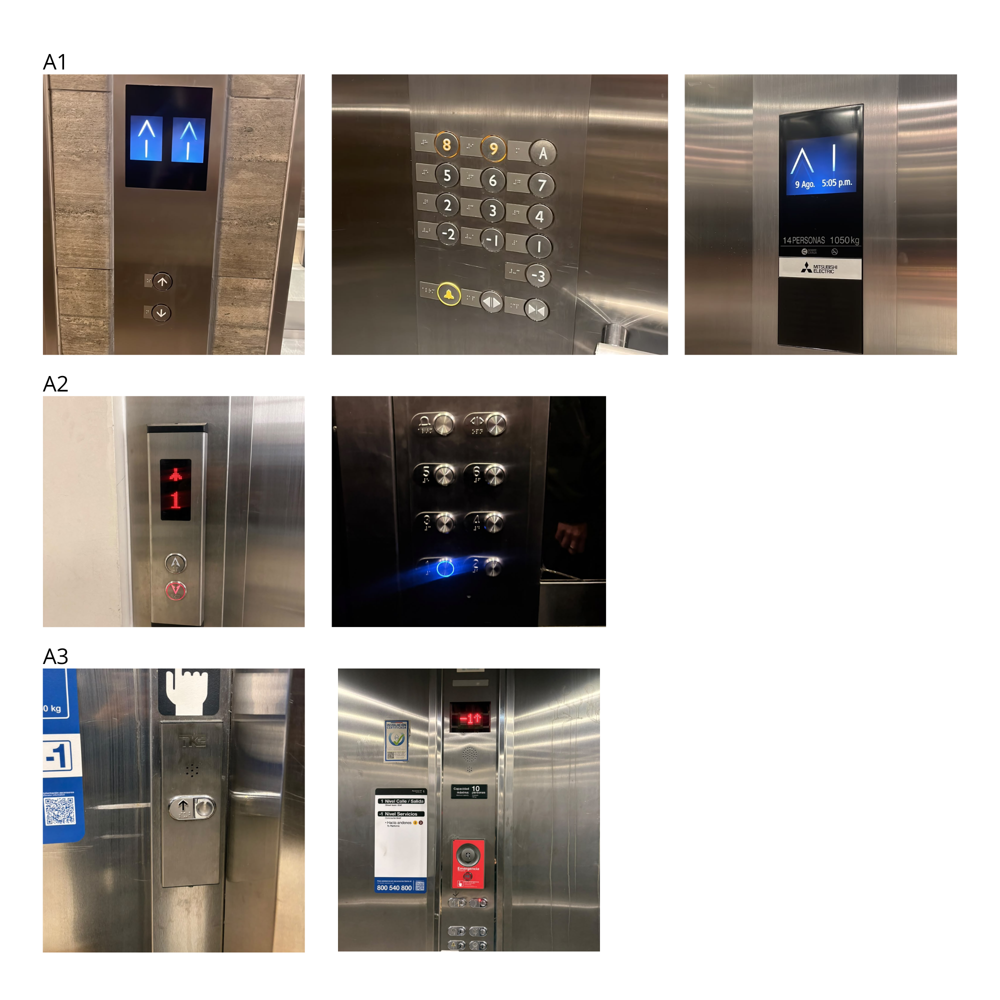

# sesion-00b

## apuntes sesión

## encargos 
A1. La botonera exterior cuenta con dos botones que permiten seleccionar la dirección de destino, que sería subir o bajar, de los dos ascensores. Al ingresar al ascensor, los botones están distribuidos en seis columnas y seis filas.

La primera columna nos muestra los botones de emergencia y los de abrir y cerrar puertas. La segunda columna corresponde al botón -3, la tercera columna a los botones -2 y -1, la cuarta columna a los pisos 2, 3 y 4, la quinta columna a los pisos 5, 6 y 7, y la sexta columna a los pisos 8, 9 y el piso A, que corresponde a la terraza.

Al momento de seleccionar un botón, tanto dentro como fuera del ascensor, se visualiza por medio de una pantalla. Si es afuera, muestra dónde se encuentra el ascensor, y dentro muestra el siguiente piso donde se va a detener.

Los números mantienen una misma tipografía y jerarquía, también tienen la misma luz de color al momento de indicar el piso y el unico boton de color distintivo (amarillo)  es el de emergencia 

A2 La botonera exterior cuenta con dos botones que permiten seleccionar la dirección de destino, que sería subir o bajar, de un ascensor y cuenta con una pantalla que indica el piso en donde se encuentra el ascensor. Al ingresar al ascensor, los botones están distribuidos en dos columnas y cuatro filas.

La primera fila, corresponde a los pisos 1 - 2, la segunda fila a los pisos 3 - 4, la tercera fila a los pisos 5 - 6, y en la parte superior se encuentran los botones de emergencia y de abrir y cerrar puertas.

Al momento de pedir el ascensor, se puede visualizar una luz rpja en el botón seleccionado y estando dentro ascensor, al momento de seleccionar un piso se ilumina de color azul. Este ascensor, en su parte interna, no cuenta con una pantalla donde se pueda visualizar el piso al que se va dirigiendo.

A3 En este ascensor se puede ver que en la parte de afuera existe únicamente un botón para subir, debido a que el recorrido está entre el piso 1 y el nivel -1. El botón exterior incorpora una flecha hacia arriba.

Al ingresar al ascensor, los botones están distribuidos en dos columnas y tres filas. Cuenta con un total de 6 botones, donde solo 2 son números, 1 y -1. Los demás botones indican las funciones de abrir y cerrar las puertas, un botón de emergencia y uno de asistencia. También cuenta con una pantalla para visualizar el piso al que se quiere ir.

## lectura
