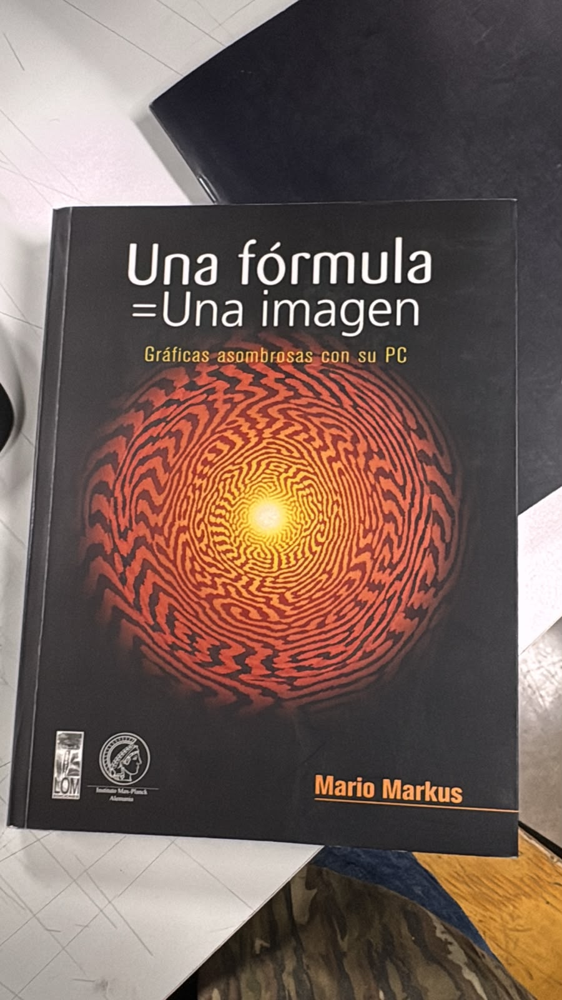

# sesion-01a

## apuntes sesión
Análisis de un ascensor.

Un ascensor se mueve en el eje z.

Que botones se encuentran en un ascensor: 

- Números arábicos, enteros positivos y negativos.
- No se encuentra el número 0.
- botones auxiliares, botones de emergencia, abrir y cerrar puertas. 

Las acciones que se pueden encontrar en un ascensor: 

- Abre la puerta.
- Sube.
- Baja.
- Cierra la puerta.
- Se mantiene.
- Puede sonar una alarma.

Las acciones que hace el ascensor se escriben entre (Paréntesis). En programación, cada acción corresponde a una función y si no hay paréntesis, es un dato.

Variables: Son los datos.
Funciones: Van a preguntar variables y, según la variable, se va a operar.

Ojo con los detalles a programar

Ejemplo: "Analizas como se cierran y se abren las puertas"

Si ponemos "Desde donde estás, pasa a 1.40". es probable que La puerta seguía avanzando si se vuelve a repetir la función.

Si "Pasa de 0 a 1.40", si solo avanza en esa distancia, si se presiona otra vez el botón, ya sabe que está en su límite.

Formato para subir un archivo en github

 - No usar tilde.
 - No usar mayúsculas.
 - Usar palabras con guion.

No ocupar NUNCA "sudo rm rf"

- do en inglés es hacer.
- su administrador del computador (contraseña/clave).
- rm remover, quitar.
- r destruye.
- f forzar.

## encargos
autorretrato: describir variables y funciones de ustedes.
investigar pantallas de segmentos, tomar fotos, documentar contexto, lugar, ubicación, alfabetos posibles, usos, comparar entre resultados encontrados, al menos 3 ejemplos distintos. https://en.wikipedia.org/wiki/Segment_display

recordar:

Variables: Son los datos.
Funciones: Van a preguntar variables y, según la variable, se va a operar.

### variables: 

nombre: bianka 

apellido: vilchez

Edad: 22

Altura: 1.53

Estado de ánimo: tranquilo, cansado, feliz, estresado

Energía: alta-media-baja

Creatividad: alta-media-baja

Paciencia: poca-mucha

Horas de sueño: depende del dia

Intereses: diseño, fotografía, moda, arte, etc

Tiempo dedicado al diseño: cambia según el día

Cantidad de café: depende del dia

### funciones:

Consultar datos personales: Junta el nombre, apellido, edad y altura para dar la presentación de la persona.

Calcular necesidad de café: Revisa las horas de sueño y el estado de ánimo. Si durmió poco o está cansada, decide aumentar las tazas de café del día.

Medir nivel de inspiración: Revisa la energía y la creatividad. Si ambas están altas, sugiere trabajar en los intereses como el diseño o la fotografía.

Organizar el tiempo de diseño: Revisa la paciencia y el tiempo disponible. Si hay mucha paciencia, asigna un proyecto difícil; si hay poca, asigna algo rápido o relajado.

Actualizar el estado de ánimo: Revisa cuántas tazas de café tomó y cuánto descansó para cambiar el estado de ánimo (por ejemplo, pasar de estar cansada a estar feliz o tranquila).

### pantalla de segmento

Una pantalla de segmentos es un dispositivo formado por varios elementos independientes que pueden encenderse o apagarse para construir números, letras o símbolos. Los segmentos suelen ser LED, cristales líquidos u otras tecnologías.

La más conocida es la de 7 segmentos

Las pantallas de 7 segmentos se utilizan principalmente para mostrar números arábigos. También pueden mostrar algunas letras mayúsculas y minúsculas del alfabeto inglés, pero a menudo las combinan para formar palabras o abreviaturas.

Las pantallas de 16 segmentos pueden mostrar números arábigos completos, letras mayúsculas del alfabeto inglés y la mayoría de las letras minúsculas del alfabeto inglés.

Con distintas combinaciones se pueden representar los números del 0 al 9 y algunas letras.

https://www.google.com/search?q=pantallas+de+segmentos&oq=pantallas+de+segmentos&gs_lcrp=EgZjaHJvbWUyBggAEEUYOTIICAEQABgWGB4yCAgCEAAYFhgeMgcIAxAAGO8FMgcIBBAAGO8FMgcIBRAAGO8FMgYIBhBFGD3SAQg0ODYwajBqN6gCALACAA&sourceid=chrome&source=chrome.ob&ie=UTF-8#fpstate=ive&vld=cid:d3c945e4-733c-40cf-883b-16259e657d53_6d438ae8,vid:czvRtCYk1Gw,st:144

### 1. Pantalla de 7 Segmentos
Son las más sencillas y populares. Tienen 7 barras con forma de número **8**.

* **¿Qué muestran?** Números del 0 al 9 y un par de letras simples (como A, C, E, F).
* **¿Cómo funcionan?** Cada barra es un LED con una letra (de la `a` a la `g`). Si enciendes las barras correctas, formas el número.
* **Tipos:**
**Ánodo Común:** Todos los LEDs comparten el polo positivo (+).
  **Cátodo Común:** Todos los LEDs comparten el polo negativo (-).

### 2. Pantalla de 14 Segmentos (Alfanumérica)
Son una versión mejorada. Tienen las 7 barras exteriores más otras **7 barras internas** (diagonales, verticales y horizontales).

 **¿Qué muestran?** Todo el alfabeto completo (**A-Z**), números y símbolos (+, -, *, /).
 
 **¿Por qué se usan?** Permiten escribir texto legible y mensajes completos que una pantalla de 7 segmentos no puede hacer.

### 3 Ejemplos de Dispositivos Diferentes

1. **Reloj Despertador Digital (Pantalla de 7 segmentos):**
    Usa 4 dígitos de 7 segmentos para mostrar solo la hora y los minutos (ejemplo: `12:45`).
   
    **Razón:** Solo necesita mostrar números del 0 al 9.

3. **Radio o Estéreo de Auto Antiguo (Pantalla de 14 segmentos):**
   Usa una fila de pantallas de 14 segmentos para mostrar el nombre de la estación o la canción (ejemplo: `ROCK 101.5` o `BLUETOOTH`).
   
     **Razón:** Necesita combinar letras y números para mostrar texto entendible.

4. **Báscula o Gramera Digital de Cocina (Pantalla de 7 segmentos):**
    Muestra el peso exacto del ingrediente (ejemplo: `150 g`).
   
    **Razón:** Su función principal es mostrar mediciones numéricas exactas de forma clara y económica.

## lectura

