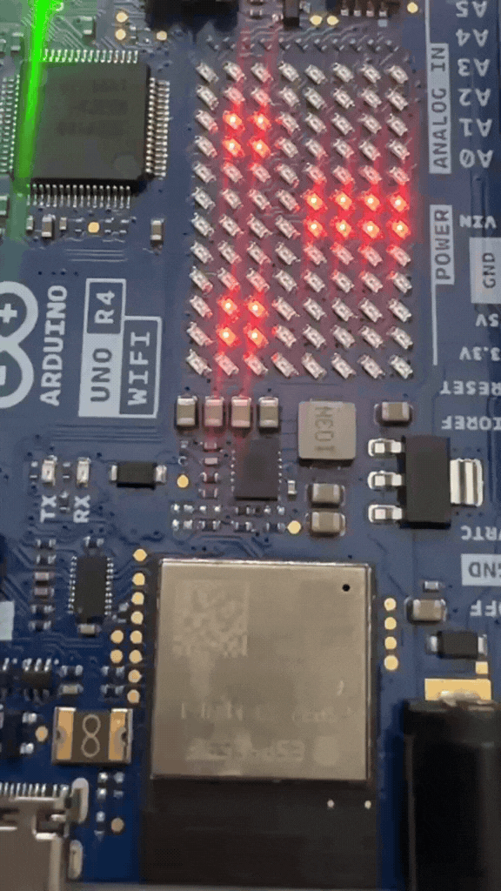
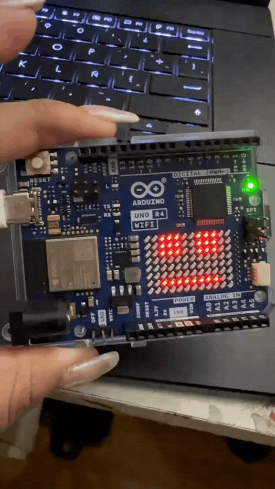
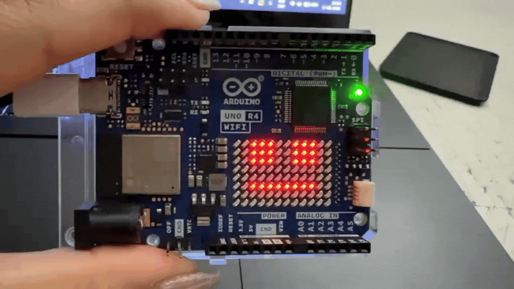

# sesion-01b

## apuntes sesión

### referentes

susan kare, diseñadora de los primeros computadores y de sus iconos.

neri oxman, diseñadora que trabaja entre diseño, ciencia, tecnología y naturaleza.

neil gershenfeld, relacionado con fabricación digital, computación y fab labs.

martin bravo.

wiring.

tom igoe, uno de los 5 co-creadores de arduino.

### variables

dato más extremo: variable si o no.

variable boolean = son o no son.

las cosas son en un contexto.

una variable tiene:

**tipo / nombre / valor**

por ejemplo:

```cpp
int biankaedad = 22;
```

`int` → tipo

`biankaedad` → nombre

`22` → valor

#### constante

constante = "algo fijo"

```cpp
const int edad = 22;
```

### algebra booleana

trabajamos con valores de:

`0` y `1`

`0` = falso / no

`1` = verdadero / si

### or

or siempre da 0, a no ser que alguna de las variables valga 1.

```text
a + 0 = a
a + 1 = 1
a + a = a
```

si alguna de las dos variables es 1, el resultado es 1.

### and

and se escribe como multiplicación.

siempre da 0 a no ser que los 2 sean 1.

```text
a · 0 = 0
a · 1 = a
a · a = a
```

### compuertas

compuerta and → tienen que cumplirse las dos condiciones.

compuerta or → basta que una condición sea verdadera.

### tipos de variables

`string` → pueden tener palabras.

`bool` → si o no. variable extrema.

`int` → número entero.

`char` → un carácter.

`int8_t`

`uint8_t` → sirve para guardar valores de 0 a 255.

8 bits = 1 byte.

### arduino

arduino uno r4

* minima
* wifi

arduino ide

processing

wiring

### setup

setup = configuración, coreografía, configurar para que empiece el inicio de las cosas.

para que el primer microcontrolador funcione.

```cpp
void setup() {

}
```

`setup()` es una función.

una función = secuencia de instrucciones para que ocurran cosas.

la función también tiene que tener un tipo.

`void` = vacío, no entrega como respuesta un valor.

`int` = el resultado es un número entero.

en este caso setup solo necesita aparecer.

```text
void → tipo
setup → nombre de la función
() → parámetros
{} → lo que ocurre dentro
```

la función se llama `setup` y es de tipo `void`.

es una función que existe, por ende está declarada.

para usarla primero tiene que existir.

### {}

`{}` = scope / contexto.

lo que está dentro de las llaves ocurre dentro de ese contexto.

por ejemplo:

```cpp
if (condicion) {

}
```

solo ocurre lo que está dentro si la respuesta es si.

### variables en c++

```cpp
bool biankaEstudianteUDP = true;
bool biankaChilena = false;

int biankaedad = 22;
int biankanacimiento = 2003;
int biankanacimientomes = 12;
int biankanacimientodia = 1;
```

`bool` → verdadero o falso.

`int` → número entero.

### = y ==

el `=` no es simétrico.

`=` → asignación de valores.

por ejemplo:

```cpp
edad = 22;
```

estoy diciendo que edad ahora vale 22.

`==` → comparar.

```cpp
edad == 22
```

pregunta si edad es igual a 22.

### if / condicionales

`if` sirve para poner una condición.

```cpp
if (condicion) {

}
```

por ejemplo:

```cpp
if (mesActual == biankanacimientomes) {

}
```

// estoy en el mes de interés

```cpp
if (diaActual == biankanacimientodia) {

}
```

// estoy en el dia de interés

también puedo juntar las dos condiciones:

```cpp
if (mesActual == biankanacimientomes && diaActual == biankanacimientodia) {

}
```

// si estoy en el mes de nacimiento y además estoy en el día de nacimiento le deseo feliz cumpleaños

`&&` = and.

las dos condiciones tienen que cumplirse.

### colores y bits

tenemos 3 receptores:

* rojo
* verde
* azul

r = rojo

g = verde

b = azul

démosle 8 bits a cada canal de color.

entonces:

```text
r = 8 bits
g = 8 bits
b = 8 bits
```

8 bits se llaman 1 byte.

0 es apagado.

255 es prendido / máximo.

tenemos:

```text
8 + 8 + 8 = 24 bits
```

con 24 bits tenemos más de 10 millones de valores posibles.

en realidad son aproximadamente 16,7 millones de colores posibles.

## funciones

una función es una secuencia de instrucciones para que ocurran cosas.

por ejemplo:

```cpp
void cumplirAnhos() {

}
```

las `void` ocurren sin emitir un resultado.

si queremos sumar números enteros:

```cpp
int sumarEnteros(int x, int y) {

}
```

es tipo `int` porque nos va a dar un resultado entero.

podemos declarar un resultado:

```cpp
int resultado = 0;
```

esto es una abreviación de dos pasos:

```cpp
int resultado;
resultado = 0;
```

primero declaramos.

después asignamos el valor.

la función puede quedar:

```cpp
int sumarEnteros(int x, int y) {

    int resultado = 0;

    resultado = x + y;

    return resultado;
}
```

`return` entrega el resultado de la función.

## comentarios / seudocódigo

los comentarios sirven para describir las ideas.

```cpp
// esto es un comentario
```

toda línea de código puede estar acompañada de un comentario para explicar qué queremos que ocurra.

el seudocódigo sirve para pensar primero la idea y después pasarla a código.

por ejemplo:

```cpp
// si estoy en el mes de nacimiento
// y además estoy en el día de nacimiento
// entonces le deseo feliz cumpleaños
```

### matrices led

matrices led = varios leds organizados en filas y columnas.

se pueden utilizar para mostrar:

* números
* letras
* formas
* imágenes
* animaciones

## encargos

1. tratar de correr un código en el microcontrolador asignado a cada dupla, incluir referentes, citas, comentarios, imágenes, descripciones textuales, y en caso de éxito o fracaso incluir aciertos, preguntas, dramas, atados. recordatorio que estos apuntes son personales, cada persona sube su versión.

para este ejercicio me tocó trabajar con un arduino uno r4 wifi junto con mi compañero. lo primero que quería entender era cómo hacer que el microcontrolador hiciera algo que yo le estaba pidiendo a través del código.

como en la clase estuvimos hablando de variables, funciones, booleanos, condiciones y de cómo las cosas funcionan dentro de un contexto, quería llevar estos conceptos a algo físico.

el arduino que estoy utilizando tiene una matriz de leds incorporada de 12 x 8, por lo que decidimos trabajar con estas luces para crear un emoji.

### primer acercamiento

antes de hacer los emojis, primero necesitaba entender cómo funcionaba la matriz de leds y cómo podía comunicarme con ella desde el computador.

para eso conecté el arduino al computador mediante el cable usb y abrí el arduino ide.

lo primero que tuve que hacer fue seleccionar la placa correspondiente:

arduino uno r4 wifi

también tuve que seleccionar el puerto para poder cargar el código al microcontrolador.

### primera prueba con la matriz

una vez que pude comunicarme con el arduino, empecé a trabajar con la matriz de leds.

la matriz tiene:

12 columnas
x
8 filas

por lo que tenemos 96 luces.

cada luz puede estar prendida o apagada.

esto lo pude relacionar con lo que vimos en clases sobre los booleanos:

true = si
false = no

en este caso puedo pensar:

true = luz prendida
false = luz apagada

también puedo pensar la matriz utilizando 0 y 1:

0 = apagado
1 = prendido

tambien me recordó a mi lectura del libro “una fórmula = una imagen”, ya que en una parte nos menciona que las imágenes se grafican en coordenadas, tenemos (x,y). entonces, en este caso contaríamos con 8 filas y 12 columnas, donde cada luz tendría una posición dentro de esta matriz. las coordenadas se podrían ir desplazando o cambiando para formar una imagen, similar a los ejercicios del colegio, donde se colocaban diferentes puntos según sus coordenadas y luego se unían para ver qué imagen formaban.


Como ya sabemos que trabajamos con ceros y unos bajo un sistema de coordenadas $(x, y)$, el siguiente paso era definir cómo traducir la imagen a la matriz. Para esto, recurrimos a Inteligencia Artificial para consultar cómo estructurar el arreglo de datos partiendo de la carita que queríamos representar: :I

### creando el emoji `:I` en el arduino

como ya sabemos que tenemos que trabajar con 0 y 1 en un eje de coordenadas (x, y), el siguiente paso era traducir la idea visual de nuestra carita a la matriz física.

la carita que decidimos realizar es: `:I`

* dos ojos abiertos e iguales `:`
* una boca recta `I`

para lograr esto en el arduino uno r4 wifi, utilizamos la librería `Arduino_LED_Matrix` y representamos la matriz de 12 columnas x 8 filas con 0 y 1:

```cpp
#include "Arduino_LED_Matrix.h"

// crear el objeto matriz
ArduinoLEDMatrix matrix;

// matriz de 8 filas x 12 columnas para dibujar el emoji :I
const uint8_t emojiCara[8][12] = {
  {0, 0, 0, 0, 0, 0, 0, 0, 0, 0, 0, 0},
  {0, 0, 1, 1, 0, 0, 0, 0, 1, 1, 0, 0}, // ojo izquierdo y ojo derecho
  {0, 0, 1, 1, 0, 0, 0, 0, 1, 1, 0, 0}, // ojos de 2x2 leds
  {0, 0, 0, 0, 0, 0, 0, 0, 0, 0, 0, 0},
  {0, 0, 0, 1, 1, 1, 1, 1, 1, 0, 0, 0}, // línea de la boca recta
  {0, 0, 0, 0, 0, 0, 0, 0, 0, 0, 0, 0},
  {0, 0, 0, 0, 0, 0, 0, 0, 0, 0, 0, 0},
  {0, 0, 0, 0, 0, 0, 0, 0, 0, 0, 0, 0}
};

void setup() {
  // inicializar la matriz
  matrix.begin();
  
  // cargar el dibujo del emoji en la matriz de leds
  matrix.renderBitmap(emojiCara);
}

void loop() {

}
```

la primera duda que se me vino a la mente al ver el código fue entender qué significa cada función que nos dio la inteligencia artificial y para qué sirve. en concreto, no sabía qué significaba la línea #include "Arduino_LED_Matrix.h".

investigando un poco, entendí lo siguiente:

Arduino_LED_Matrix.h: es una librería oficial diseñada especialmente para el arduino uno r4 wifi. en programación, una librería es un paquete de código ya escrito por otras personas que nos facilita el trabajo. en vez de tener que escribir instrucciones complejas para controlar los 96 leds de la placa uno por uno, esta librería le enseña al arduino cómo interpretar nuestra matriz de 0s y 1s de forma automática.

#include: es la orden que le da al programa para importar esa librería al código y poder usar sus funciones.

ArduinoLEDMatrix matrix;: crea el objeto que representa la pantalla led dentro de nuestro código.

matrix.begin(): es la función que inicializa y "despierta" la matriz de leds en el setup().

matrix.renderBitmap(...): es la función que toma nuestro arreglo de coordenadas (ceros y unos) y lo traduce a impulsos eléctricos para encender las luces físicas en la placa.

### agregando movimiento y animación

el siguiente paso fue darle vida a la matriz haciendo que la carita no fuera estática, sino que tuviera una animación. para lograr esto, creamos tres funciones diferentes (`caraSeria()`, `transicion()` y `lengua()`) y utilizamos la función `delay()` para controlar la velocidad de los cambios en el `loop()`.

también aplicamos el uso de una variable `estado` de tipo `int` junto con condicionales `if` para controlar la secuencia de la animación paso a paso.

```cpp
#include "Arduino_LED_Matrix.h"

ArduinoLEDMatrix matrix;

// variable que guarda el estado
int estado = 0;

// carita seria :l
void caraSeria() {

  uint8_t frame[8][12] = {
    {0,0,0,0,0,0,0,0,0,0,0,0},
    {0,1,1,0,0,0,0,0,1,1,0,0},
    {0,1,1,0,0,0,0,0,1,1,0,0},
    {0,0,0,0,0,0,0,0,0,0,0,0},
    {0,0,0,0,1,1,1,1,0,0,0,0},
    {0,0,0,0,1,1,1,1,0,0,0,0},
    {0,0,0,0,0,0,0,0,0,0,0,0},
    {0,0,0,0,0,0,0,0,0,0,0,0}
  };

  matrix.renderBitmap(frame, 8, 12);
}

// transición :|
void transicion() {

  uint8_t frame[8][12] = {
    {0,0,0,0,0,0,0,0,0,0,0,0},
    {0,1,1,0,0,0,0,0,1,1,0,0},
    {0,1,1,0,0,0,0,0,1,1,0,0},
    {0,0,0,0,0,0,0,0,0,0,0,0},
    {0,0,0,0,0,1,1,0,0,0,0,0},
    {0,0,0,0,0,1,1,0,0,0,0,0},
    {0,0,0,0,0,1,1,0,0,0,0,0},
    {0,0,0,0,0,0,0,0,0,0,0,0}
  };

  matrix.renderBitmap(frame, 8, 12);
}

// carita sacando la lengua :=
void lengua() {

  uint8_t frame[8][12] = {
    {0,0,0,0,0,0,0,0,0,0,0,0},
    {0,1,1,0,0,0,0,0,1,1,0,0},
    {0,1,1,0,0,0,0,0,1,1,0,0},
    {0,0,0,0,0,0,0,0,0,0,0,0},
    {0,0,0,0,0,1,1,0,0,0,0,0},
    {0,0,0,0,0,1,1,0,0,0,0,0},
    {0,0,0,0,0,1,1,0,0,0,0,0},
    {0,0,0,0,0,1,1,0,0,0,0,0}
  };

  matrix.renderBitmap(frame, 8, 12);
}

void setup() {

  // configuración inicial
  matrix.begin();

}

void loop() {

  // estado 0
  estado = 0;

  if (estado == 0) {
    caraSeria();
    delay(800);
  }

  // estado 1
  estado = 1;

  if (estado == 1) {
    transicion();
    delay(150);
  }

  // estado 2
  estado = 2;

  if (estado == 2) {
    lengua();
    delay(800);
  }
}
```

### lo que aprendí con este código:

 **funciones independientes:** creamos tres funciones distintas (`caraSeria()`, `transicion()`, `lengua()`) que contienen cada una su propio dibujo o *frame*.
 **control por variable:** usamos la variable `estado` para indicarle al programa qué cara le toca mostrar en cada paso.
 **`delay()`:** sirve para pausar el programa durante un número de milisegundos (`800` ms = 0.8 segundos). esto es clave para que los ojos alcancen a ver el cambio antes de pasar a la siguiente figura.



 ### con mi compañero 

 ### animando cuadro por cuadro (*frame by frame*)

para lograr un movimiento mucho más fluido y natural al sacar la lengua, decidimos descomponer la animación en varios fotogramas intermedios (*frames*). 

en lugar de saltar directamente de la carita neutra a la carita sacando la lengua, creamos variaciones progresivas para los ojos y para la lengua asomándose.

```cpp
#include "Arduino_LED_Matrix.h"

// aca se crea un objeto para controlar la matriz de leds
ArduinoLEDMatrix matrix;

// aqui creo el dibujo del emoji usando una matriz de 8 filas y 12 columnas

byte miEmoji[8][12] = {
  { 0, 0, 1, 1, 1, 0, 0, 1, 1, 1, 0, 0 },
  { 0, 0, 1, 1, 1, 0, 0, 1, 1, 1, 0, 0 },
  { 0, 0, 1, 1, 1, 0, 0, 1, 1, 1, 0, 0 },
  { 0, 0, 0, 0, 0, 0, 0, 0, 0, 0, 0, 0 },
  { 0, 0, 0, 0, 0, 0, 0, 0, 0, 0, 0, 0 },
  { 0, 0, 1, 1, 1, 1, 1, 1, 1, 1, 0, 0 },
  { 0, 0, 0, 0, 0, 0, 0, 1, 0, 1, 0, 0 },
  { 0, 0, 0, 0, 0, 0, 0, 1, 1, 1, 0, 0 }
};

// aqui esta la carita neutra :I
byte caraNeutral[8][12] = {
  { 0, 0, 1, 1, 1, 0, 0, 1, 1, 1, 0, 0 },
  { 0, 0, 1, 1, 1, 0, 0, 1, 1, 1, 0, 0 },
  { 0, 0, 1, 1, 1, 0, 0, 1, 1, 1, 0, 0 },
  { 0, 0, 0, 0, 0, 0, 0, 0, 0, 0, 0, 0 },
  { 0, 0, 0, 0, 0, 0, 0, 0, 0, 0, 0, 0 },
  { 0, 0, 1, 1, 1, 1, 1, 1, 1, 1, 0, 0 },
  { 0, 0, 0, 0, 0, 0, 0, 0, 0, 0, 0, 0 },
  { 0, 0, 0, 0, 0, 0, 0, 0, 0, 0, 0, 0 }
};

// aqui esta el primer frame intermedio, parpadeo
byte frameIntermedioOjos[8][12] = {
  { 0, 0, 0, 0, 0, 0, 0, 0, 0, 0, 0, 0 },
  { 0, 0, 1, 1, 1, 0, 0, 1, 1, 1, 0, 0 },
  { 0, 0, 0, 0, 0, 0, 0, 0, 0, 0, 0, 0 },
  { 0, 0, 0, 0, 0, 0, 0, 0, 0, 0, 0, 0 },
  { 0, 0, 0, 0, 0, 0, 0, 0, 0, 0, 0, 0 },
  { 0, 0, 1, 1, 1, 1, 1, 1, 1, 1, 0, 0 },
  { 0, 0, 0, 0, 0, 0, 0, 0, 0, 0, 0, 0 },
  { 0, 0, 0, 0, 0, 0, 0, 0, 0, 0, 0, 0 }
};

// aqui esta el segundo frame intermedio
byte frameIntermedioOjosMitad[8][12] = {
  { 0, 0, 0, 1, 0, 0, 0, 0, 1, 0, 0, 0 },
  { 0, 0, 1, 1, 1, 0, 0, 1, 1, 1, 0, 0 },
  { 0, 0, 0, 1, 0, 0, 0, 0, 1, 0, 0, 0 },
  { 0, 0, 0, 0, 0, 0, 0, 0, 0, 0, 0, 0 },
  { 0, 0, 0, 0, 0, 0, 0, 0, 0, 0, 0, 0 },
  { 0, 0, 1, 1, 1, 1, 1, 1, 1, 1, 0, 0 },
  { 0, 0, 0, 0, 0, 0, 0, 0, 0, 0, 0, 0 },
  { 0, 0, 0, 0, 0, 0, 0, 0, 0, 0, 0, 0 }
};

// aqui esta el tercer frame intermedio
byte frameIntermedioBoca[8][12] = {
  { 0, 0, 1, 1, 1, 0, 0, 1, 1, 1, 0, 0 },
  { 0, 0, 1, 1, 1, 0, 0, 1, 1, 1, 0, 0 },
  { 0, 0, 1, 1, 1, 0, 0, 1, 1, 1, 0, 0 },
  { 0, 0, 0, 0, 0, 0, 0, 0, 0, 0, 0, 0 },
  { 0, 0, 0, 0, 0, 0, 0, 0, 0, 0, 0, 0 },
  { 0, 0, 1, 1, 1, 1, 1, 1, 1, 1, 0, 0 },
  { 0, 0, 0, 0, 0, 0, 0, 0, 0, 0, 0, 0 },
  { 0, 0, 0, 0, 0, 0, 0, 0, 0, 0, 0, 0 }
};

// aqui esta el cuarto frame intermedio, la lengua recien asomando
byte lenguaAsomando[8][12] = {
  { 0, 0, 1, 1, 1, 0, 0, 1, 1, 1, 0, 0 },
  { 0, 0, 1, 1, 1, 0, 0, 1, 1, 1, 0, 0 },
  { 0, 0, 1, 1, 1, 0, 0, 1, 1, 1, 0, 0 },
  { 0, 0, 0, 0, 0, 0, 0, 0, 0, 0, 0, 0 },
  { 0, 0, 0, 0, 0, 0, 0, 0, 0, 0, 0, 0 },
  { 0, 0, 1, 1, 1, 1, 1, 1, 1, 1, 0, 0 },
  { 0, 0, 0, 0, 0, 0, 0, 0, 1, 0, 0, 0 },
  { 0, 0, 0, 0, 0, 0, 0, 0, 0, 0, 0, 0 }
};

// aqui esta el quinto frame intermedio, la lengua a la mitad
byte lenguaMitad[8][12] = {
  { 0, 0, 1, 1, 1, 0, 0, 1, 1, 1, 0, 0 },
  { 0, 0, 1, 1, 1, 0, 0, 1, 1, 1, 0, 0 },
  { 0, 0, 1, 1, 1, 0, 0, 1, 1, 1, 0, 0 },
  { 0, 0, 0, 0, 0, 0, 0, 0, 0, 0, 0, 0 },
  { 0, 0, 0, 0, 0, 0, 0, 0, 0, 0, 0, 0 },
  { 0, 0, 1, 1, 1, 1, 1, 1, 1, 1, 0, 0 },
  { 0, 0, 0, 0, 0, 0, 0, 1, 1, 1, 0, 0 },
  { 0, 0, 0, 0, 0, 0, 0, 0, 0, 0, 0, 0 }
};

// aqui se inicia la matriz de leds
void setup() {
  matrix.begin();
}

// esto es basicamente para que se repita constantemente
void loop() {
  matrix.renderBitmap(caraNeutral, 8, 12);
  delay(800);
  matrix.renderBitmap(frameIntermedioOjos, 8, 12);
  delay(200);
  matrix.renderBitmap(frameIntermedioOjosMitad, 8, 12);
  delay(200);
  matrix.renderBitmap(frameIntermedioBoca, 8, 12);
  delay(120);
  matrix.renderBitmap(lenguaAsomando, 8, 12);
  delay(120);
  matrix.renderBitmap(lenguaMitad, 8, 12);
  delay(120);
  matrix.renderBitmap(miEmoji, 8, 12);
  delay(800);
}
```

### reflexiones sobre la animación:







2. proponer una función con nombre, tipo, argumentos y uso, que modele algún área de su interés, por ejemplo subirCerro(enBicicleta), tomarMetro(conPaseEscolar), etc. escribir en pseudocódigo los pasos que necesita esa función internamente para que literalmente funcione.

Nombre: bailar()

Tipo: void (solo ejecuta las acciones, no devuelve un número ni texto).

Parámetros: (bool tengoEnergia, bool espacioGrande)

Uso: Decidir qué tipo de pasos hacer según las ganas y el espacio disponible.


```cpp
// variables

bailar()

bool tengoEnergia = true;
bool espacioGrande = false;

// declarar la función bailar
// tipo void porque ejecuta acciones y no entrega resultado
void bailar(bool energia, bool espacio) {

  // si tengo energía y además el espacio es grande
  if (energia == true && espacio == true) {

    // bailar con saltos y giros

  }
  // si no se cumplen ambas condiciones
  else {

    // bailar suave en el lugar

  }
}

void setup() {

  // llamar a la función bailar
  bailar(tengoEnergia, espacioGrande);
}

void loop() {

}

