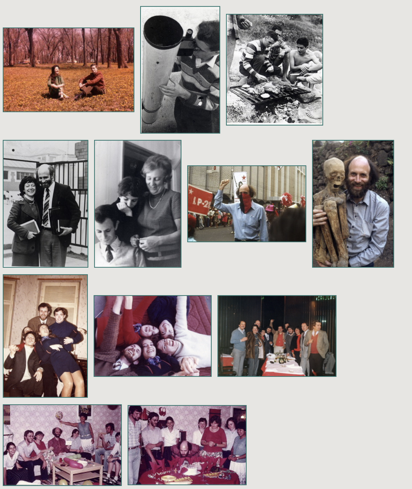
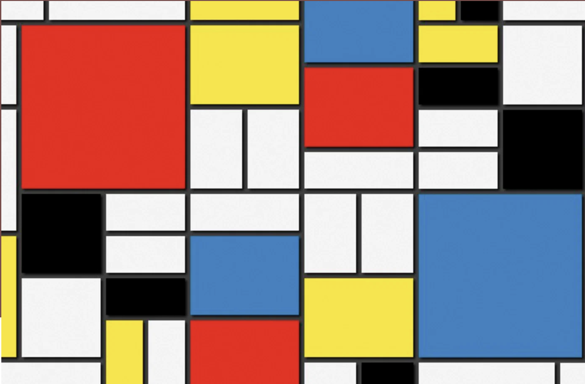
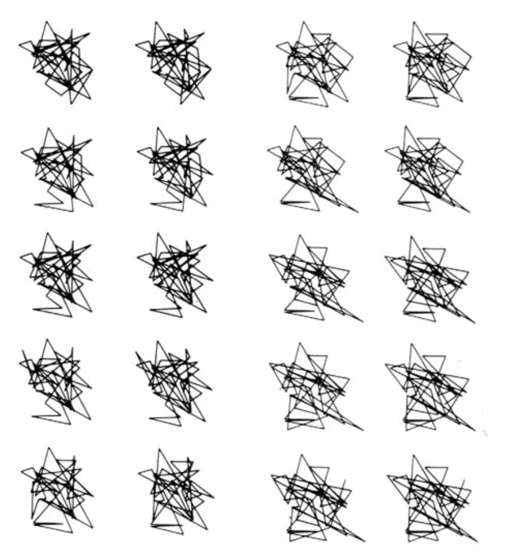

# sesion-02a

## apuntes sesión

### referencias mencionados en clase

- **Jacques Derrida**: filósofo francés.
- **lav.io**: proyecto de crítica social.
- **Manuela Infante**: relacionada al Festival Teatro a Mil.
- **Martín Gubbins**: trabaja temas de fuentes de derecho, poesía chilena y la asamblea constituyente.

### potenciómetros y botones:

### potencia

Antes de hablar de potenciómetros, tengo que tener clara la fórmula de potencia:

**Potencia = energía / tiempo**

Entonces, si quiero que la potencia suba, tengo dos caminos: subir la energía, o bajar el tiempo.

En electricidad, esta misma idea se traduce así:

**Potencia (P) = Voltaje × Corriente**

### ¿Qué es un potenciómetro?

(resistor variable) Va de 0 a un valor máximo, y lo uso para regular potencia (por ejemplo, el volumen de un parlante).

pot : r1 + r2= constante 

algo clave: `R1 + R2 = constante`. Es decir, cuando giro la perilla, un resistor sube mientras el otro baja, pero la suma siempre da lo mismo.

Las perillas de los potenciómetros pueden ser de **giro infinito** (encoders).

Nota veloz sobre sonido: para que algo suene el doble de fuerte, la potencia tiene que ser **10 veces** la original, no el doble. Esto es porque la percepción del oído es logarítmica. Por eso existen dos tipos de potenciómetros:

- **Tipo A**: exponencial, se usa para audio (porque coincide con cómo el oído percibe el volumen).
  
- **Tipo B**: lineal.

### los botones que tenemos disponibles

existen dos tipos de botones:

- **Toggles**: este no se usa en el curso.

Al presionarlo o moverlo, se queda fijo en esa posición hasta que yo mismo lo cambie de nuevo; no vuelve solo a su estado anterior.(tipo interruptor de luz).

- **Pushbuttons**: es el que estaremos ocupando en la clase.

es **momentáneo**. Solo mantiene su estado mientras lo tengo presionado con el dedo; apenas lo suelto, vuelve solo a su posición de reposo (por resorte interno). Por eso son "elementos temporales": no guardan nada, reflejan únicamente el instante en que están siendo presionados.

Dentro de los pushbuttons, hay dos configuraciones:
- **N.O. (Normalmente Abierto)**: sin presionar, no conecta nada.
-
- `5V - GND / 0V = corto circuito`.
- 
- **N.C. (Normalmente Conectado)**: siempre conectado de dos lugares, y se pueden desconectar con presión.

Y **VCC** es simplemente el nombre que le damos a la fuente de voltaje del circuito (el "positivo"). La lógica básica de lectura es:
- `0`: no estoy (presionando)
- `1`: estoy (presionando)

## encargos

## lectura
mario markus es un físico y artista chileno-alemán nacido en Santiago en 1944. Se formó como físico en Alemania y desarrolló una importante trayectoria científica, pero en los años 80 comenzó a explorar el arte a través de la computadora, utilizándola como un “pincel” para transformar fórmulas, datos y conceptos matemáticos en imágenes.

su trabajo busca mostrar cómo la ciencia y el arte pueden relacionarse, convirtiendo elementos que normalmente son abstractos, como las matemáticas y las fórmulas, en representaciones visuales. Una de sus obras más destacadas es Charts for Prediction and Chance, posteriormente traducida al español como Una Fórmula = Una Imagen, donde se puede ver principalmente esta relación entre fórmula, imagen y creatividad.

https://www.mariomarkus.com/

en el siguiente link pueden encontrar más información sobre Mario Markus, incluyendo notas de prensa, información sobre su trayectoria y fotografías del autor en su vida personal.

 

esta fue la lectura de esta semana paginas enumeradas según el libro de 1-14 capitulo 1-2-3 parte del 4

capítulo 1 "lo útil y lo bello"

nos habla un poco de la introducción a la creación de imagen con matemática y nos muestra cómo tenemos que mirar las imágenes del libro desde lo que está analizando. nos muestra la creación de imágenes a través de únicas fórmulas matemáticas. nos describe dos tipos de fórmula:

fórmula con una utilidad científica: como estudios de casos reales, física, química y biología, que a mi parecer describe lo que seria lo útil.

fórmulas cuyo objetivo es estético: al momento de determinar valores y variación de este, se pueden producir imágenes estéticas, y en este caso describe como seria lo bello.

nos habla sobre coordenadas y parámetros: el autor nos habla de cómo x e y son parámetros de un sistema.

es decir, imagen = f(x,y). si se cambia el valor de alguna de las dos coordenadas, puede producir que la imagen sea completamente diferente.

capítulo 2 "el objet trouvé en matematicas"

en este capítulo nos hace una relación directa entre la imagen y el arte. el autor plantea como ejemplo el urinario de duchamp y se pregunta: ¿puede ser arte un objeto que ya existe? esta es una de las primeras interrogantes que plantea para hablar sobre la creación y la intención artística.

a partir de esto, lo relaciona con la creación de imágenes a través de cálculos matemáticos y plantea otra pregunta: realmente, ¿quién es el creador de la imagen? ¿el autor, la computadora o la matemática?

al igual que en la fotografía, uno fotografía algo que ya existe, pero es el fotógrafo quien decide qué mostrar, desde qué perspectiva, en qué angulo y con qué intención. por lo tanto, aunque la matemática genere diferentes posibilidades y resultados, es el artista quien selecciona y decide cuáles utilizar para darle una intención a la obra.

capítulo 3 "los expertimentos de mondrian"

este capítulo parte con un experimento realizado por michael noll en 1966, relacionado con las pinturas de piet mondrian.

en este capítulo nos lleva a una comparación: ¿podemos distinguir una obra hecha por un artista de una imagen generada por una computadora? y también, ¿se puede considerar estética una imagen hecha por una computadora y no directamente por el artista?

para esto, primero nos habla de quién es mondrian. lo pone como ejemplo porque su arte es fácil de traducir a la matemática. sus imágenes están compuestas por líneas verticales y horizontales, rectángulos, cuadrados, patrones y repeticiones.

 

luego nos empieza a hablar de michael noll, quien creó un programa que intentaba generar imágenes parecidas a las composiciones de mondrian.

 

a partir de esto, nos presenta el concepto de algoritmo.

algoritmo: un conjunto de instrucciones que le dicen a la computadora qué hacer.

de esta forma, Michael Noll creó figuras mondrianoides. Por medio de la computadora se pueden crear imágenes siguiendo una lógica similar a la de Mondrian, como, por ejemplo, determinar dónde se quieren ubicar las líneas para luego formar cuadrados, repetir el proceso y así poder formar miles de imágenes con distintas variaciones, dependiendo de la ubicación de los parámetros.

capitulo 4 "memorias anecdoticas sobre el caos" 
en este capítulo nos empieza a contar algunas experiencias personales, tratando de explicarnos los sistemas caóticos, la ciencia del caos, el pluralismo horizontal y termina el capítulo hablando del concepto del azar controlado. En general, este capítulo trata de mostrar cómo el caos, aunque pueda parecer desordenado o impredecible, sigue teniendo reglas matemáticas detrás. Y justamente estas reglas pueden ser utilizadas por la computadora para generar comportamientos complejos y, posteriormente, transformarlos en imágenes.

eue un capítulo muy difícil de entender, ya que presenta varios conceptos nuevos y relaciona diferentes áreas. Como tarea personal, es releer el capítulo para poder sacar un concepto más claro de cada término y ver mejor las relaciones. 

###citas###

