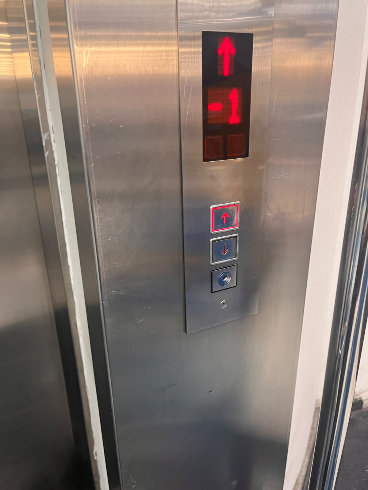
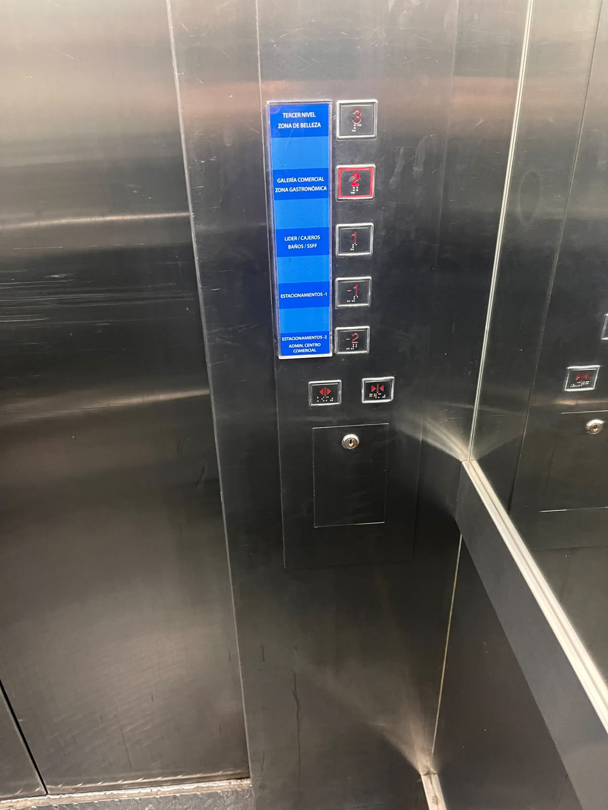
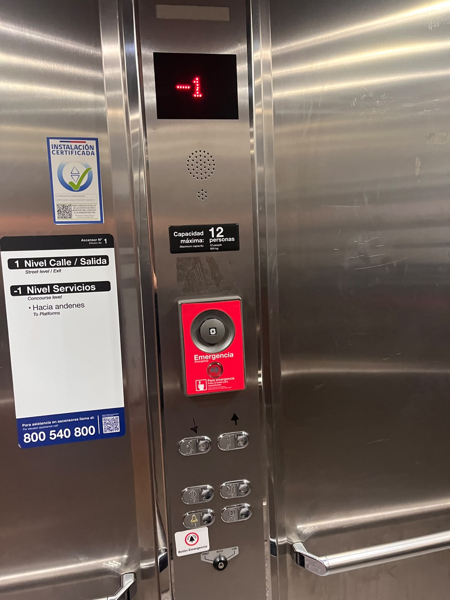
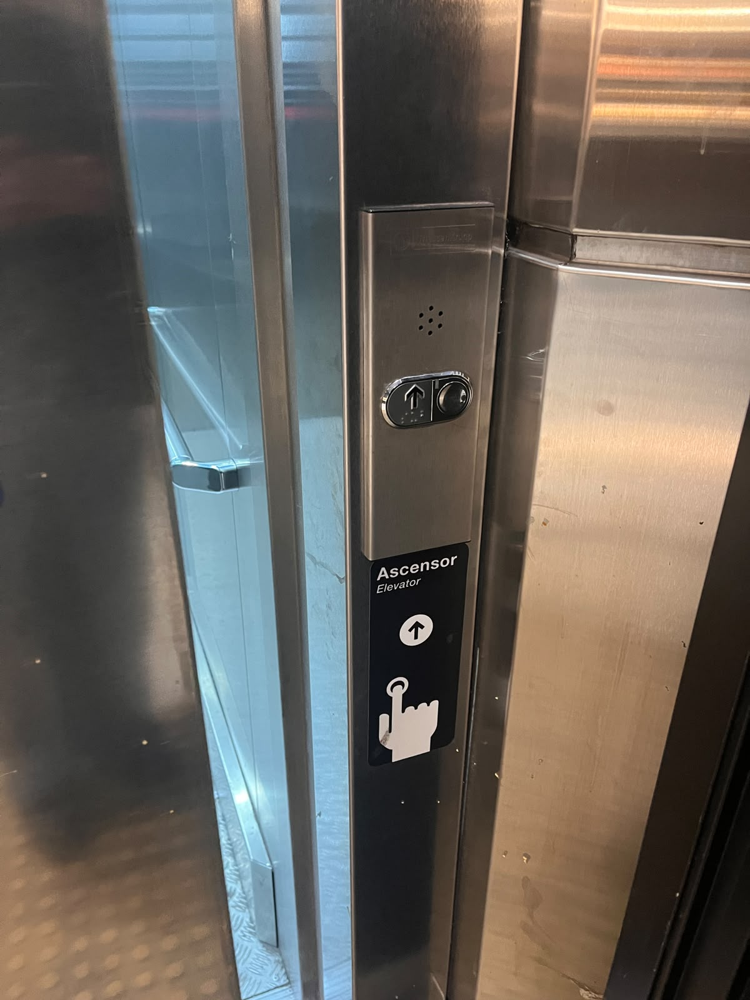

# sesion-00b

## apuntes sesión
No estuve en esa clase 

## encargos
**Analisis ascensores**

# 1. Ascensor 1:
El primer ascensor es de un supermercado, es un ascensor corto donde al interior de el tiene los botones de los cinco pisos y los correspondientes a abrir y cerrar puertas. No se presenta ningún botón de emergencia o llamado para el exterior.

Por el exterior tiene los 2 botones de subir o bajar con la pantalla indicador de los pisos. 

# 2. Ascensor 2:
Este segundo ascensor se encuentra en la ultima estación de metro de la línea 3. La estación tiene varios ascensores, pero yo tome el ultimo que da directamente a la salida de la calle y lo interesante de este ascensor que es un ascensor de doble acceso, que yo por lo menos lo las veo tan seguido. 

Este ascensor era bastante grande a comparación de los otros, presentaba una botonera de solo 2 botones de -1 y 1, con unas flechas marcadas con plumón donde al parecer la gente se confunde al tomarlo. Después tenemos los botones de abrir y cerrar la puerta, ademas 2 botones de emergencia pequeños, el para llamar al exterior y de alarma, pero después hay otro botón más de emergencia grande rojo.

En el exterior de este ascensor solo tiene el botón para subir.

# 3. Ascensor 3:
El ultimo ascensor es de un hospital, tiene los 4 botones respectivo a los pisos, -2, -1, 1 y 2, además los de abrir y cerrar puertas y no presenta botón de emergencia. Este panel está protegido por una lámina de plástico transparente.

En el exterior están los botones de subir y bajar y la pantalla de en que piso se encuentra el ascensor no esta con los botones.

## lectura
