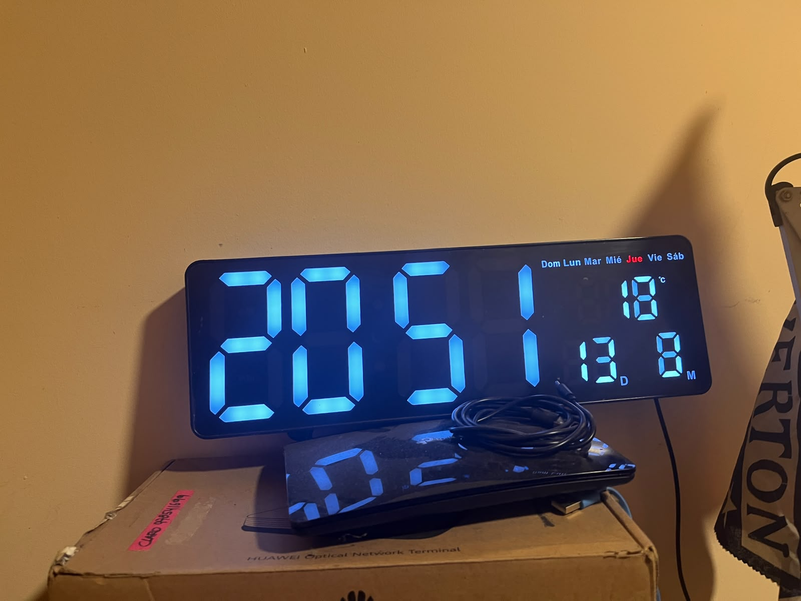
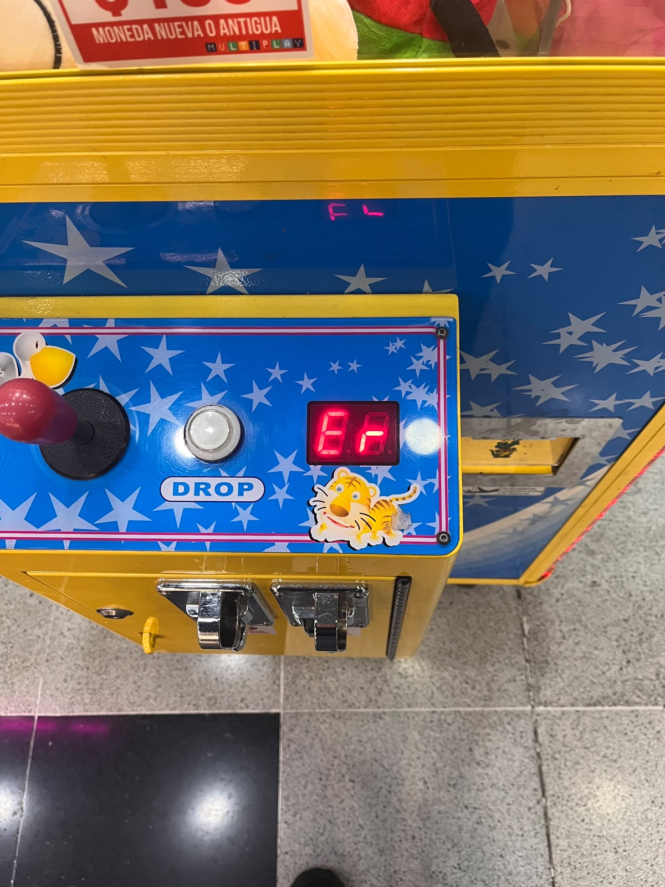
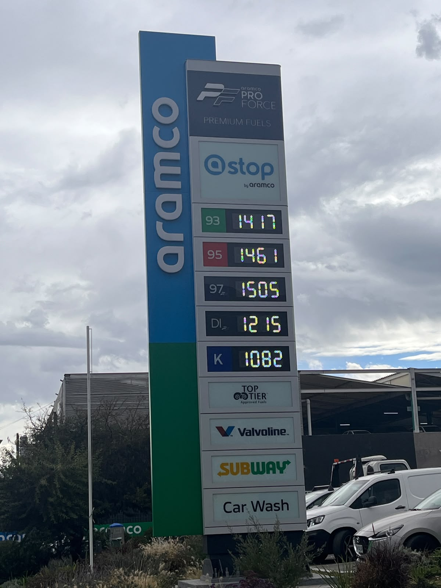
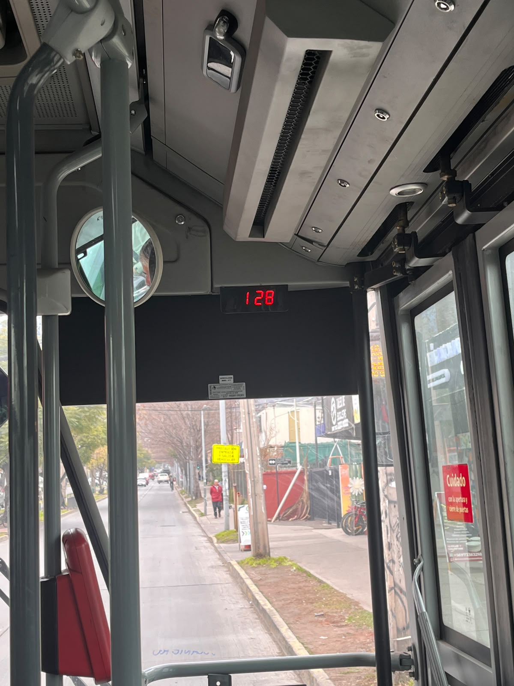
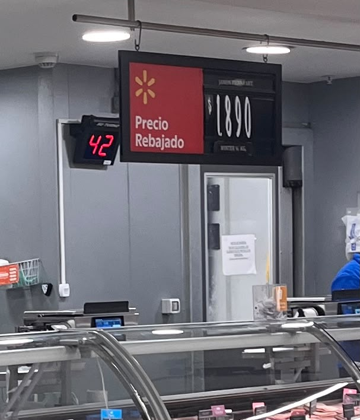

# sesion-01a
2026-08-11

elegí el libro fuentes del derecho  

## apuntes sesión

no espacios ni mayúsculas en los archivos de fotos 

manera de agregar fotos 
./= aquí mismo

datos internos y constantes de un ascensor, trabajo en grupos de a 5 

-datos internos:

distancia entre pisos (cuánto tiene que viajar)
cantidad de pisos
selección de ascensor más próximo al piso en el que se solicita mediante la botonera de llamada

si pasa una cantidad determinada de tiempo (5 min aprox), el ascensor baja a la planta de manera automática

prioridad de llamada dependiendo del sentido en el que desean viajar los usuarios y la cercanía que tiene el ascensor

tiempo de espera que tienen las puertas para mantenerse abiertas

-datos constantes:

sabe en donde se encuentran los pisos y la cantidad de estos (20 pisos)

cantidad máxima

velocidad en la que se traslada  

## encargos
1. autoretrato: variables y funciones 

2.investigacion pantallas de segmentos: tomar fotos, documentar contexto, lugar, ubicación, alfabetos posibles, usos, comparar entre resultados encontrados, al menos 3 ejemplos distintos. https://en.wikipedia.org/wiki/Segment_display

pantalla de segmentos 1: reloj oficina

esta pantalla de segmentos se encuentra en la oficina de mi papa, es un reloj donde la informacion de hora y minutos es más grande comparado con los otros datos del reloj como el día, mes y temperatura. este reloj muestra varias segmentos a la vez a diferencia de los otras fotos. 
 

pantalla de segmentos 2: maquina de peluches 

la maquina de peluches se encuentra en el lider mas cercano de mi casa, estaba al frente de las cajas autoservicio, en esos momentos la maquina solamente marcaba intermitente er y el numero 3 cada aproximadamente 3 segundos. 
 

pantalla de segmentos 3: precios de la bencina 

esta pantalla se encuentra afuera del lider, es la bencinera aramco donde se muestran todos los precios elevados.. 
 

pantalla de segmentos 4: micro 

tomando la micro que siempre tomo a mi casa despues de clases, la pantalla esta en la parte de al frente de la micro donde se muestra el día, la hora y la temperatura, donde además tiene una pantalla de segmentos mas pequeña para poner la letra c .la información cambia cada 10 segundos.
 

pantalla de segmentos 5: fila de la fiambrería 

pantalla para organizar la fila para comprar fiambre en el lider, donde esta pantalla cambia constantemente dependiendo  del trabajador y la necesidad de hacer avanzar la fila. 
 
## lectura
