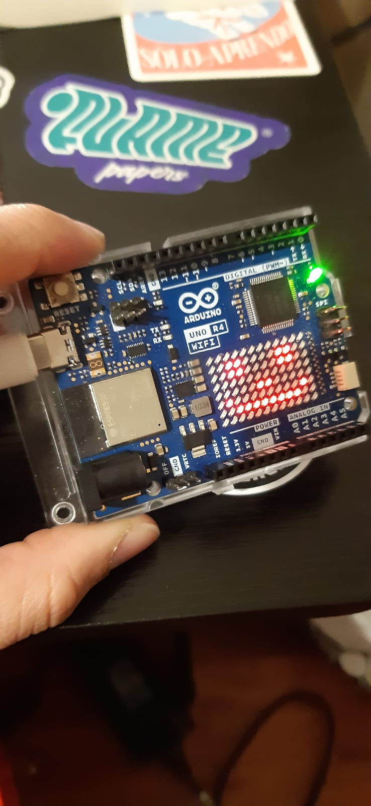
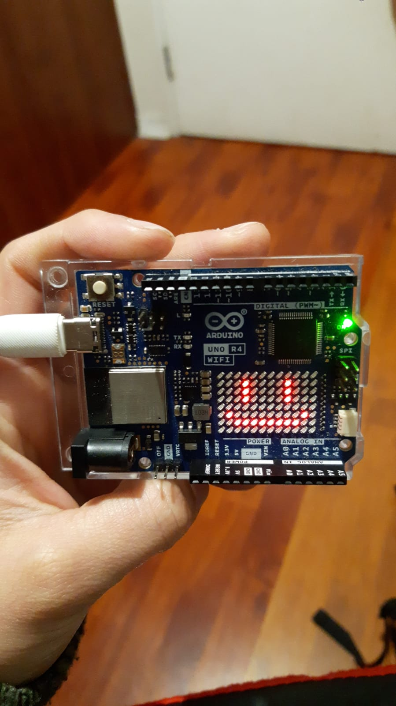
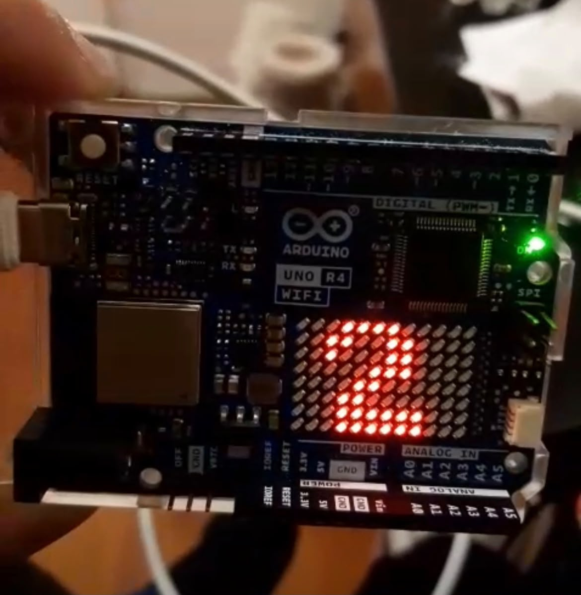
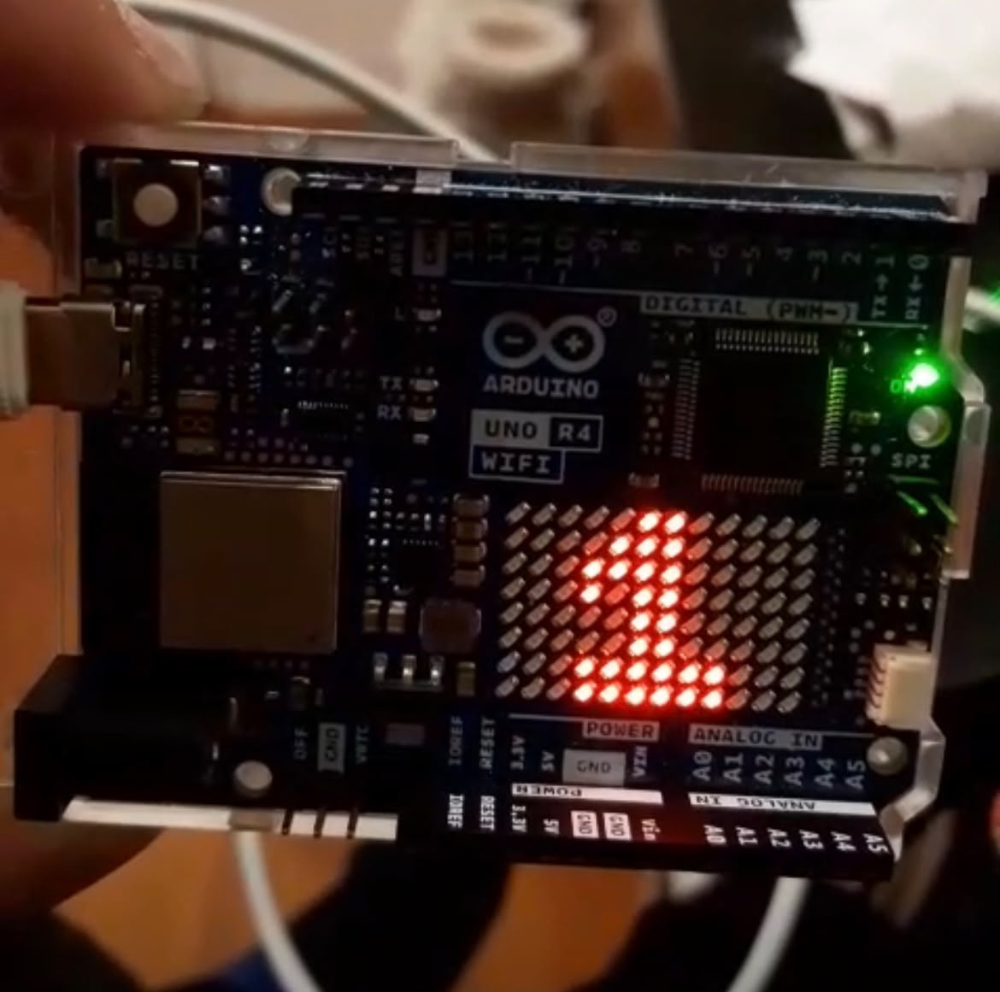
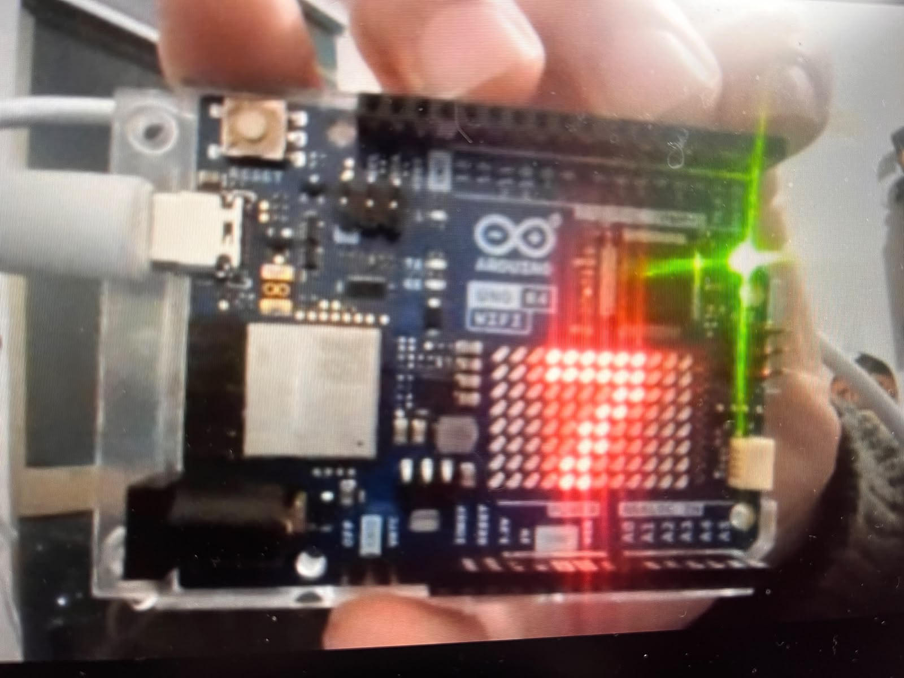
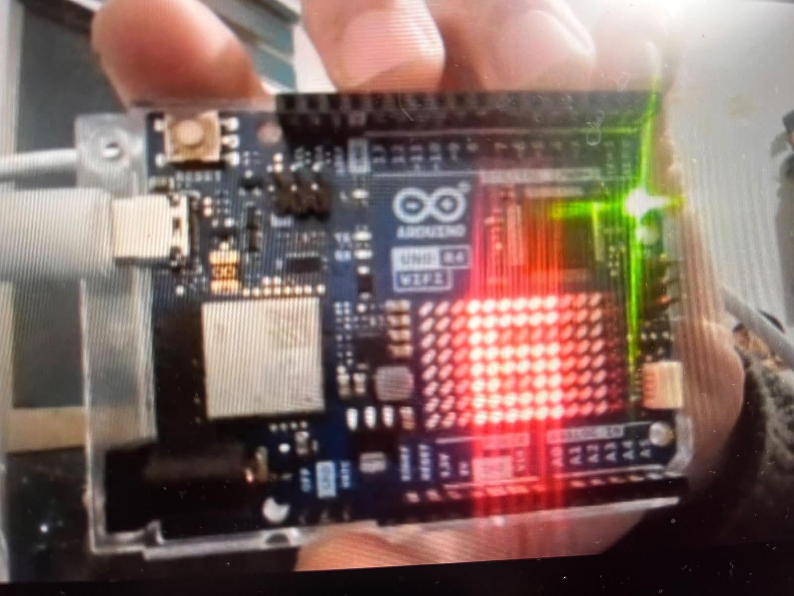

# sesion-01b

## apuntes sesión
2026-08-14
boolean

**C++ variables:**
bool,string,int,char,double.
0 al 7 con 3 bits
256 bits posibles

**bool** solo datos solamente si  o no 

ej: bool maitechilena: true

**int** son numeros enteros

ej: intkristelNacimientoAnho: 2003 


8 bits a cada color rojo,verde y azul 
// comentario 
este es el comando para llamar a a la funcion: nombre de la funcion(); 

descargar Arduino IDE 2.3.10 
 
uno r4 instalar 

setup: configurar 

toda la linea de codigo tiene que tener un comentario describiendo lo que tiene que pasar.  
backtick
## encargos

encargo01b:

# 1. tratar de correr un código en el microcontrolador asignado a cada dupla, incluir referentes, citas, comentarios, imágenes, descripciones textuales, y en caso de éxito o fracaso incluir aciertos, preguntas, dramas, atados. recordatorio que estos apuntes son personales, cada persona sube su versión.


-Lo primero que nos preguntamos como dupla es como funciona, la pantalla led y de que forma se trabaja. Lo primero de todo conectamos el Arduino de mi compañera a su computador y comenzamos a investigar, comprendiendo de apoco lo de "Arduino_LED_Matrix.h"

-La fuente de información nos ayudo de todas maneras en el funcionamiento y de como generar la matriz bidimensional, soltar el miedo al Arduino. La primera relación que tuvimos con la placa fue ocupar el código de ejemplo, este era solamente una carita feliz y fuimos cambiando pequeñas cosas a la matriz bidimensional con el 0 o 1 y comenzamos a analizar el código de donde van las cosas y de porque están ahí.

 

``` cpp byte frame[8][12] = {
  { 0, 0, 1, 1, 0, 0, 0, 1, 1, 0, 0, 0 },
  { 0, 1, 0, 0, 1, 0, 1, 0, 0, 1, 0, 0 },
  { 0, 1, 0, 0, 0, 1, 0, 0, 0, 1, 0, 0 },
  { 0, 0, 1, 0, 0, 0, 0, 0, 1, 0, 0, 0 },
  { 0, 0, 0, 1, 0, 0, 0, 1, 0, 0, 0, 0 },
  { 0, 0, 0, 0, 1, 0, 1, 0, 0, 0, 0, 0 },
  { 0, 0, 0, 0, 0, 1, 0, 0, 0, 0, 0, 0 },
  { 0, 0, 0, 0, 0, 0, 0, 0, 0, 0, 0, 0 }
};
```
"Esta opción es fácil de entender, ya que la imagen se visualiza en el patrón del array y se puede editar fácilmente durante la ejecución. Los elementos del array anterior forman un corazón, y esa es la imagen que se ve en la pantalla"

"Para seleccionar un píxel individual, elige su dirección y cambia su valor; recuerda que debes empezar a contar desde 0. Por lo tanto, la siguiente línea seleccionará el tercer píxel desde la izquierda y el segundo desde arriba, y luego lo activará"

 

 

-Después de probar la cara, partimos desde cero poniendo en la pantalla led un punto y tratar que se haga una línea de apoco, nos costo bastante y tuvimos investigando vario tiempo de como funciona para sacar un led y aparezca otro, no nos funcionaba. 

-Después de entender los de los segundos logramos hacer una linea que aparece y desaparece de apoco y esto nos abría paso a poder poner distintas animaciones ya que entendimos el delay en loop.

- Comenzamos poniendo en la pantalla el numero 1 y el numero 2 con 2 segundos de diferencia. Funciono bien y fuimos variando códigos para que duraran más segundos o menos segundos.
  

   

- Ocupamos el mismo código de 1 y 2, pero después lo hicimos con 6 y 7.
  
 

``` cpp #include "Arduino_LED_Matrix.h"

ArduinoLEDMatrix matrix;

// frame 1, numero 6 
uint8_t frame1[8][12] = { 
  { 0, 0, 0, 1, 1, 1, 1, 1, 1, 0, 0, 0 },
  { 0, 0, 0, 1, 1, 1, 1, 1, 1, 0, 0, 0 },
  { 0, 0, 0, 1, 1, 0, 0, 0, 0, 0, 0, 0 },
  { 0, 0, 0, 1, 1, 1, 1, 1, 1, 0, 0, 0 },
  { 0, 0, 0, 1, 1, 1, 1, 1, 1, 0, 0, 0 },
  { 0, 0, 0, 1, 1, 0, 0, 1, 1, 0, 0, 0 },
  { 0, 0, 0, 1, 1, 1, 1, 1, 1, 0, 0, 0 },
  { 0, 0, 0, 1, 1, 1, 1, 1, 1, 0, 0, 0 }
}; 

//  Frame 2, numero 7 
uint8_t frame2[8][12] = {  
  { 0, 0, 0, 1, 1, 1, 1, 1, 1, 0, 0, 0 },
  { 0, 0, 0, 1, 1, 1, 1, 1, 1, 0, 0, 0 },
  { 0, 0, 0, 0, 0, 0, 0, 1, 1, 0, 0, 0 },
  { 0, 0, 0, 0, 0, 0, 1, 1, 0, 0, 0, 0 },
  { 0, 0, 0, 0, 0, 1, 1, 0, 0, 0, 0, 0 },
  { 0, 0, 0, 0, 0, 1, 1, 0, 0, 0, 0, 0 },
  { 0, 0, 0, 0, 1, 1, 0, 0, 0, 0, 0, 0 },
  { 0, 0, 0, 0, 1, 1, 0, 0, 0, 0, 0, 0 }
};

void setup() {
  matrix.begin();
}

void loop() {
  // Muestra número 1 por 500 milisegundos
  matrix.renderBitmap(frame1, 8, 12);
  delay(500);
  
  // Muestra número 2 por 500 milisegundos
  matrix.renderBitmap(frame2, 8, 12);
  delay(500);
}
```

   
   
  
**Dudas** 
-Tuvimos la duda de que significa uint8_t
- Nos consto muchooo entender como funciona el delay y como se agrega al Arduino.
- Nos preguntabamos que es matrix.renderBitmap
- Los textos que corren, por ejemplo las pantallas de la línea 3,  hacen hacen uno x uno con la matriz bidimensional o hay una forma de hacerlo mas rápido, como escribir el texto en algún comando y que aparezca en la pantalla?
 -Investigando vi un video de la universidad de Madrid explicando algunas cosas y quede bastante confundida.


  https://docs.52pi.com/md/kz-0073/arduino/p3/ 
  
  https://lab.bricogeek.com/tutorial/guia-de-modelos-arduino-y-sus-caracteristicas/arduino-uno-r4-wifi

  https://mediateca.educa.madrid.org/video/s7tpstyjlth1hoxo
  
# 2. proponer una función con nombre, tipo, argumentos y uso, que modele algún área de su interés, por ejemplo subirCerro(enBicicleta), tomarMetro(conPaseEscolar), etc. escribir en pseudocódigo los pasos que necesita esa función internamente para que literalmente funcione.

## lectura
