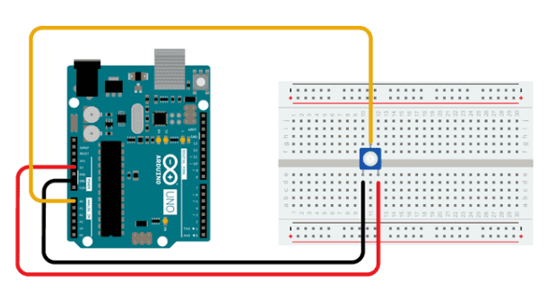

# sesion-02a

## apuntes sesión
2026-08-17

Manuela Infante 

**Potenciometros y botones:**

Push buttons

Toggles


# 1. Potenciómetro:

- Regula la potencia de algún objeto. resistencia variables.

- Es una interfaz es una forma de encapsular.


- Existen 2 tipos de potenciómetros donde tienen letra A o  B.

- Los A son de audio y los B son lineales. 

- No comprar los tipos A.
 
- Subiendo energía y bajando el tiempo se genera potencia.

- Potencia= voltaje x corriente 

- Dentro del voltaje hay energía y dentro de la corriente hay tiempo.

- Que hace un resistor: hace que el electrón pase. 

- Se pueden definir los volts.

**Potenciómetro**

 

 


1: se conecta al voltaje

2: lectura

3: tierra


# 2.Botones/ Pushbutton

- Son temporales.

- No guardan información a largo plazo.

- N.O= normally open.

- Si nadie lo está presionando, significa que está abierto.

- RESISTOR, PULLDOWN, PULLUP

- vcc, cuando no esta conectado, 1: no toy / 0:toy

- Siempre hacer primero en papel lo que quieres hacer.

**Botón**


Cable negro: se ocupa para tierra 

Cable rojo: Volts

Breadboard/Protoboard: 
Tabla blanca 

Contiene alerones en las orillas. Impone voltajes

0: ausencia / 1: presencia


# 3. Arduino

 


-no usar vin

-+3V3 +5V: alimentan

-analog in: solo puede leer, no escribir, conectar potenciometro.

-digital (pwm-): salida digital de audio y botones.


-Conectar un cable a gnd 


-const int: no se puede cambiar 

-prohibido poner en loop 
```cpp 
Serial.begin();
```

-El puerto USB es serial 


```cpp
Serial.begin(9600);
```
-El número es es la velocidad de 9600 mensajes x segundos 

-Al poner el codigo se puede variar del 0 al 1023 

-10 bits  2 elevado a 10

-bang: !

while 

serial.println el ln ordena 


del 0 al 3: vale 0

del 0 al 4: vale 1

y así sucesivamente 


## encargos

## lectura

Lectura pagina 7 a la 21.

- Estas 14 paginas leídas se dividen en 4 poemas (hipotesis,verdad,persona e igualdad), entonces les entrego un punteo de lo que rescate de cada poema y lo que entiendo desde mi perspectiva y con algunas citas.


**1. EPÍGRAFE** 

"La opinión pública debería acostumbrarse a la idea de que una cosa es lo que se dice en el medio social circundante y otra es lo que se encuentra en los expedientes judiciales. Para los asuntos judiciales lo que interesa es lo que hay en los expedientes".(pag 9)

- siento que el epígrafe habla mucho de un procesamiento cerrado y que cuesta el cambio.
  
-  Que cumple solo una forma de proceso. Pero porque solo un tipo de proceso?
  
  

 **2. HIPOTESIS**
-   Siento que se habla mucho de las realidades y del poder del dinero.

 "El orden se integra en el caos / El canon de la belleza es un caos / Esta opinión no es pacífica" (pag 12)

  -Existe realmente el verdadero orden o esta cambiando constantemente?
  - Se puede controlar el caos?
  - Hay que tener todo controlado.
    


 **3. VERDAD**
  - Existen varias verdades
    
    "La verdad no es certeza"(pag 16)
    
    -La busqueda de la verdad.
    - Ocurre o no ocurre.
    - Demuestran que no existe solamente una verdad entonces cuestiona de como el juez no sabe nada como sabe cual es la verdad y se explica donde la verdad solo se sabe con la certeza.

      

  **4. PERSONA**
    - Todos los seres humanos nacemos iguales y con la misma realidad.
    
   - Nos convertimos en conceptos de una realidad, bueno no de una realidad sino de la construcción de ella.
   


   **5. IGUALDAD** 
   
   "Que es lo igual y qué es lo distinto" (pag 21)
   
   - La contradicción es lo que nos diferencia?
    
   - Se vuelve en una abstracción pero no en cualquier abstracción.
