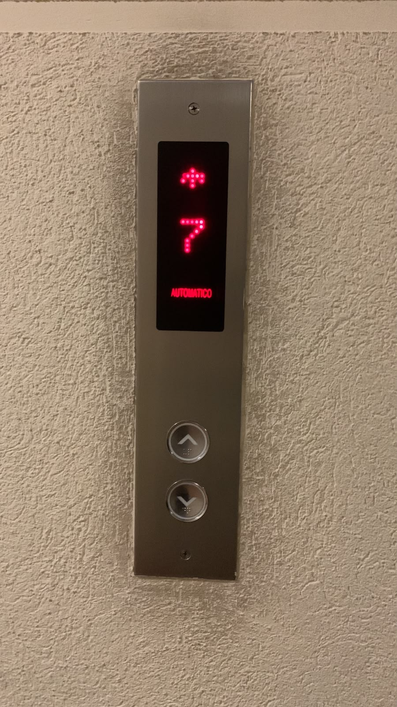
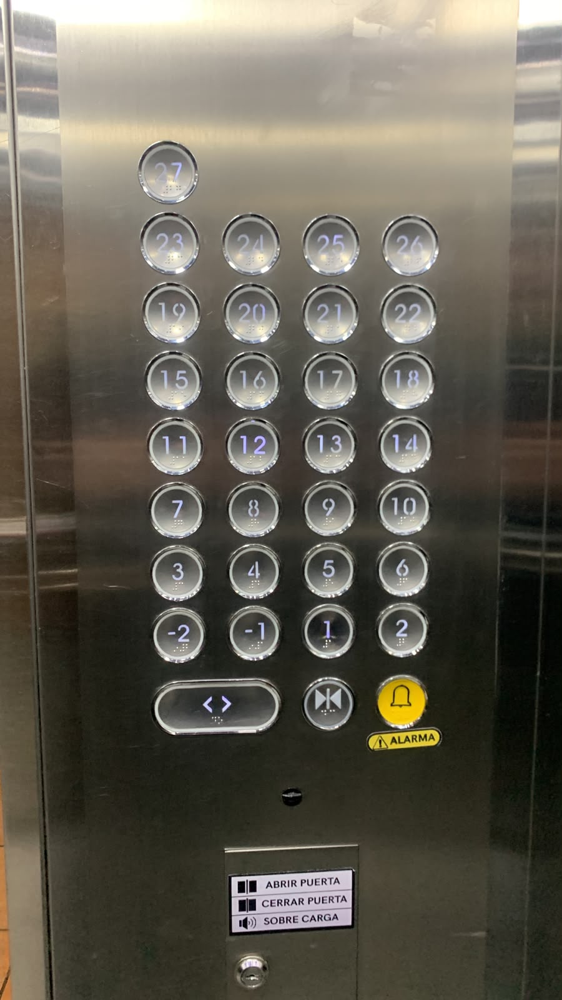
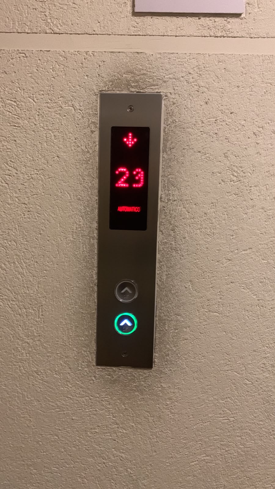
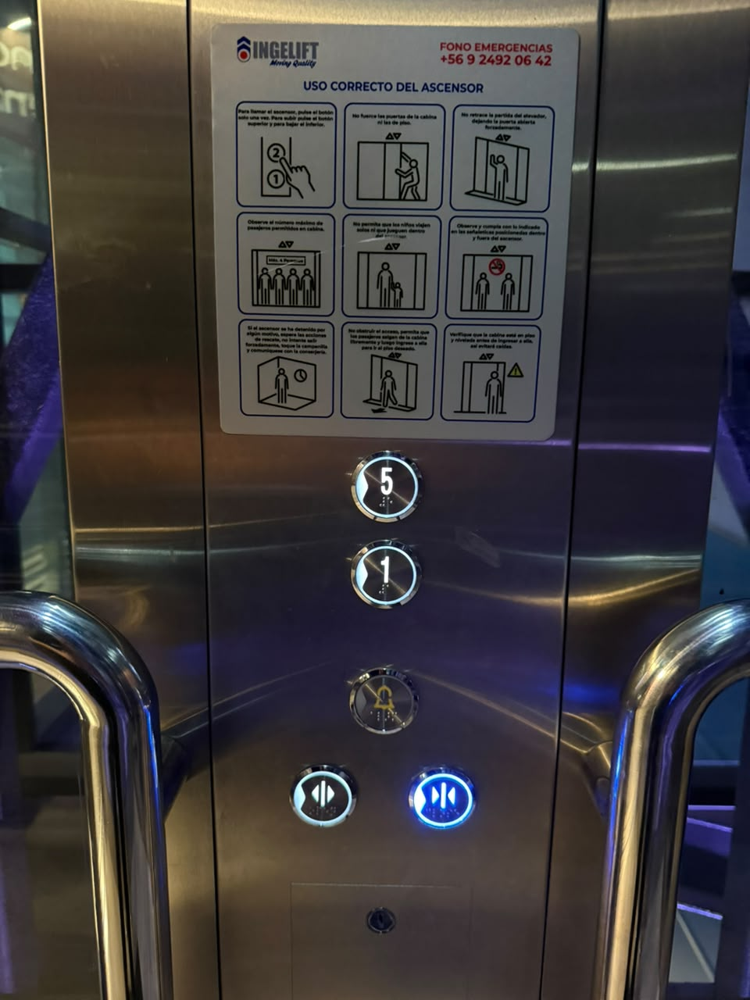
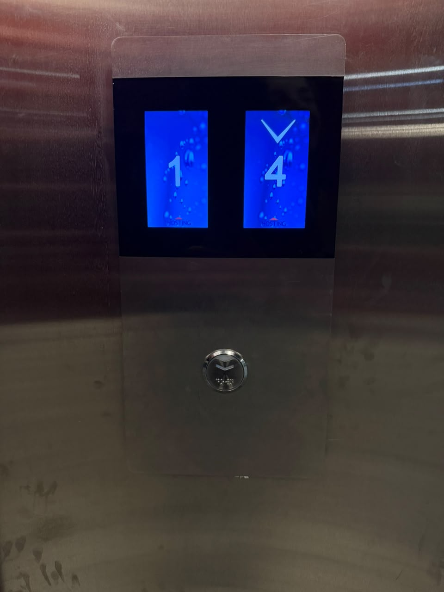

# sesion-00b

## apuntes sesión

## encargos
ascensor n°1

botones de pisos ubicados en dos columnas desde el -1 hasta el piso 17. tiene botones para abrir y cerrar la puerta, botón para emergencias y un piso “l”. los botones para llamar el ascensor tienen flechas hacia arriba y abajo pero también una línea a la izquierda que pareciera ser un signo negativo, ocuparon los mismos botones que tienen los pisos pero orientados a otro lado.

ascensor n°2

los botones de los pisos están colocados de izquierda a derecha desde el -2 hasta el 27 en filas de cuatro botones, sin embargo el último piso queda solo en la parte superior. posee botones para abrir y cerrar las puertas pero son de distinto tamaño. en la última foto se ve como en un piso en específico los botones para solicitar el ascensor están mal orientados, además presentaban error en los números de la pantalla.

ascensor n°3

ascensor dentro de un mall que va únicamente de primer a quinto piso, sin embargo, se le ha visto detenerse en pisos intermedios pese a no tener los botones respectivos para ello. solo hay un botón para solicitar el ascensor por la misma razón de solo tener 1 destino, subir cuando estás en el primer piso o bajar estando en el quinto. 
## lectura
