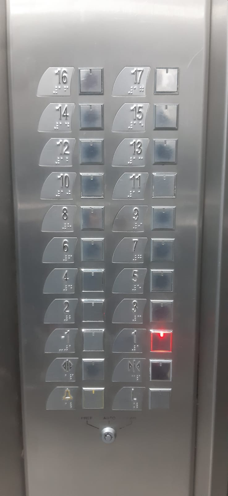

# sesion-00b

## apuntes sesión

## encargos

Botones de pisos ubicados en dos columnas desde el -1 hasta el piso 17. Tiene botones para abrir y cerrar la puerta, botón para emergencias y un piso “L”.  Los Botones para llamar el ascensor tienen flechas hacia arriba y abajo pero también una línea a la izquierda que pareciera ser un signo negativo, ocuparon los mismos botones que tienen los pisos pero orientados a otro lado.
## lectura
