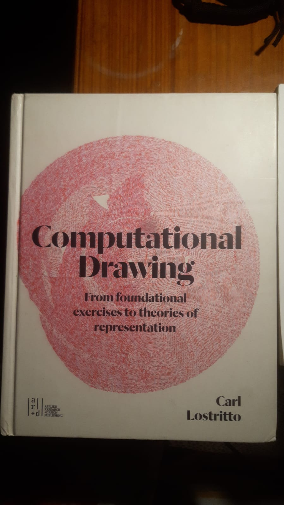

# sesion-01a
2016-08-11

elegí el libro computational drawing

## apuntes sesión
actividad en clases grupal: responder datos internos y constantes que manejan los ascensores

datos internos:
-distancia entre pisos(cuanto viajará)
-

datos constantes:

## encargos

## lectura
