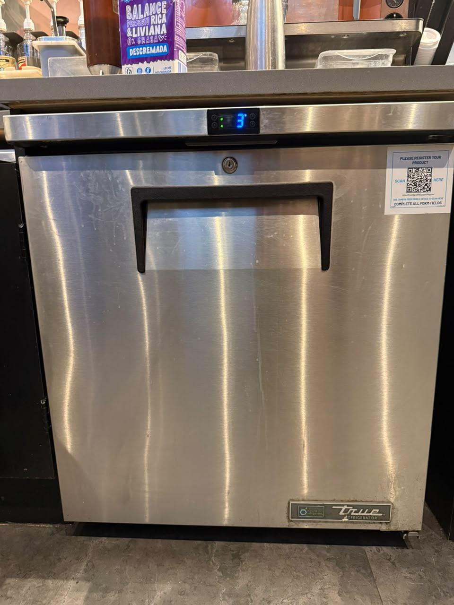
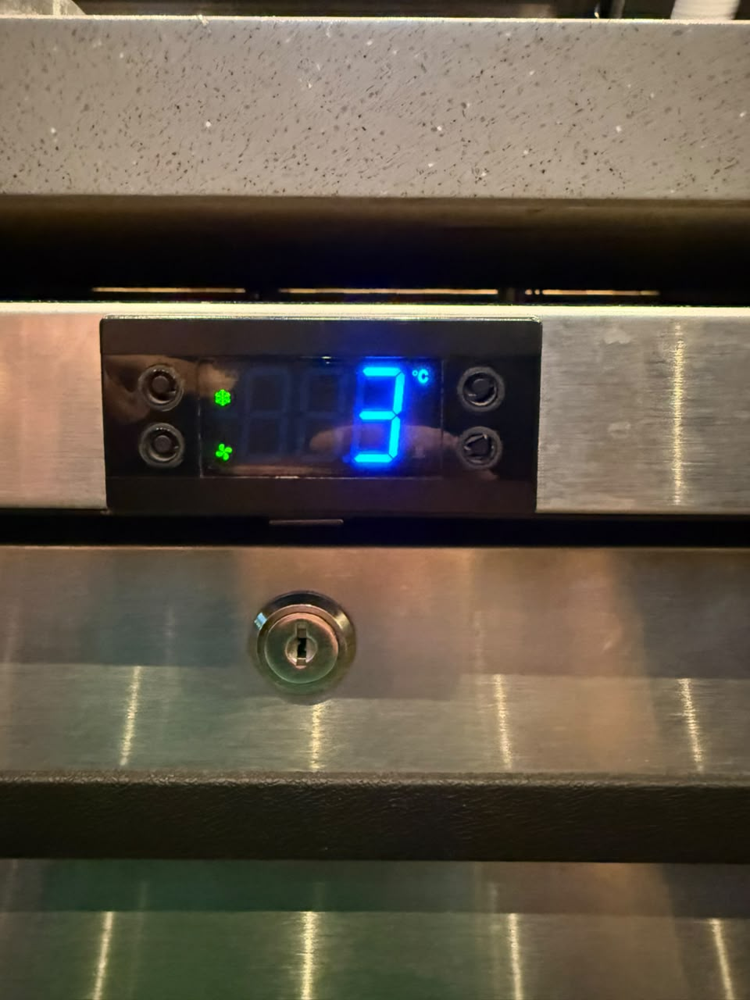

# sesion-01a
2016-08-11

elegí el libro computational drawing

## apuntes sesión

características de un ascensor:

tiene puertas

sube y baja(eje z)

tiene botones, poleas, contrapeso, motor

actividad en clases grupal: responder datos internos y constantes que manejan los ascensores

datos internos:

1.distancia entre pisos(cuanto viajará)

2.se selecciona el ascensor mas cercano al piso en que se solicita por medio de la botonera de llamada

3.prioridad de llamada, el ascensor se traslada según el tiempo en que se solicita, el lugar donde se encuentra el usuario y el sentido del trayecto

4.el ascensor se mueve al primer piso automáticamente luego de 5 min sin actividad

datos constantes:

1.distancia entre cada piso y la cantidad de estos

2.capacidad máxima (kg)

3.velocidad de movimiento

## encargos
pantalla n°1 medidor de temperatura

## lectura
