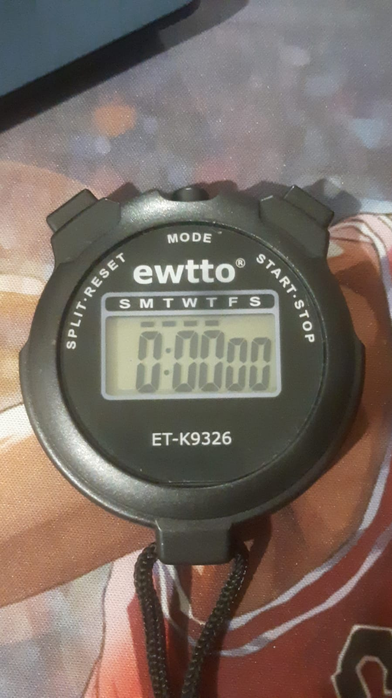
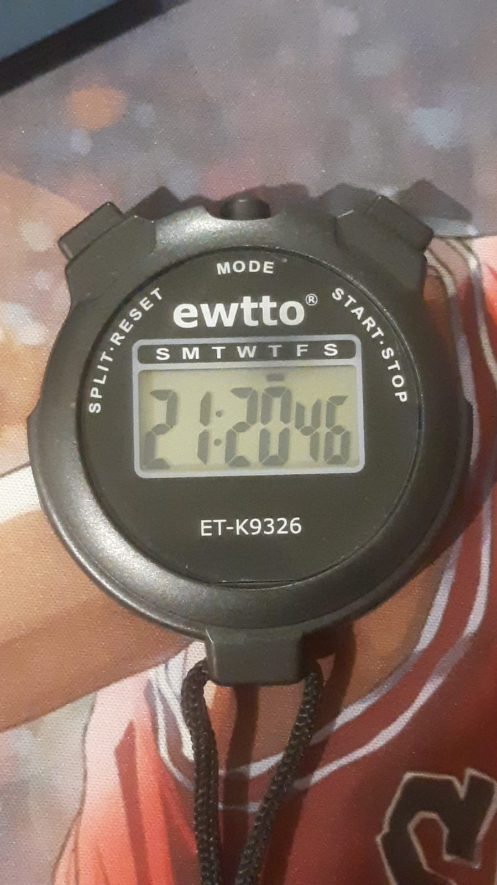
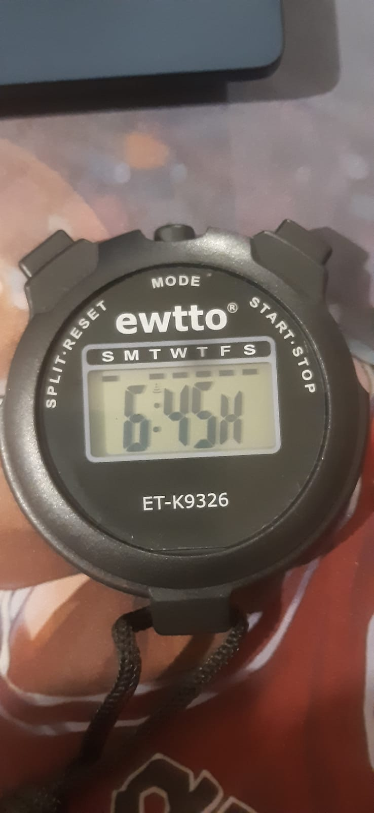
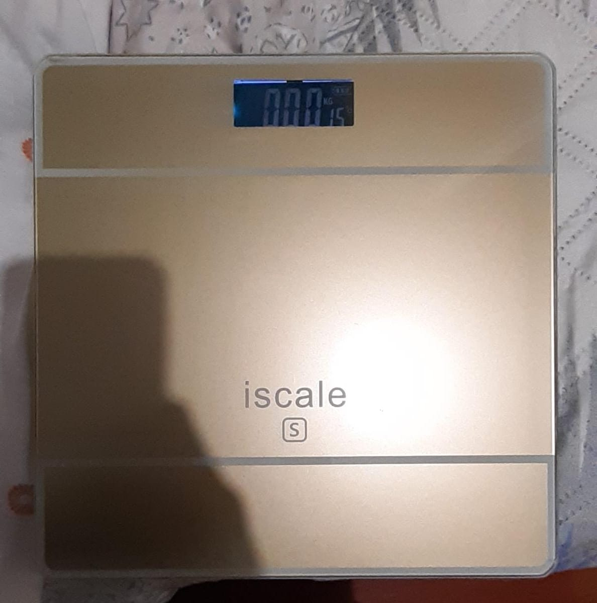
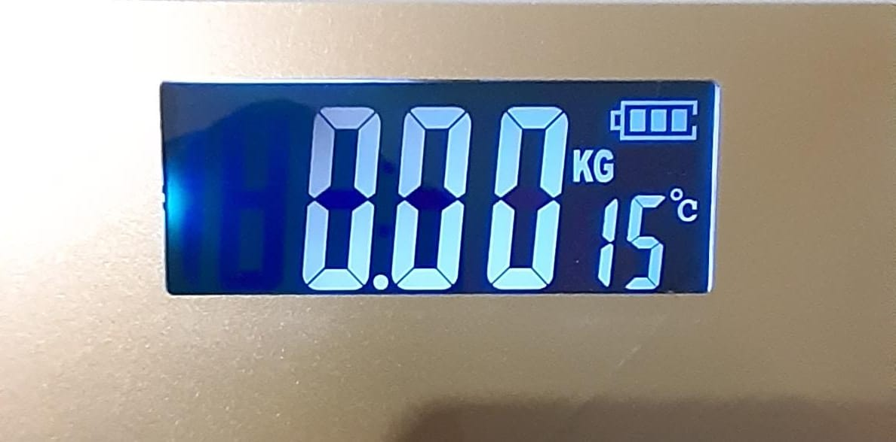

# sesion-01a
2016-08-11

elegí el libro computational drawing

## apuntes sesión

**características de un ascensor:**

tiene puertas; sube y baja(eje z); tiene botones, poleas, contrapeso y motor

actividad en clases grupal: responder datos internos y constantes que manejan los ascensores

**datos internos:**

1.distancia entre pisos(cuanto viajará)

2.se selecciona el ascensor mas cercano al piso en que se solicita por medio de la botonera de llamada

3.prioridad de llamada, el ascensor se traslada según el tiempo en que se solicita, el lugar donde se encuentra el usuario y el sentido del trayecto

4.el ascensor se mueve al primer piso automáticamente luego de 5 min sin actividad

**datos constantes:**

1.distancia entre cada piso y la cantidad de estos

2.capacidad máxima (kg)

3.velocidad de movimiento

## encargos

autorretrato: variables y funciones

variables: mi nombre es maría ignacia zamudio benoni, prefiero el apodo nacha/nachis/nachi/ entre otros, estoy trabajando en mis pronombres por lo que me refiero de ambas formas a mi mismo, aunque mas masculino. mido 1.63 metros, peso 64 kilos, tengo 22 años y nací el 30 de enero del 2004. mi pelo es café oscuro, mis ojos son grandes y también cafés, tengo tez morena, el pelo corto y al dejarlo crecer se forman algunas ondas. me han operado dos veces, del ligamento cruzado anterior y una cirugia maxilofacial. me gusta jugar videojuegos para pasar el rato con amigos, crecí jugando con la consola wii y wii u, en computador juego valorant, peak, repo y minecraft principalmente. Escucho mucha música, mi banda favorita es twenty one pilots. tengo 3 gatos, cada uno con 3 nombres.

funciones: practico deporte, en especial basketball, y hago actividad física recurrentemente, trabajo en un starbucks con el rol de barista y barista trainer 20 horas a la semana, estudio diseño con mención industrial. practico tocar guitarra acústica como hobby. 

pantalla de segmento n°1 medidor de temperatura

pantalla ubicada en mi lugar de trabajo que entrega estado de la temperatura de un refrigerador para mantenerlo en una temperatura óptima para guardar cajas de leche.

pantalla de segmento n°2 cronometro con varias funciones

cronómetro con varias funciones(cronometro, alarma, fecha y hora) de uso personal especialmente para el ámbito deportivo

pantalla segmento n°3 pesa digital

pesa digital de casa para mostrar el valor de masa en kilogramos y además mostrar la t° ambiente del hogar

## lectura
