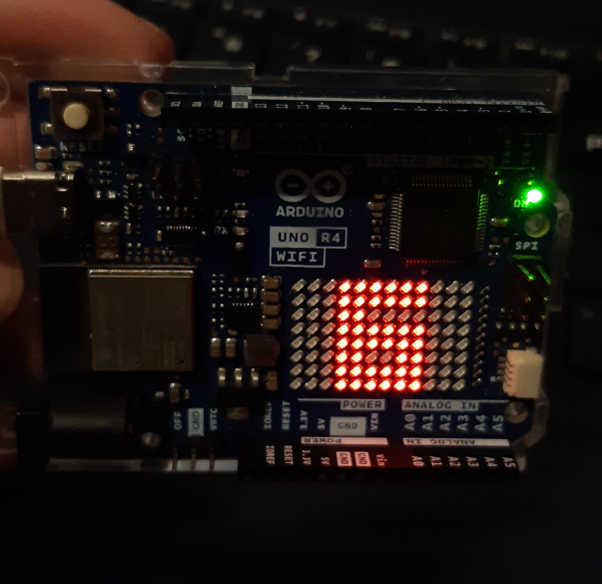
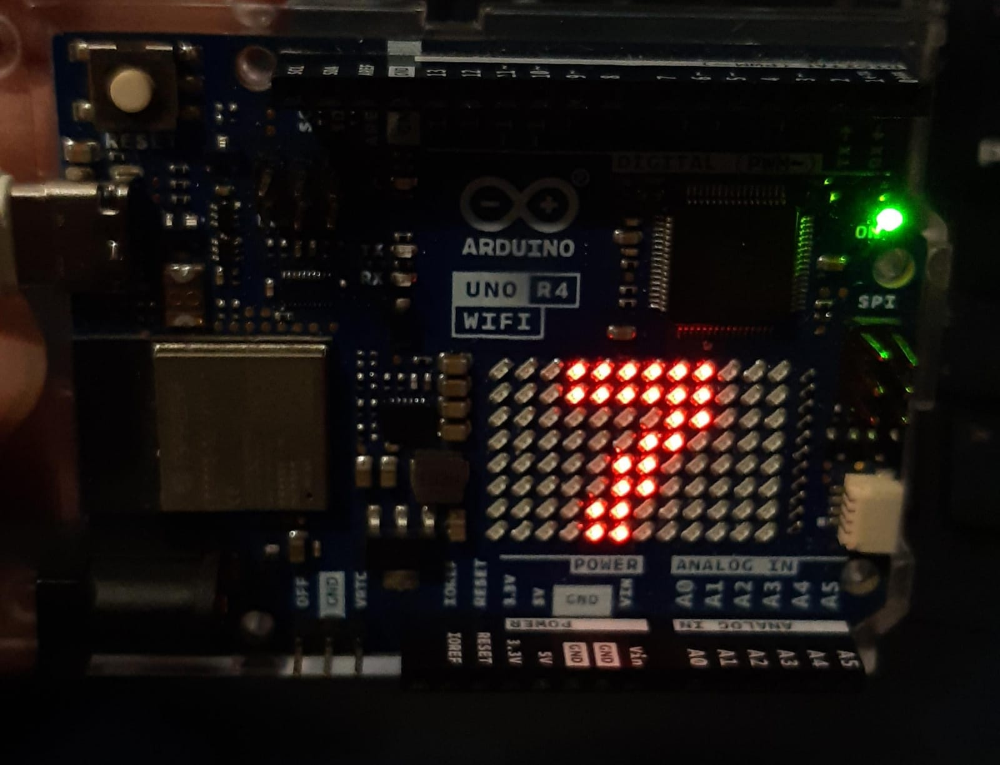

# sesion-01b

## apuntes sesión

variables enteras, sin numero decimal; variables string, bool: con valor 0 y 1(si o no), char, double. 

3bits: 8variables, 4bits 16variables, 2 elevado a x, donde x es la cantidad de bits presentes. 

intx_t, int para usar numeros enteros, donde x es la cantidad de bits a utilizar, por ejemplo para decir la edad podemos utilizar un bit contenga el rango de edades optima, 8 bits sería demasiado. 

**ARDUINO** c++

setup: función de configuración, para empezar. (secuencia de instrucciones para que ocurran acciones) 

void: vacio, no expulsa valor como respuesta, para funciones que no necesitan esta respuesta. va antes de setup

VOID SETUP() {CODIGO}

loop: se repite constantemente hasta que se interrumpa la función. 

VOID LOOP() {CODIGO}

{}: murcielago para anotar la acción a ocurrir. puede ocurrir una vez al principio(run once) o repeatedly

está prohibido escribir una línea de código antes de escribir un comentario de lo que se espera de él. SEUDOCODIGO.

Ejemplo para encargo variantes:, verdadero o falso

BOOL: respuesta de si o no

Int: respuestas numéricas, edad, nacimiento.


## encargos

encargo01b:

1. tratar de correr un código en el microcontrolador asignado a cada dupla, incluir referentes, citas, comentarios, imágenes, descripciones textuales, y en caso de éxito o fracaso incluir aciertos, preguntas, dramas, atados. recordatorio que estos apuntes son personales, cada persona sube su versión.

idea de código: ocupar la matriz del microcontrolador para hacer animaciones.

https://docs.52pi.com/md/kz-0073/arduino/p3/ muy buena pagina explicando el paso a paso de como generar los codigos. 

Para familiarizarnos con el trabajo copiamos un código de ejemplo que encontramos para saber como es el proceso de enviarlo al microprocesador. Conectamos el Arduino 1 r4 wifi al computador y enviamos la función. 


editamos el código para variar la forma de la carita feliz


Dentro de está página encontramos información de como funciona la matriz y como ocuparla. En primer lugar entendimos que cada LED del panel funcionan como un pixel que podemos controlar de forma individual, enviandole señales a través de Arduino para prenderlos y apagarlos. 

Para iniciar esta funcion debemos escribir el siguiente código al inicio del boceto:

```cpp
 #include "Arduino_LED_Matrix.h"

ArduinoLEDMatrix matrix;

void setup() {
  Serial.begin(115200);
  matrix.begin();
}
```
la primera parte: #include "Arduino_LED_Matrix.h"  y ArdionoLEDMatrix Matrix crean el objeto LED en el boceto de Arduino, luego el código matrix.begin() dentro del setup para iniciarlo.

Luego se añade la matriz de esta manera para tener todos los espacios y ocupar los 0 y 1 como apagado y encendido respectivamente en filas que formen los pixeles de 8 x 12:
```cpp
byte frame[8][12] = {
  { 0, 0, 0, 0, 0, 0, 0, 0, 0, 0, 0, 0 },
  { 0, 0, 0, 0, 0, 0, 0, 0, 0, 0, 0, 0 },
  { 0, 0, 0, 0, 0, 0, 0, 0, 0, 0, 0, 0 },
  { 0, 0, 0, 0, 0, 0, 0, 0, 0, 0, 0, 0 },
  { 0, 0, 0, 0, 0, 0, 0, 0, 0, 0, 0, 0 },
  { 0, 0, 0, 0, 0, 0, 0, 0, 0, 0, 0, 0 },
  { 0, 0, 0, 0, 0, 0, 0, 0, 0, 0, 0, 0 },
  { 0, 0, 0, 0, 0, 0, 0, 0, 0, 0, 0, 0 }
};
```

En esta parte ya pudimos hacer figuras y definirlos como frames para luego pasar a usar comandos de loop que los muestren en secuencias. podemos dibujar nuestra figura de esa forma o tratarlo individualmente usando el panel y los espacios con coordenadas, contando de iqz a derecha desde el 0 al 11 y de arriba a abajo desde el 0 al 7.
```cpp
frame[2][1] = 1;

matrix.renderBitmap(frame, 8, 12);
```
aquí el pixel de esa ubicación estaría prendido ya que el frame es = 1, este frame va con el código inferior para que se ejecute. 

Encontramos más información de otras formas de escribir estas figuras pero no entendimos como funcionaba, por lo que nos limitamos a estas dos por ahora. 

Seguimos probando escribir números y ubicar ambos frames dentro de un loop


Nuestro código completo quedaba de la siguiente manera:

```cpp
#include "Arduino_LED_Matrix.h"

ArduinoLEDMatrix matrix;

// frame 1, numero 6 
uint8_t frame1[8][12] = { 
  { 0, 0, 0, 1, 1, 1, 1, 1, 1, 0, 0, 0 },
  { 0, 0, 0, 1, 1, 1, 1, 1, 1, 0, 0, 0 },
  { 0, 0, 0, 1, 1, 0, 0, 0, 0, 0, 0, 0 },
  { 0, 0, 0, 1, 1, 1, 1, 1, 1, 0, 0, 0 },
  { 0, 0, 0, 1, 1, 1, 1, 1, 1, 0, 0, 0 },
  { 0, 0, 0, 1, 1, 0, 0, 1, 1, 0, 0, 0 },
  { 0, 0, 0, 1, 1, 1, 1, 1, 1, 0, 0, 0 },
  { 0, 0, 0, 1, 1, 1, 1, 1, 1, 0, 0, 0 }
}; 

//  Frame 2, numero 7 
uint8_t frame2[8][12] = {  
  { 0, 0, 0, 1, 1, 1, 1, 1, 1, 0, 0, 0 },
  { 0, 0, 0, 1, 1, 1, 1, 1, 1, 0, 0, 0 },
  { 0, 0, 0, 0, 0, 0, 0, 1, 1, 0, 0, 0 },
  { 0, 0, 0, 0, 0, 0, 1, 1, 0, 0, 0, 0 },
  { 0, 0, 0, 0, 0, 1, 1, 0, 0, 0, 0, 0 },
  { 0, 0, 0, 0, 0, 1, 1, 0, 0, 0, 0, 0 },
  { 0, 0, 0, 0, 1, 1, 0, 0, 0, 0, 0, 0 },
  { 0, 0, 0, 0, 1, 1, 0, 0, 0, 0, 0, 0 }
};

void setup() {
  matrix.begin();
}

void loop() {
  // Muestra número 1 por 2 segundos
  matrix.renderBitmap(frame1, 8, 12);
  delay(500);
  
  // Muestra número 2 por 2 segundos 
  matrix.renderBitmap(frame2, 8, 12);
  delay(500);
}
```
se puede ver como primero definimos ambos números y luego los colocamos en una funcion. En este caso en un loop donde cambia constantemente uno al otro. Creando el icónico sixseven. 




Luego hicimos otras pruebas haciendo que un punto parezca trasladarse por los pixeles, pero al prender un pixel y luego el que está a su lado, teníamos que apagar el que habíamos prendido en primero lugar, por lo que era un ejercicio mucha mas extenso:

```cpp
void punto1(){
  //inicio de bala
  frame[5][1] = 1;
}

void punto2 (){
  frame[5][1] = 0;
  frame[5][2] = 1;
}

void punto3(){
  frame[5][1] = 0;
  frame[5][2] = 0;
  frame[5][3] = 1;
```
Pensábamos que el segundo frame tenía que apagar la luz del primero, y el tercer frame el del primero y el segundo, así se van sumando más casillas a cada frame. Pero no era necesario, puesto que el segundo ya está apagando al anterior y no se vuelve a encender, por lo que solo hay que apagar el frame anterior de cada uno. 

```cpp
void punto1(){
  //inicio de bala
  frame[5][1] = 1;
}

void punto2 (){
  frame[5][1] = 0;
  frame[5][2] = 1;
}

void punto3(){
  frame[5][2] = 0;
  frame[5][3] = 1;
}
void punto4(){
  frame[5][3] = 0;
  frame[5][4] = 1;
}
```
Aquí se observa mejor como el frame 2(punto2) apaga al frame 1(punto1), y luego el frame 3(punto 3) tiene que apagar solamente el frame 2, ya que el 1 se encuentra inactivo.

2. proponer una función con nombre, tipo, argumentos y uso, que modele algún área de su interés, por ejemplo subirCerro(enBicicleta), tomarMetro(conPaseEscolar), etc. escribir en pseudocódigo los pasos que necesita esa función internamente para que literalmente funcione.

```cpp
void VisitarFeria(){
  //dias desde el 1 que corresponde al primer día del mes
int DiaFeria = 23;

//enero es 1, diciembre es 12
int MesFeria = 8;

// horario feria es a las 10am, optima hora para llegar
//si quiero llegar a esa hora debo levantarme a las 8am
int HorarioFeria = 10;

//día empieza a las 0 hasta las 23
int Horalevantarse = 8;

//dinerito necesario para comprar ropita linda
//dinero en efectivo
int DineroParaGastar = 20000;

if (DiaFeria == DiaActual && MesActual == MesFeria ){VisitarFeria();
}
if (DiaActual == DiaFeria -1){ColocarAlarma(a las 8);
}
//
if RopaBonita < 5000 {ComprarPrenda ();
}
//joya encontrada

else if (RopaBonita > 5000){NoComprar();
}
// ta muy caro, a menos que sea una real joya

void ColocarAlarma (8am);
}
```
## lectura
