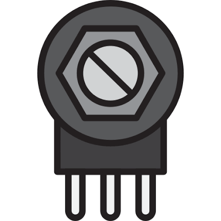
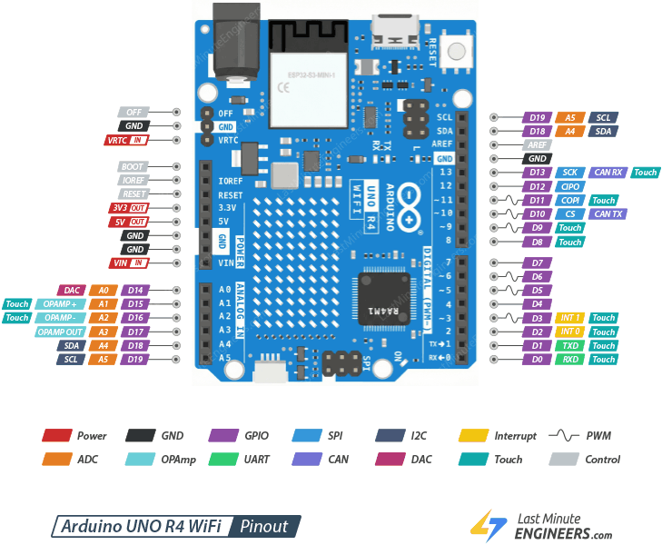
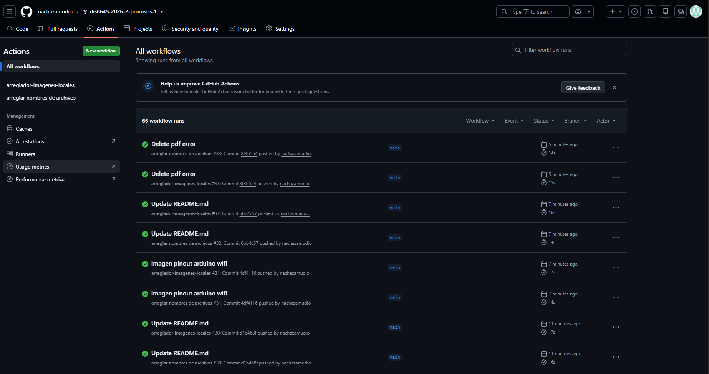

# sesion-02a

## apuntes sesión

POTENCIÓMETRO Y BOTONES

Push buttons, no usaremos toggles. 

Potenciómetros(resistor variable): regula la potencia de algo, variando la resistencia. 

Potencia: energía/tiempo.

En electricidad, la Potencia: Voltaje x Corriente. energía → voltaje y Corriente → tiempo. La corriente tiene que ver con el flujo de electrones.

El potenciómetro le pone resistencia al flujo de electrones. 

El resistor se divide en dos partes R1 Y R2, donde podemos dividirlo en cualquier parte con la perilla, dejando una resistencia más grande al comienzo o al final, o la misma en ambas partes. R1 + R2 siempre será constante, solo se divide la resistencia en dos partes. 

tiene tipo A Y B, donde a es de audio que trabaja con logaritmos,  y b son lineales. USAREMOS LOS B.

botones: pulsadores/push button, son temporales, al presionarlos abre el camino del flujo. 

toggles: mantienen su estado

En el inicio de nuestro arduino, no puede tener valor 0,  ya que al llegarle el voltaje por medio de nuestro botón, hace un corto circuito. Para ello, podemos usar un resistor entre el botón y nuestro arduino para bajar el flujo de electrones que trae y así amortiguar el voltaje. En este caso el resistor es de PULLDOWN, ya que baja el flujo, lo tira abajo. Así permite que el voltaje en el inicio sea 0.
1(activar botón: activarlo, pasa la corriente. 0(circuito abierto): apagado

En otro caso, al poner el resistor antes del botón, baja la corriente antes de abrir o cerrar el circuito. resistor PULLUP, y al cerrar el circuito(activar el botón) el circuito queda en 0V y se “desactiva la función”, 1(activar el botón): desactivado. 0(circuito abierto): activado.

Vcc. voltaje de corriente continua

N.O: normally open, abierto y el electrón no puede circular, 

Encoders: otras perillas, codificadores, de giro infinito.

POTENCIÓMETRO:

1.VCC

2.LECTURA

3.GND

PINOUT que hace cada “patita” de arduino:

PATITAS
VIN: NO USAR
+5V: conecta hacia el potenciómetro

Analog: permite leer NO escribir, lee el potenciómetro

Digital: tiene más funciones, los botones van en este lado. también sirve para audio. 

ejercicio:
conectar cable a GND, en sector POWER.

A0 en arduino es un valor numérico posible

CONST INT “NOMBRE” = A0, de esta manera lo convertimos en una constante.

int “valor lectura” = 0; 
int “valor lectura” = -1;  

VOID LOOP(){
valorLectura = analogRead(patitaLectura);  analog solo lee, otros casos sería digitalWrite.
}

void setup (){
Serial.begin(9600);  
}

puerto serial comienza, se coloca en SETUP, 9600 es la velocidad más común, velocidad moderada. 

void loop(){
  Serial.println(“mensaje”); lo dice literal pq va entre comillas
  Serial.println(valorLectura); sin comillas te da el valor de valorLectura.

al iniciar la funcion, podremos llegar a valores de 0 a 1023, 1024 valores posibles. Es decir, tiene un rango de 10bits 2^10, [0, 1023]

while (!serial) no comenzar, no mandar mensajes hasta que esté listo para recibir. while: mientras 

!: lo contrario de 

.print(“valor actual: “);       tiene que llevar ese espacio antes de cerrar las comillas.

.println(poteLectura);          lee y se salta una línea.

int poteFiltrado = -1 para procesar 

## encargos

Equipo dinamita: Belén Castillo - Martina Fernandez - Maite Villarroel - Ignacia(nacha - yo) Zamudio

## lectura

El libro muestra imagenes a lo largo de la lectura, hay 3 tipos según el tipo de gráfico en uso:

1. Gráfico vectorial

2. Gráficos de pixeles

3. Gráficos hecho por computer-controlled pen plotter

Algoritmo: en el libro centrado hacía el código informático, no al lenguaje de programación. 
"The drawing and computing are at their foundations a set of actions. When coding, the actions are called functions. Functions, essentially, do something based on some imput or prompting", como estamos viendo en clases para poder lograr una acción debemos escribir y juntar muchas indicaciones para que funcione.

página 35

Me gustó como explica la secuencia "if then" e "if then else" que vimos algunas veces en clase o ejemplos. 

página 36 

página 37 

ibamos bien y se puso brigido esto, ta weno igual. 

MAÑANA SUBO LAS IMAGENES Q NO TENGO COMO SACAR FOTOS asjdaksdjasd
