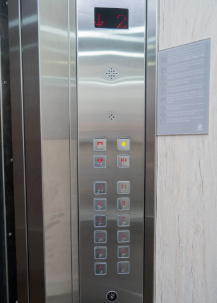
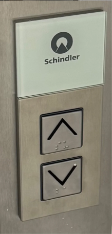
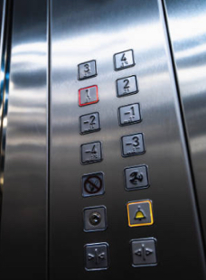

# Sesión-00b
Viernes 07 de Agosto

En esta sesión fuimos a la charla de Heidi Jalkh y, luego de esto, nos reunimos en la sala, donde nos presentamos. También Aaron nos habló de que trataba el taller y qué haríamos durante este semestre.

## Charla Heidi Jalkh

### Bioinspirado
- La naturaleza puede servir como referencia para generar nuevas formas de comportamiento.
- Una pregunta que queda es ¿Cómo continuar explorando las distintas formas y morfologías que pueden surgir a partir de estos procesos?
- Aparece la posibilidad de investigar materiales que puedan tener un menor impacto.
- Es importante seguir experimentando según las posibilidades y características que entrega cada material.

### Bioconstruido
- Diferentes especies pueden aportar propiedades y cualidades que pueden ser aprovechadas dentro del diseño.
- Los micelios de algunos hongos pueden comportarse de manera territorial (no se mezclan entre si. Esto nos demuestra como este tipo de materiales desarrollan sus propias formas de organización.
- La variabilidad debe ser entendida como parte de el proceso de el diseño y dejar de considerarla como un error o algo que se debe eliminar.
- Al trabajar con la naturaleza uno como diseñador debe adaptarse a ella, en lugar de tratar de tener un control absoluto de el resultado.

### Biobasados
- Esta la posibilidad de aplicar materiales y procesos basados en organismos dentro áreas como la arquitectura.
- Se abre la posibilidad de pensar en materiales y sistemas constructivos diferentes a los que se utilizan actualmente.
- Un ejemplo mencionado es el uso de los moluscos como parte de procesos de construcción.

## Encargo botoneras de ascensor
Se nos pidió hacer registro fotográfico de 3 botoneras de ascensor (no se especifico si debían ser interiores o exteriores) luego de hacer el registro debíamos hacer un análisis de estas. 

### Botonera 01

<table>
<tr>
<td align="center">

</td>
</tr>
</table>

- Los botones están organizados en dos columnas, lo que facilita seguir una secuencia visual.
- Los números y símbolos están en color rojo para facilitar su lectura.
- Cuenta con accesibilidad, ya que incorpora Braille.
- Hay una pantalla que indica el número del piso en que se encuentra y también si este subirá o bajará.

---

### Botonera 02

<table>
<tr>
<td align="center">

</td>
</tr>
</table>

- Panel rectangular integrado a la pared.
- Botón superior.
- Botón inferior.
- Cuenta con accesibilidad, incorpora Braille.
- Enciende una luz para indicar qué botón fue presionado.

---
### Botonera 03

<table>
<tr>
<td align="center">

</td>
</tr>
</table>

- Los botones están distribuidos de forma vertical y ordenada.
- Utiliza números, flechas y símbolos universales.
- Algunos botones se iluminan para indicar que fueron seleccionados.
- Incorpora Braille y elementos táctiles.
