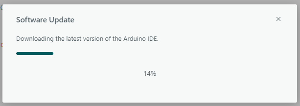

# sesion-01b
Viernes 14 de Agosto

## apuntes sesión
## Álgebra Booleana
Existen las compuertas **AND** y **OR** (son las principales):
- **AND:** Es bastante estricta, como guía el resultado es `1` solo si todas las entradas son `1`. Si UNA sola condición falla (es `0`), el resultado se vuelve `0`.
- **OR:** Esta es mucho más flexible, su regla es: el resultado es `1` si al menos una de las entradas es `1`. Solo da `0` cuando TODAS las entradas son `0`.

---

## Variables y funciones
Con las funciones hay que ser específicos. Si dices `movimiento()`, hay que especificar qué es lo que mueves.

### Tipos de datos básicos:
- **bool** = sí o no -> `false` o `true`
- **String** = pueden contener palabras *(Nota: en Arduino se recomienda usar `String` con mayúscula)*
- **int** = números enteros (por ejemplo, horas de sueño)

### Variables de C++
Referencia: [W3Schools - C++ Variables](https://www.w3schools.com/cpp/cpp_variables.asp)

| Tipo | ¿Qué almacena? | Ejemplo |
|---|---|---|
| `int` | Números enteros, sin decimales | `123` o `-123` |
| `double` | Números con decimales | `19.99` o `-19.99` |
| `char` | Un solo carácter | `'a'` o `'B'` |
| `string` | Texto o cadenas de caracteres | `"Hola Mundo"` |
| `bool` | Valores de verdadero o falso | `true` o `false` |

### Bits 
- Con 3 bits se llegan a 8 valores (desde 0 a 7). Si vamos agregando bits se va duplicando aprox.
- Con 4 bits llegamos a 16 valores (desde 0 a 15).

## ¿QUÉ HICIMOS?
Descargamos Arduino IDE
- Este no lo instalé en clases ya que lo tengo instalado desde el curso de "Interacciones inalámbricas".
  

- En clase se instaló la versión 2.3.10.
- Yo tengo la versión 2.3.8 y me dio la opción de actualizar.
  
  
- Utilizaremos la placa **Arduino R4 WiFi**.

### MICROCONTROLADORES
Hernando Barragán: Creador de la plataforma de desarrollo *Wiring*, en la cual se basó la creación de Arduino.
[Historia de Arduino](https://arduinohistory.github.io/)

## Codigo

### Ejemplo de esqueleto

```cpp
void setup() {
  // aqui va setup(), ocurre una vez, al principio
}

void loop() {
  // aqui va loop()
  // ocurre despues de setup()
  // se repite hasta que no se pueda
}
```

### Ejemplo en clases

```cpp
// kristel es estudiante udp

// bools
bool kristelEstudianteUDP = true;
bool kristelChilena = true;
bool kristelCoreana = false;
bool kristelDientes = true;

// integers
int kristelEdad = 22;

// cristo es 0, el tiempo fluye hacia delante
// eso es paralelo a cristo lo mas grande
int kristelNacimientoAnho = 2003;

// enero es 1, diciembre es 12
int kristelNacimientoMes = 11;

// dias desde 1 hasta lo que dure el mes
int kristelNacimientoDia = 5;

// azul
String kristelColorFavorito = "0000ff";

void setup() {
  // aqui va setup(), ocurre una vez, al principio
}

void loop() {
  // aqui va loop()
  // ocurre despues de setup()
  // se repite hasta que no se pueda

  // si estoy en el mes de nacimiento de kristel
  // y ademas estoy en el dia de nacimiento de kristel
  // le deseo feliz cumpleanhos

  // scope esta dentro de {}
  // scope es un contexto

  // if (mesActual == kristelNacimientoMes) {
  // estoy en el mes de interes

  // if (diaActual == kristelNacimientoDia) {
  // decirle feliz cumple, que se tome el dia libre, traer cositas pa picar
  // cumplirAnhosKristel();
  // }

  // otra opcion
  // if (mesActual == kristelNacimientoMes && diaActual == kristelNacimientoDia) {
  // }
}

// la vamos a correr cuando sea el cumple de Kristel
void cumplirAnhosKristel() {
  // actualizar la edad de Kristel
  // edad es la que es mas uno
  kristelEdad = kristelEdad + 1;
  
  // manera abreviada
  // kristelEdad += 1;
  // kristelEdad++;
}
```

### Ejemplo de declaración de funciones

```cpp
int valorPancito = 2000;
int valorCafecito = 3000;

void setup() {
  // put your setup code here, to run once:
}

void loop() {
  // put your main code here, to run repeatedly:
  int valorDesayuno = sumarEnteros(valorPancito, valorCafecito);

  if (valorDesayuno < 5000) {
    // oh no 
  } else {
    // oh si
  }
}

// sumar numeros enteros
// es tipo int porque nos va a dar un resultado
// las void ocurren sin emitir un resultado
int sumarEnteros(int x, int y) {
  // declarar un resultado
  int resultado = 0;
  
  // es una abreviacion de dos pasos:
  // declarar:        int resultado;
  // asignar valor:   resultado = 0;

  // hacer la suma de x e y y reemplazar valor resultado por ese valor
  resultado = x + y;

  // emitir resultado al exterior de la funcion
  return resultado;

  // declarar solo lo puedo hacer una vez
}
```
### Sistema Hexadecimal (0 a 15)

| Decimal | Hexadecimal |
| :---: | :---: |
| 00 | 0 |
| 01 | 1 |
| 02 | 2 |
| 03 | 3 |
| 04 | 4 |
| 05 | 5 |
| 06 | 6 |
| 07 | 7 |
| 08 | 8 |
| 09 | 9 |
| 10 | A |
| 11 | B |
| 12 | C |
| 13 | D |
| 14 | E |
| 15 | F |


## encargos

encargo01b:

1. tratar de correr un código en el microcontrolador asignado a cada dupla, incluir referentes, citas, comentarios, imágenes, descripciones textuales, y en caso de éxito o fracaso incluir aciertos, preguntas, dramas, atados. recordatorio que estos apuntes son personales, cada persona sube su versión.
2. proponer una función con nombre, tipo, argumentos y uso, que modele algún área de su interés, por ejemplo subirCerro(enBicicleta), tomarMetro(conPaseEscolar), etc. escribir en pseudocódigo los pasos que necesita esa función internamente para que literalmente funcione.

## lectura
